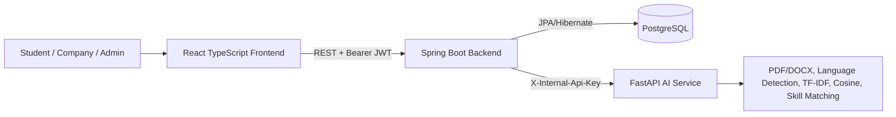
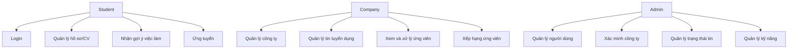
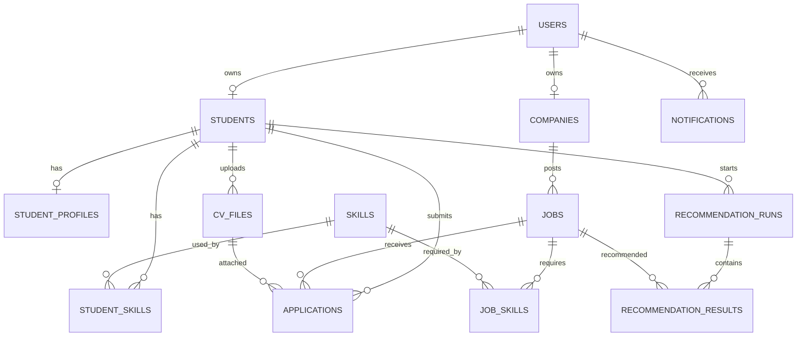
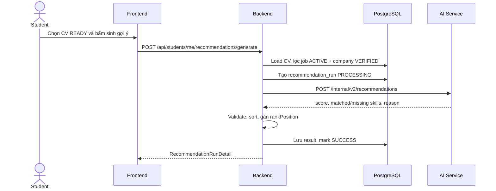
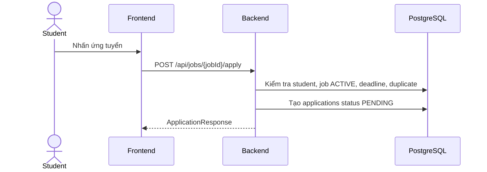

# Báo cáo phân tích hệ thống gợi ý việc làm cho sinh viên IT

Phạm vi phân tích: source code hiện tại trong repository `student-job-recommendation-system`, gồm `frontend/`, `backend/`, `ai-service/`, `docs/`, migration SQL và cấu hình Docker. Báo cáo chỉ dựa trên code đã đọc, không chạy migration, không thay đổi cơ sở dữ liệu và không chỉnh sửa source code.

## 1. Tóm tắt dự án

Tên dự án là **Student Job Recommendation System**. Mục tiêu của hệ thống là xây dựng nền tảng tuyển dụng cho sinh viên Công nghệ Thông tin, cho phép sinh viên quản lý hồ sơ/CV, tìm kiếm việc làm, nhận gợi ý việc làm dựa trên nội dung CV và kỹ năng, ứng tuyển và theo dõi trạng thái ứng tuyển. Doanh nghiệp có thể quản lý hồ sơ công ty, tin tuyển dụng, ứng viên và xếp hạng ứng viên theo từng tin. Quản trị viên có các màn hình và API quản lý người dùng, công ty, tin tuyển dụng, kỹ năng và đơn ứng tuyển.

Hệ thống hiện gồm ba thành phần chính: frontend React/TypeScript, backend Spring Boot và AI service FastAPI. Backend là hệ thống trung tâm, sở hữu xác thực JWT, phân quyền, nghiệp vụ, PostgreSQL/Flyway, lọc công việc hợp lệ, gọi AI service, kiểm tra phản hồi AI và lưu kết quả gợi ý. AI service là dịch vụ tính toán stateless, xử lý PDF/DOCX, nhận diện ngôn ngữ Anh/Việt, trích xuất kỹ năng canonical, tính TF-IDF/Cosine Similarity và sinh giải thích gợi ý.

Luồng tổng quát: người dùng đăng ký tài khoản theo vai trò; đăng nhập để nhận JWT; sinh viên cập nhật hồ sơ, tải CV, yêu cầu phân tích CV, sinh danh sách việc làm gợi ý từ CV READY; sinh viên xem danh sách việc làm, lưu việc, ứng tuyển; doanh nghiệp xem ứng viên và cập nhật trạng thái; hệ thống tạo thông báo khi trạng thái ứng tuyển thay đổi.

Nguồn chính: `README.md`; `backend/pom.xml`; `frontend/package.json`; `ai-service/main.py`; `docker-compose.yml`.

## 2. Công nghệ sử dụng

### Frontend

Frontend dùng React 18, TypeScript, Vite, Tailwind CSS và hệ component tự xây dưới `frontend/src/components`. Các thư viện chính gồm `react-router-dom` cho định tuyến, `axios` cho HTTP, `react-hook-form` và `zod` cho form/validation ở một số phần, `lucide-react` cho icon, `recharts` cho biểu đồ. Cấu hình dependency nằm tại `frontend/package.json`.

API được gọi qua `frontend/src/services/api/httpClient.ts`. Base URL là `import.meta.env.VITE_API_BASE_URL ?? "/api"` tại dòng 6-7; token lấy từ `sessionStorage` và gắn vào header `Authorization: Bearer ...` tại dòng 13-18; khi gặp HTTP 401 thì xóa token và phát sự kiện hết phiên tại dòng 21-29.

Thông tin đăng nhập được quản lý bởi `AuthProvider` trong `frontend/src/app/providers/AuthProvider.tsx`. Khi khởi động, nếu có token thì frontend gọi `/auth/me`; đăng nhập gọi `loginRequest`; đăng xuất xóa token. Route guard nằm tại `frontend/src/routes/RouteGuards.tsx`, chia role frontend thành `candidate`, `recruiter`, `admin`.

### Backend

Backend dùng Java 21, Spring Boot 3.5.16, Maven, Spring Web, Spring Security, Spring Data JPA/Hibernate, Jakarta Validation, Flyway, PostgreSQL driver, JJWT và springdoc-openapi. Cấu hình nằm trong `backend/pom.xml`.

Backend tổ chức theo module nghiệp vụ dưới package `com.tttn.jobrecommendation.modules`: `auth`, `student`, `company`, `job`, `skill`, `cv`, `recommendation`, `application`, `notification`, `statistics`, `user`, `candidateranking`. Kiến trúc controller-service-repository-entity/DTO/mapper được áp dụng nhất quán.

API trả về qua `ApiResponse<T>` trong `backend/src/main/java/com/tttn/jobrecommendation/common/response/ApiResponse.java`, gồm `success`, `message`, `errorCode`, `data`. Exception được chuẩn hóa bởi `GlobalExceptionHandler` trong `backend/src/main/java/com/tttn/jobrecommendation/common/exception/GlobalExceptionHandler.java`.

### Cơ sở dữ liệu

Cơ sở dữ liệu là PostgreSQL 17, khởi tạo qua Docker Compose và quản lý schema bằng Flyway. Migration nằm tại `backend/src/main/resources/db/migration`. Các bảng chính gồm `users`, `students`, `student_profiles`, `companies`, `skills`, `student_skills`, `jobs`, `job_skills`, `saved_jobs`, `cv_files`, `applications`, `recommendation_runs`, `recommendation_results`, `notifications`, `saved_candidates`, `user_notification_settings`, `saved_searches`, `candidate_ranking_runs`, `candidate_ranking_results`.

### Hệ thống gợi ý

AI service dùng Python, FastAPI, Pydantic V2, pdfplumber, python-docx, underthesea, scikit-learn và NumPy. Contract V2 gồm `POST /internal/v2/cv/parse` và `POST /internal/v2/recommendations` trong `ai-service/v2/api.py`. Thuật toán chính là `tfidf-cosine-hybrid`, version `bilingual-recommendation-v2`, processing version `bilingual-nlp-v2-skills-v1` trong `ai-service/v2/constants.py`.

TF-IDF và Cosine Similarity được triển khai tại `ai-service/v2/recommender.py`: import `TfidfVectorizer` và `cosine_similarity` ở dòng 7-8; vector hóa tại dòng 92-110; tính cosine tại dòng 111. Trọng số cùng ngôn ngữ là 0.65 văn bản và 0.35 kỹ năng tại dòng 18-19, áp dụng ở dòng 164-165.

## 3. Cấu trúc thư mục

```text
student-job-recommendation-system/
  frontend/                 React + TypeScript UI
  backend/                  Spring Boot API, security, business logic
  ai-service/               FastAPI NLP/recommendation service
  docs/                     Tài liệu API, schema, runbook, trạng thái dự án
  performance/              Tooling benchmark và dữ liệu đo hiệu năng
  scripts/                  Script smoke/e2e hỗ trợ vận hành
  docker-compose.yml        PostgreSQL, backend, AI service
```

Trong backend, `controller` nhận request và trả `ApiResponse`; `service` xử lý nghiệp vụ; `repository` truy cập PostgreSQL; `entity` ánh xạ bảng; `dto/request` và `dto/response` định nghĩa dữ liệu API; `mapper` chuyển entity sang response. Trong AI service, `v2/api.py` khai báo route nội bộ, `v2/cv_service.py` xử lý file CV, `v2/preprocessor.py` tiền xử lý Anh/Việt, `v2/recommender.py` tính điểm, `v2/service.py` điều phối song ngữ. Trong frontend, `pages` là màn hình, `features` chứa logic theo domain, `services` chứa HTTP/mock service, `routes` và `constants/routes.ts` khai báo route.

## 4. Kiến trúc hệ thống

Kiến trúc tổng thể là full-stack nhiều dịch vụ:

```text
Người dùng -> React Frontend -> REST API Spring Boot -> PostgreSQL
                                      |
                                      v
                              FastAPI AI Service
```

Frontend chỉ gọi backend. Backend gọi AI service bằng internal API key qua `RestAiServiceClient`, không truyền JWT người dùng sang AI service. AI service không truy cập cơ sở dữ liệu và không tự lưu kết quả. Backend giữ vai trò system of record: lọc job hợp lệ, tạo run, validate phản hồi AI, sort theo `score DESC`, `jobId ASC`, gán `rankPosition` và persist.

Nguồn: `backend/src/main/java/com/tttn/jobrecommendation/infrastructure/ai/client/RestAiServiceClient.java` dòng 61-80 và 84-99; `backend/src/main/java/com/tttn/jobrecommendation/modules/recommendation/service/impl/RecommendationGenerationServiceImpl.java` dòng 28-52; `backend/src/main/java/com/tttn/jobrecommendation/modules/recommendation/service/impl/AiRecommendationResponseValidator.java` dòng 64-65, 130-134.

## 5. Vai trò người dùng

| Vai trò | Mục đích | Giao diện liên quan | API liên quan | Trạng thái |
|---|---|---|---|---|
| STUDENT | Quản lý hồ sơ, CV, tìm/lưu việc, nhận gợi ý, ứng tuyển | `/candidate/**`, public job/company pages | `/api/students/me/**`, `/api/jobs/{id}/apply`, `/api/students/me/recommendations/generate`, `/api/students/me/cv/**` | Backend và nhiều màn hình frontend đã kết nối; interview/message/invitation còn mock/chưa có backend |
| COMPANY | Quản lý công ty, tin tuyển dụng, ứng viên, saved candidates, candidate ranking | `/recruiter/**` | `/api/companies/me/**`, `/api/jobs/**`, `/api/companies/me/applications`, `/api/companies/me/jobs/{jobId}/candidate-ranking-runs` | Nghiệp vụ chính đã có backend; members/interviews/messages một phần là giao diện/mock |
| ADMIN | Quản trị người dùng, công ty, tin, ứng tuyển, kỹ năng | `/admin/**` | `/api/admin/users`, `/api/admin/companies`, `/api/admin/applications`, `/api/jobs`, `/api/skills` | API quản trị lõi có; content/report/audit/system settings chủ yếu giao diện hoặc dữ liệu không có backend tương ứng |

Phân quyền backend dùng `@PreAuthorize`, ví dụ CV chỉ `STUDENT` tại `CvController.java` dòng 31-32; job create/update/status/delete cho `COMPANY` hoặc `ADMIN` tại `JobController.java` dòng 55-94; recommendation chỉ `STUDENT` tại `RecommendationController.java` dòng 24-25; candidate ranking chỉ `COMPANY` tại `CandidateRankingController.java` dòng 29-30.

## 6. Danh sách chức năng

### Sinh viên

| Chức năng | Giao diện | API/Bảng | Trạng thái |
|---|---|---|---|
| Đăng ký | `/register/candidate` | `POST /api/auth/register`, `users`, `students`, `student_profiles` | Đã có |
| Đăng nhập/đăng xuất | `/login` | `POST /api/auth/login`, JWT | Đã có |
| Quên/đặt lại mật khẩu | `/forgot-password`, `/reset-password` | Không thấy API backend tương ứng | Chỉ giao diện, submit hiển thị toast |
| Đổi mật khẩu | `/candidate/settings/security` | `PATCH /api/users/me/password` | Đã có |
| Hồ sơ sinh viên | `/candidate/profile`, `/candidate/profile/edit` | `/api/students/me`, `/api/students/me/profile`, `/api/students/me/skills` | Đã kết nối backend |
| Mong muốn nghề nghiệp | `/candidate/profile/preferences` | `/api/students/me/profile`; vẫn có `candidatePreferencesService` mock/localStorage | Một phần backend, một phần mock |
| Upload CV | `/candidate/cvs/upload` | `POST /api/students/me/cv`, `cv_files` | Đã có upload, sau upload trạng thái `NOT_READY` |
| Phân tích CV | `/candidate/cvs/:cvId/analysis` | `POST /api/students/me/cv/{cvId}/reanalyze`, AI `/internal/v2/cv/parse` | Đã có, chạy theo thao tác phân tích lại |
| Danh sách/tìm/lọc việc | `/candidate/jobs`, `/jobs` | `/api/jobs`, `/api/public/jobs` | Đã kết nối backend |
| Lưu việc | `/candidate/jobs/saved` | `/api/students/me/saved-jobs` | Đã có |
| Gợi ý việc làm | `/candidate/jobs/recommended` | `/api/students/me/recommendations/generate`, `/api/students/me/recommendation-results/latest` | Đã có backend + frontend |
| Ứng tuyển | modal apply trong job detail | `POST /api/jobs/{jobId}/apply`, `applications` | Đã có |
| Lịch sử ứng tuyển | `/candidate/applications` | `/api/students/me/applications` | Đã có |
| Thông báo | `/candidate/notifications` | `/api/notifications` | Đã có |
| Tin nhắn, phỏng vấn, lời mời | `/candidate/messages`, `/candidate/interviews`, `/candidate/invitations` | Không thấy module backend tương ứng | Giao diện/mock |

Nguồn tiêu biểu: `CvServiceImpl.java` dòng 59-97; `CvAnalysisServiceImpl.java` dòng 35-48; `ApplicationServiceImpl.java` dòng 71-96; `frontend/src/features/candidate/recommendedJobs/recommendedJobsService.ts` dòng 80-126; `frontend/src/features/candidate/apply/CandidateApplyFlowModal.tsx` dòng 128.

### Doanh nghiệp

| Chức năng | Giao diện | API/Bảng | Trạng thái |
|---|---|---|---|
| Đăng ký doanh nghiệp | `/register/recruiter` | `POST /api/auth/register`, `companies` | Đã có; backend hiện tạo `CompanyStatus.VERIFIED` khi self-register |
| Cập nhật công ty | `/recruiter/company`, `/recruiter/settings` | `/api/companies/me` | Đã có |
| Xác minh doanh nghiệp | `/recruiter/company/verification` | Admin có `/api/admin/companies/{id}/status`; không thấy API gửi yêu cầu xác minh riêng | Một phần |
| Tạo/sửa/đóng tin tuyển dụng | `/recruiter/jobs/**` | `/api/jobs`, `jobs`, `job_skills` | Đã có backend |
| Xem ứng viên | `/recruiter/candidates` | `/api/companies/me/applications` | Đã có |
| Xem CV ứng viên | candidate detail/ranking | `/api/companies/me/applications/{id}/cv/file` | Đã có |
| Đổi trạng thái ứng tuyển | candidate management/ranking | `PATCH /api/applications/{id}/status` | Đã có |
| Lưu ứng viên | `/recruiter/saved-candidates` | `/api/companies/me/saved-candidates` | Đã có |
| Xếp hạng ứng viên | `/recruiter/jobs/:jobId/candidate-ranking` | `/api/companies/me/jobs/{jobId}/candidate-ranking-runs` | Đã có |
| Thành viên, chiến dịch, phỏng vấn, tin nhắn | `/recruiter/members`, `/recruiter/campaigns`, `/recruiter/interviews`, `/recruiter/messages` | Không thấy backend tương ứng | Chủ yếu giao diện/mock |

### Quản trị viên

| Chức năng | Giao diện | API/Bảng | Trạng thái |
|---|---|---|---|
| Dashboard | `/admin/dashboard` | `/api/public/statistics`, `/api/admin/users`, `/api/admin/companies`, `/api/jobs` | Một phần kết nối |
| Quản lý user/khóa mở tài khoản | `/admin/users` | `/api/admin/users`, `/api/admin/users/{id}/status` | Đã có |
| Quản lý/xác minh công ty | `/admin/companies` | `/api/admin/companies`, `/api/admin/companies/{id}/status` | Đã có |
| Duyệt/từ chối tin | `/admin/jobs`, `/admin/jobs/pending` | `/api/jobs/{id}/status` | Đã có status API; không có workflow review riêng ngoài status |
| Quản lý đơn ứng tuyển | `/admin/applications` | `/api/admin/applications` | Đã có |
| Quản lý kỹ năng/danh mục | `/admin/categories` | `/api/skills` | Kỹ năng có API; category/industry độc lập chưa thấy backend |
| Nội dung, báo cáo, audit log, system settings | `/admin/content`, `/admin/reports`, `/admin/analytics`, `/admin/system-settings` | Không thấy backend module tương ứng | Giao diện/placeholder một phần |

## 7. Danh sách giao diện

Frontend định tuyến trong `frontend/src/app/router/appRouter.tsx` và `frontend/src/constants/routes.ts`.

Các route public: `/`, `/jobs`, `/jobs/:jobId`, `/companies`, `/companies/:companyId`, `/career-resources`, `/career-resources/:slug`, `/about`, `/contact`, `/privacy-policy`, `/terms`.

Các route auth: `/login`, `/register`, `/register/candidate`, `/register/recruiter`, `/forgot-password`, `/reset-password`.

Các route candidate chính: `/candidate/dashboard`, `/candidate/jobs`, `/candidate/jobs/:jobId`, `/candidate/jobs/recommended`, `/candidate/jobs/saved`, `/candidate/profile`, `/candidate/profile/edit`, `/candidate/profile/preferences`, `/candidate/cvs`, `/candidate/cvs/upload`, `/candidate/cvs/:cvId`, `/candidate/cvs/:cvId/analysis`, `/candidate/applications`, `/candidate/notifications`, `/candidate/settings/**`, cùng các route interviews/invitations/messages còn mock/chưa backend.

Các route recruiter chính: `/recruiter/dashboard`, `/recruiter/company`, `/recruiter/jobs`, `/recruiter/jobs/create`, `/recruiter/jobs/:jobId`, `/recruiter/jobs/:jobId/candidate-ranking`, `/recruiter/candidates`, `/recruiter/saved-candidates`, `/recruiter/reports`, `/recruiter/settings/**`, cùng members/campaigns/interviews/messages còn thiếu backend.

Các route admin chính: `/admin/dashboard`, `/admin/users`, `/admin/companies`, `/admin/jobs`, `/admin/jobs/pending`, `/admin/applications`, `/admin/cv-analysis`, `/admin/recommendation-system`, `/admin/categories`, `/admin/content`, `/admin/reports`, `/admin/analytics`, `/admin/system-settings`.

## 8. Danh sách API

| Nhóm | Method | Endpoint | Vai trò | Trạng thái |
|---|---|---|---|---|
| Auth | POST | `/api/auth/register` | Public | Đã có |
| Auth | POST | `/api/auth/login` | Public | Đã có |
| Auth | GET | `/api/auth/me` | Authenticated | Đã có |
| User | PATCH | `/api/users/me/password` | STUDENT/COMPANY/ADMIN | Đã có |
| Student | GET/PUT | `/api/students/me` | STUDENT | Đã có |
| Student profile | GET/PUT | `/api/students/me/profile` | STUDENT | Đã có |
| Student skills | GET/PUT | `/api/students/me/skills` | STUDENT | Đã có |
| Saved searches | GET/POST/PUT/DELETE | `/api/students/me/saved-searches` | STUDENT | Đã có |
| Skill | GET | `/api/skills`, `/api/skills/{id}` | STUDENT/COMPANY/ADMIN | Đã có |
| Skill | POST/PUT | `/api/skills`, `/api/skills/{id}` | ADMIN | Đã có |
| Public job | GET | `/api/public/jobs`, `/api/public/jobs/{jobId}` | Public | Đã có |
| Job | GET | `/api/jobs`, `/api/jobs/{id}` | STUDENT/COMPANY/ADMIN | Đã có |
| Job | POST/PUT/PATCH/DELETE | `/api/jobs`, `/api/jobs/{id}`, `/api/jobs/{id}/status` | COMPANY/ADMIN | Đã có |
| Saved job | POST/GET/DELETE | `/api/students/me/saved-jobs` | STUDENT | Đã có |
| Public company | GET | `/api/public/companies`, `/api/public/companies/{id}` | Public | Đã có |
| Company | GET/PUT | `/api/companies/me` | COMPANY | Đã có |
| Admin company | GET/PATCH | `/api/admin/companies`, `/api/admin/companies/{id}/status` | ADMIN | Đã có |
| CV | POST/GET/PATCH/DELETE | `/api/students/me/cv/**` | STUDENT | Đã có |
| Recommendation | GET/POST | `/api/students/me/recommendation-runs`, `/api/students/me/recommendations/generate`, `/api/students/me/recommendation-results/latest` | STUDENT | Đã có |
| Application | POST | `/api/jobs/{jobId}/apply` | STUDENT | Đã có |
| Application | GET | `/api/students/me/applications` | STUDENT | Đã có |
| Application | GET | `/api/companies/me/applications`, `/api/companies/me/jobs/{jobId}/applications` | COMPANY | Đã có |
| Application | PATCH | `/api/applications/{id}/status` | STUDENT/COMPANY/ADMIN | Đã có |
| Admin application | GET | `/api/admin/applications` | ADMIN | Đã có |
| Notification | GET/PATCH | `/api/notifications`, `/api/notifications/unread-count`, `/api/notifications/{id}/read`, `/api/notifications/read-all` | Authenticated | Đã có |
| Notification settings | GET/PUT | `/api/users/me/notification-settings` | Authenticated | Đã có |
| Statistics | GET | `/api/public/statistics` | Public | Đã có |
| Candidate ranking | POST/GET | `/api/companies/me/jobs/{jobId}/candidate-ranking-runs` | COMPANY | Đã có |
| AI internal | POST | `/internal/v2/cv/parse`, `/internal/v2/recommendations`, `/internal/v2/candidate-rankings` | Internal API key | Đã có trong AI service |

Nguồn controller: kết quả quét `@RequestMapping`, `@GetMapping`, `@PostMapping` trong `backend/src/main/java/com/tttn/jobrecommendation/modules/**/controller`.

## 9. Thiết kế cơ sở dữ liệu

| Bảng | Mục đích | Khóa chính | Khóa ngoại/quan hệ |
|---|---|---|---|
| `users` | Tài khoản, email, password hash, role, status | `id` | email unique |
| `students` | Thông tin sinh viên gắn user | `id` | `user_id -> users.id`, unique |
| `student_profiles` | Hồ sơ học vấn, headline, preference | `id` | `student_id -> students.id`, unique |
| `companies` | Hồ sơ doanh nghiệp | `id` | `user_id -> users.id`, unique |
| `skills` | Danh mục kỹ năng | `id` | `name` unique, `normalized_name` unique sau V11 |
| `student_skills` | Kỹ năng sinh viên | `id` | `student_id`, `skill_id`, unique `(student_id, skill_id)` |
| `jobs` | Tin tuyển dụng | `id` | `company_id -> companies.id` |
| `job_skills` | Kỹ năng yêu cầu của job | `id` | `job_id`, `skill_id`, unique `(job_id, skill_id)` |
| `saved_jobs` | Việc đã lưu của sinh viên | `id` | `student_id`, `job_id`, unique `(student_id, job_id)` |
| `cv_files` | Metadata file CV và kết quả phân tích | `id` | `student_id -> students.id` |
| `applications` | Đơn ứng tuyển hiện tại | `id` | `student_id`, `job_id`, `cv_file_id`, unique `(student_id, job_id)` |
| `recommendation_runs` | Lần sinh gợi ý của sinh viên | `id` | `student_id`, `cv_file_id` |
| `recommendation_results` | Kết quả từng job trong một run | `id` | `run_id`, `job_id`, unique `(run_id, job_id)` |
| `notifications` | Thông báo người dùng | `id` | `user_id -> users.id` |
| `saved_candidates` | Ứng viên đã lưu của công ty | `id` | `company_id`, `student_id`, `application_id`, unique `(company_id, student_id)` |
| `user_notification_settings` | Cấu hình thông báo | `id` | `user_id -> users.id`, unique |
| `saved_searches` | Bộ lọc tìm việc đã lưu | `id` | `student_id`, unique theo `student_id + lower(name)` |
| `candidate_ranking_runs` | Lần xếp hạng ứng viên cho job | `id` | `job_id -> jobs.id`, unique request id |
| `candidate_ranking_results` | Kết quả xếp hạng từng application | `id` | `run_id`, `application_id`, `cv_file_id` |

Không thấy bảng `application_status_history`; vì vậy lịch sử chuyển trạng thái ứng tuyển chưa được lưu thành bảng riêng. `applications.status` chỉ phản ánh trạng thái hiện tại.

## 10. Luồng xử lý CV

Luồng thực tế:

1. Sinh viên chọn file PDF/DOCX trên frontend `/candidate/cvs/upload`.
2. Frontend gửi multipart `POST /api/students/me/cv`.
3. Backend `CvServiceImpl.uploadCv()` kiểm tra file không rỗng, kích thước, extension `.pdf`/`.docx`, content type; đặt tên lưu bằng `studentId_UUID.ext`; lưu file vào thư mục cấu hình; tạo bản ghi `cv_files` với `analysisStatus = NOT_READY`. Nguồn: `CvServiceImpl.java` dòng 59-97 và 189.
4. Khi sinh viên bấm phân tích, frontend gọi `POST /api/students/me/cv/{cvId}/reanalyze`.
5. Backend `CvAnalysisServiceImpl.reanalyze()` mark PROCESSING, đọc file, gọi AI service `/internal/v2/cv/parse`, validate phản hồi, lưu `extractedText`, `processedText`, `extractedSkills`, `languageCode`, `languageConfidence`, `processingVersion`, `warnings`, `analyzedAt`; nếu lỗi thì mark FAILED. Nguồn: `CvAnalysisServiceImpl.java` dòng 35-48; `CvAnalysisPersistenceService.java` dòng 44, 62, 81.
6. AI service đọc file một lần, kiểm tra size, suffix, MIME, preflight DOCX, extract text, detect language, preprocess, extract skills canonical và trả kết quả. Nguồn: `ai-service/v2/cv_service.py` dòng 104, 127-153.

Điểm cần ghi chú: upload CV không tự động phân tích ngay trong `CvServiceImpl`; phân tích là endpoint riêng. API `PATCH /api/students/me/cv/{cvId}/extracted-data` tồn tại ở controller nhưng service hiện gọi `rejectExtractedDataUpdate`, tức chức năng chỉnh dữ liệu trích xuất chưa được hỗ trợ thực sự.

## 11. Thuật toán gợi ý việc làm

### Dữ liệu đầu vào

Backend chỉ cho sinh gợi ý từ CV đã phân tích READY. `RecommendationTransactionService.createProcessingRun()` kiểm tra CV thuộc sinh viên, `analysisStatus == READY`, có `extractedText` và `processedText`. Backend lấy `extractedSkills` từ CV, build corpus job hợp lệ, tạo request gồm CV id, raw text CV, skills và danh sách job.

Job hợp lệ được lấy trong `EligibleJobCorpusBuilder.build()` bằng `JobStatus.ACTIVE`, `CompanyStatus.VERIFIED` và deadline còn hiệu lực, sau đó ghép các phần `TITLE`, `DESCRIPTION`, `REQUIREMENTS`, `SKILLS` thành text gửi AI. Nguồn: `EligibleJobCorpusBuilder.java` dòng 29-56.

### Tiền xử lý

AI service phát hiện ngôn ngữ bằng fixed lexicon tại `ai-service/v2/language_detector.py`. Tiền xử lý nằm tại `ai-service/v2/preprocessor.py`: chuẩn hóa Unicode, bỏ URL/email, chuyển casefold, token hóa tiếng Anh bằng regex, token hóa tiếng Việt bằng `underthesea.word_tokenize`, bỏ stopword, bảo vệ một số thuật ngữ IT như `spring boot`, `rest api`, `.net`, `c#`.

### Biểu diễn và tính điểm

Cùng ngôn ngữ: AI tạo TF-IDF cho job corpus bằng `TfidfVectorizer`, transform CV, tính `cosine_similarity`, sau đó tính kỹ năng trùng/thiếu theo canonical skills. Nếu job có skill khai báo: `score = 0.65 * textScore + 0.35 * skillScore`; nếu job không có skill: `score = textScore`. Nguồn: `ai-service/v2/recommender.py` dòng 92-111, 164-165.

Khác ngôn ngữ hoặc không đủ tự tin: AI không dùng text similarity, đặt `textScore = null` và `score = skillScore`. Nguồn: `ai-service/v2/recommender.py` dòng 205-255; `ai-service/v2/service.py` dòng 73-140.

Backend không tin mù phản hồi AI. `AiRecommendationResponseValidator.validate()` kiểm tra request id, job id thuộc eligible set, threshold, limit, score 0..1, strategy, skill array, reason length; sau đó sort lại `score DESC`, `jobId ASC`, gán `rankPosition`. Nguồn: `AiRecommendationResponseValidator.java` dòng 29-65, 95-134.

### Kết quả đầu ra

Kết quả trả về frontend gồm job id/title/company, rank, score, textScore, skillScore, scoringStrategy, matchedSkills/matchedKeywords, missingSkills, reason. Frontend map điểm 0..1 sang phần trăm trong `frontend/src/features/candidate/recommendedJobs/recommendedJobsService.ts` và lấy thêm public job detail để hiển thị thông tin job.

### Đánh giá thuật toán

Điểm mạnh: thuật toán deterministic, có giải thích, hỗ trợ tiếng Anh/Việt, tách trách nhiệm rõ giữa backend và AI, có validate response và persist run/result. Hạn chế: content-based filtering phụ thuộc chất lượng CV và skill catalog; chưa có feedback loop từ hành vi người dùng; chưa học từ lịch sử ứng tuyển; cross-language chỉ dựa trên kỹ năng nên bỏ qua ngữ cảnh mô tả; không thấy vector được lưu bền vững, AI tính lại theo request.

## 12. Luồng ứng tuyển

Luồng thực tế:

1. Sinh viên mở danh sách hoặc chi tiết việc làm.
2. Frontend mở `CandidateApplyFlowModal` và gửi `POST /jobs/{jobId}/apply`.
3. Backend `ApplicationServiceImpl.apply()` lấy student từ user hiện tại, lấy job, kiểm tra job `ACTIVE`, kiểm tra deadline chưa qua, kiểm tra chưa ứng tuyển trước đó, kiểm tra CV nếu có thuộc sinh viên, tạo `JobApplication` với `status = PENDING`.
4. Doanh nghiệp xem danh sách đơn qua `/api/companies/me/applications` hoặc `/api/companies/me/jobs/{jobId}/applications`.
5. Doanh nghiệp/admin cập nhật trạng thái qua `PATCH /api/applications/{id}/status`; backend kiểm tra công ty sở hữu job hoặc admin, kiểm tra transition hợp lệ.
6. Sinh viên có thể rút đơn từ `PENDING` sang `WITHDRAWN`.
7. Khi company/admin đổi trạng thái, backend gọi `notificationService.createApplicationStatusChangedNotification()`.

Nguồn: `ApplicationServiceImpl.java` dòng 71-96, 231-256, 332-346. Chưa có bảng lịch sử trạng thái ứng tuyển riêng, nên yêu cầu “Application status history” trong PDF chưa được đáp ứng ở mức database.

## 13. Xác thực và phân quyền

Đăng ký: `AuthServiceImpl.register()` normalize email, kiểm tra trùng email, không cho self-register `ADMIN`, mã hóa mật khẩu bằng `PasswordEncoder`, tạo user ACTIVE, tạo profile theo role. Sinh viên được tạo `students` và `student_profiles`; công ty được tạo `companies` với trạng thái `VERIFIED`. Nguồn: `AuthServiceImpl.java` dòng 55-61, 122-126.

Đăng nhập: `AuthServiceImpl.login()` tìm user theo email, kiểm tra BCrypt password, từ chối user không ACTIVE, cập nhật `lastLoginAt`, tạo JWT và trả `tokenType = Bearer`, `expiresIn`. Nguồn: `AuthServiceImpl.java` dòng 81-96.

JWT: `JwtTokenProvider` lưu subject là email, claim `userId` và `role`, hết hạn theo `app.jwt.expiration-ms`. Nguồn: `JwtTokenProvider.java` dòng 18-35. Security stateless và public endpoint được khai báo trong `SecurityConfig.java`: `/api/auth/**`, `/api/public/companies/**`, `/api/public/jobs/**`, `/api/public/statistics`, Swagger docs được permitAll; phần còn lại yêu cầu auth.

Frontend lưu token trong `sessionStorage`, không dùng refresh token. Khi API trả 401, token bị xóa và user được chuyển về login. Không thấy cơ chế refresh token hoặc forgot-password backend.

## 14. Mức độ kết nối frontend - backend

| Chức năng | Trang frontend | API backend | Đã kết nối | Ghi chú |
|---|---|---|---|---|
| Login/register | `/login`, `/register/*` | `/auth/login`, `/auth/register` | Có | Register không tự login |
| Public jobs/companies/home | `/`, `/jobs`, `/companies` | `/public/jobs`, `/public/companies`, `/public/statistics` | Có | Có skeleton/loading/error |
| Candidate dashboard/profile/CV/job/application/notification | `/candidate/**` | Nhiều API `/students/me/**`, `/notifications` | Có | Preferences còn một phần localStorage |
| Recommended jobs | `/candidate/jobs/recommended` | `/students/me/recommendation-*` | Có | Có localStorage cho ẩn/not interested ở client |
| Recruiter jobs/candidates/saved candidates/ranking/settings | `/recruiter/**` | `/jobs`, `/companies/me`, `/companies/me/applications`, candidate-ranking | Có | Members/campaigns/interviews/messages thiếu backend |
| Admin users/companies/jobs/applications/dashboard | `/admin/**` | `/admin/users`, `/admin/companies`, `/jobs`, `/admin/applications` | Có | Một số trang dùng disabled fields/placeholder |
| Admin content/reports/audit/system settings | `/admin/content`, `/admin/reports`, `/admin/analytics`, `/admin/system-settings` | Không thấy API tương ứng | Không đầy đủ | Chủ yếu giao diện hoặc dữ liệu chưa nối |

Vấn đề đặt biệt: frontend mặc định base URL là `/api`; vì vậy khi dev server chạy riêng cần cấu hình proxy Vite hoặc `VITE_API_BASE_URL` trỏ đúng backend. Cấu hình này nằm tại `frontend/src/services/api/httpClient.ts` dòng 6-7.

## 15. Mức độ hoàn thiện của từng module

| Module | Giao diện | API | Database | Xử lý nghiệp vụ | Mức độ |
|---|---|---|---|---|---|
| Authentication | Có | Có | Có | JWT/BCrypt/role guard | Gần hoàn thành; thiếu refresh/forgot password backend |
| Student profile | Có | Có | Có | Update profile, skill | Gần hoàn thành |
| CV | Có | Có | Có | Upload, active CV, reanalyze AI | Gần hoàn thành; edit extracted data bị reject |
| Skill | Có admin category page | Có `/api/skills` | Có | CRUD skill admin, student skills | Gần hoàn thành; category riêng chưa rõ |
| Job | Có | Có | Có | CRUD/status/ownership | Gần hoàn thành |
| Recommendation | Có | Có | Có | Contract V2, validate, persist | Hoàn thành cho luồng CV READY |
| Application | Có | Có | Có | Apply, status transition, notification | Gần hoàn thành; thiếu status history table |
| Company | Có | Có | Có | Profile, admin status | Gần hoàn thành; self-register đang VERIFIED |
| Admin | Có | Một phần | Có phần lõi | User/company/job/application/skill | Đang phát triển |
| Notification | Có | Có | Có | List/read/settings/status changed | Gần hoàn thành |
| Statistics | Có | Public API | Query DB | Public stats | Một phần |
| Security | Không phải UI riêng | Có | N/A | Stateless JWT, method security | Gần hoàn thành; thiếu refresh token |
| Interview/message/invitation/member/content/report/audit/settings | Có route/page | Không thấy backend tương ứng | Không thấy bảng tương ứng | Mock/placeholder | Chỉ có giao diện hoặc đang phát triển |

## 16. Các vấn đề phát hiện

| Mức độ | Vị trí | Vấn đề | Ảnh hưởng | Đề xuất |
|---|---|---|---|---|
| Cao | `backend/src/main/resources/db/migration`; `ApplicationServiceImpl.java` | Không có bảng `application_status_history` dù yêu cầu nghiệp vụ mô tả lịch sử trạng thái | Không truy vết được các lần đổi trạng thái, chỉ biết trạng thái hiện tại | Thêm migration và service ghi lịch sử khi status đổi |
| Cao | `AuthServiceImpl.java` dòng 122-126 | Công ty tự đăng ký được set `CompanyStatus.VERIFIED` | Không đúng luồng xác minh doanh nghiệp nếu báo cáo yêu cầu pending/approve | Nếu cần kiểm duyệt, đổi thành `PENDING` bằng migration/logic mới |
| Trung bình | `CvAnalysisPersistenceService.java` dòng 37; `CvController.java` dòng 78 | API chỉnh dữ liệu trích xuất CV tồn tại nhưng service reject | Frontend route edit-extracted không thể lưu dữ liệu thật | Hoàn thiện update extracted data hoặc bỏ route/API khỏi UI |
| Trung bình | `frontend/src/pages/auth/AuthFlowPage.tsx` | Forgot/reset password chỉ toast, không gọi backend | Người dùng không thể khôi phục mật khẩu thật | Thiết kế API reset password/token email |
| Trung bình | `frontend/src/services/mock/**`, `PlaceholderPage.tsx`, nhiều page admin/recruiter | Một số module còn mock hoặc disabled fields | Dễ gây nhầm là đã hoàn thành | Gắn nhãn rõ trong báo cáo/demo; ưu tiên nối API thật |
| Trung bình | `frontend/src/services/api/httpClient.ts` dòng 21-29 | Chỉ xử lý 401 tập trung, chưa có xử lý tập trung 403/404/500 | UX lỗi chưa thống nhất | Bổ sung error adapter/toast dùng chung |
| Trung bình | `frontend/src/services/api/httpClient.ts` dòng 13-18 | JWT lưu trong sessionStorage | Giảm rủi ro hơn localStorage nhưng vẫn có nguy cơ nếu XSS | Cân nhắc httpOnly cookie hoặc CSP chặt hơn |
| Thấp | Một số file frontend hiển thị chuỗi bị mojibake trong output đọc file | Text nguồn có dấu hiệu encoding không thống nhất ở vài đoạn | Ảnh hưởng chất lượng hiển thị/nội dung báo cáo nếu source bị lưu sai encoding | Chuẩn hóa UTF-8 và kiểm tra build/runtime |
| Thấp | `ai-service/v2/preprocessor.py`, `language_detector.py` | Một số stopword/term tiếng Việt trong output đọc file bị mojibake | Có thể ảnh hưởng tiền xử lý nếu file thực sự bị encoding sai | Kiểm tra encoding file thực tế và test tiếng Việt |

## 17. Các sơ đồ đề xuất

### Sơ đồ kiến trúc hệ thống



### Use case tổng quát



### ERD tổng quát



### Sequence gợi ý việc làm



### Sequence ứng tuyển



## 18. Nội dung có thể đưa vào báo cáo

### 18.1. Mô tả bài toán

Trong bối cảnh sinh viên Công nghệ Thông tin có nhiều lựa chọn nghề nghiệp nhưng khó xác định vị trí phù hợp với kỹ năng và CV hiện có, một hệ thống hỗ trợ tìm kiếm và gợi ý việc làm có ý nghĩa thực tiễn. Bài toán đặt ra là xây dựng nền tảng cho phép sinh viên tạo hồ sơ, tải CV, trích xuất thông tin kỹ năng và nhận danh sách công việc có mức độ phù hợp cao.

Đối với doanh nghiệp, hệ thống hỗ trợ quản lý thông tin công ty, đăng tin tuyển dụng, theo dõi ứng viên và xử lý trạng thái ứng tuyển. Đối với quản trị viên, hệ thống cung cấp các công cụ quản lý người dùng, doanh nghiệp, tin tuyển dụng, kỹ năng và dữ liệu vận hành.

Trọng tâm kỹ thuật của đề tài là ứng dụng Content-Based Filtering. Thay vì dựa vào hành vi của nhiều người dùng, hệ thống so sánh nội dung CV/kỹ năng của sinh viên với nội dung mô tả công việc và kỹ năng yêu cầu của từng tin tuyển dụng. Cách tiếp cận này phù hợp với dữ liệu tuyển dụng ban đầu, khi hệ thống chưa có nhiều lịch sử tương tác.

### 18.2. Mục tiêu hệ thống

Mục tiêu tổng quát là thiết kế và xây dựng hệ thống gợi ý việc làm cho sinh viên IT dựa trên nội dung CV và kỹ năng. Mục tiêu cụ thể gồm: quản lý tài khoản theo ba vai trò; quản lý hồ sơ, CV, kỹ năng; quản lý tin tuyển dụng và ứng tuyển; tích hợp xử lý CV PDF/DOCX; triển khai thuật toán gợi ý dùng TF-IDF, Cosine Similarity và skill matching; lưu lịch sử lần sinh gợi ý và giải thích kết quả.

### 18.3. Kiến trúc hệ thống

Hệ thống áp dụng kiến trúc tách lớp và tách dịch vụ. Frontend React chịu trách nhiệm hiển thị giao diện và gửi request REST. Backend Spring Boot giữ vai trò trung tâm, xử lý xác thực, phân quyền, nghiệp vụ, truy cập dữ liệu và điều phối AI. AI service FastAPI đảm nhận tác vụ xử lý ngôn ngữ và tính toán điểm phù hợp. PostgreSQL lưu dữ liệu nghiệp vụ lâu dài và Flyway đảm bảo schema có thể tái tạo.

### 18.4. Thiết kế hệ thống gợi ý

Sinh viên tải CV lên hệ thống, sau đó yêu cầu phân tích CV. AI service trích xuất raw text, tiền xử lý tiếng Anh hoặc tiếng Việt, nhận diện kỹ năng canonical và trả dữ liệu phân tích cho backend lưu vào `cv_files`. Khi sinh viên sinh gợi ý, backend chỉ sử dụng CV có trạng thái READY, lọc các công việc hợp lệ rồi gửi corpus sang AI service. AI service tính điểm theo chiến lược cùng ngôn ngữ hoặc khác ngôn ngữ, trả về điểm, kỹ năng phù hợp, kỹ năng thiếu và lý do gợi ý. Backend validate, sort, gán rank và lưu kết quả.

### 18.5. Kết quả xây dựng

Phiên bản hiện tại đã xây dựng được backend đầy đủ cho các luồng chính: đăng ký/đăng nhập, quản lý sinh viên, công ty, kỹ năng, job, CV, recommendation, application, notification, saved jobs, saved searches, saved candidates và candidate ranking. Frontend đã kết nối backend cho nhiều luồng lõi. AI service đã có Contract V2 song ngữ và test coverage trong `ai-service/tests`.

## 19. Hạn chế của hệ thống

Hệ thống chưa có refresh token và chưa có backend cho quên/đặt lại mật khẩu. Một số màn hình frontend vẫn là mock hoặc placeholder, đặc biệt là tin nhắn, phỏng vấn, lời mời, members, content, audit log, system settings. Luồng ứng tuyển chưa có bảng lịch sử trạng thái riêng. Việc xác minh doanh nghiệp chưa thật sự nhất quán vì tài khoản company tự đăng ký đang được tạo với trạng thái VERIFIED. Thuật toán gợi ý chưa học từ phản hồi người dùng và chưa dùng dữ liệu hành vi.

## 20. Hướng phát triển

Nên ưu tiên bổ sung bảng `application_status_history`, hoàn thiện workflow xác minh doanh nghiệp, triển khai forgot/reset password, chuẩn hóa các màn hình mock thành API thật hoặc ẩn khỏi phạm vi demo. Với recommendation, có thể bổ sung đánh giá chất lượng bằng dữ liệu gán nhãn thực tế, lưu feedback người dùng, mở rộng skill catalog, cải thiện xử lý tiếng Việt và kết hợp thêm tiêu chí địa điểm, mức lương, loại công việc theo trọng số có kiểm soát.

## 21. Kết luận theo yêu cầu PDF

1. Hệ thống hiện tại đã giải quyết các yêu cầu lõi: quản lý tài khoản theo vai trò, quản lý CV, phân tích CV, gợi ý việc làm content-based, lưu kết quả gợi ý, tìm/lưu việc và ứng tuyển.
2. Các chức năng hoàn thành tương đối đầy đủ từ giao diện đến database gồm login/register, hồ sơ sinh viên, CV upload/phân tích, job CRUD, saved jobs, recommendation, application, notification, company profile, admin users/companies/applications/jobs, candidate ranking.
3. Các chức năng mới chỉ có giao diện hoặc mock gồm forgot/reset password, interviews, invitations, messages, recruiter members/campaigns, admin content/report/audit/system settings và một số preference localStorage.
4. Thuật toán Content-Based Filtering đã được tích hợp thực tế qua AI service V2 và backend recommendation orchestration.
5. TF-IDF và Cosine Similarity được triển khai tại `ai-service/v2/recommender.py`, đặc biệt các dòng 7-8, 92-111.
6. Dữ liệu tạo gợi ý gồm text CV đã phân tích, kỹ năng trích xuất từ CV, text job được ghép từ title/description/requirements/skills và skill yêu cầu của job.
7. Frontend chưa kết nối đầy đủ toàn bộ backend; nhiều luồng lõi đã kết nối, nhưng một số trang còn mock/placeholder.
8. Thiếu sót nên ưu tiên: application status history, forgot/reset password, workflow xác minh doanh nghiệp, hoàn thiện edit extracted CV data, loại bỏ hoặc nối thật các trang mock.
9. Hệ thống đủ điều kiện demo các luồng: đăng ký/đăng nhập, student profile, upload và phân tích CV, sinh gợi ý việc làm, xem/lưu việc, ứng tuyển, company xem ứng viên và đổi trạng thái, admin quản lý user/company/job/application, candidate ranking.
10. Các nội dung nên ghi chú là hướng phát triển: tin nhắn/phỏng vấn/lời mời, audit log, content management, feedback-based recommendation, refresh token, status history đầy đủ.

