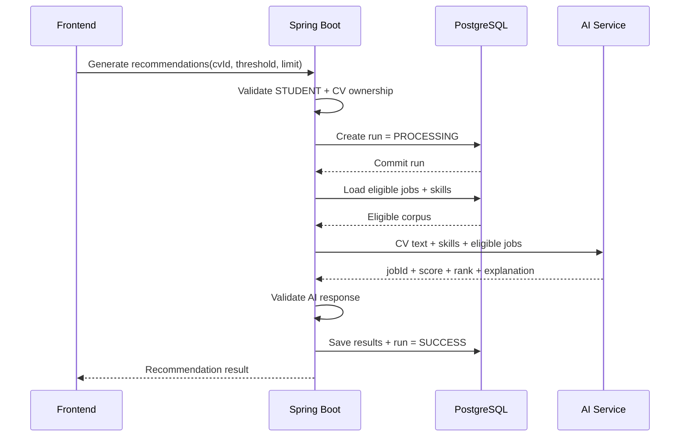

# Student Job Recommendation System

Hệ thống gợi ý việc làm dành cho sinh viên Công nghệ thông tin, sử dụng **Content-Based Filtering**, **TF-IDF** và **Cosine Similarity** để so khớp hồ sơ/CV với các tin tuyển dụng phù hợp.

Dự án được xây dựng theo hướng tách biệt rõ ràng giữa:

- **Frontend**: giao diện người dùng và tích hợp REST API.
- **BE Core**: xác thực, phân quyền, dữ liệu nghiệp vụ, transaction và API công khai.
- **Recommendation Engine**: phân tích CV, chuẩn hóa dữ liệu và tính điểm tương đồng.

> Đây là đồ án tốt nghiệp. Mục tiêu chính là xây dựng một luồng gợi ý có thể giải thích, kiểm thử được và đủ ổn định để demo end-to-end.

---

## 1. Bài toán

Sinh viên thường gặp khó khăn khi:

- Không biết tin tuyển dụng nào phù hợp với kỹ năng hiện tại.
- Phải đọc thủ công nhiều mô tả công việc.
- Không nhận ra những kỹ năng còn thiếu so với yêu cầu tuyển dụng.
- Dùng một CV cho nhiều vị trí nhưng không đánh giá được mức độ phù hợp.

Hệ thống giải quyết bài toán bằng cách biểu diễn nội dung CV và tin tuyển dụng dưới dạng vector TF-IDF, sau đó dùng Cosine Similarity để tính mức độ tương đồng.

Kết quả gợi ý bao gồm:

- Điểm phù hợp trong khoảng `0.0 - 1.0`.
- Thứ hạng công việc.
- Kỹ năng trùng khớp.
- Kỹ năng còn thiếu, khi Recommendation Engine hỗ trợ.
- Lý do gợi ý ở mức có thể giải thích.

---

## 2. Trạng thái hiện tại

| Hạng mục | Trạng thái |
|---|---|
| BE Core: Auth, User, Student, Company | Hoàn thành |
| Job, Application, CV file management | Hoàn thành |
| Public jobs/companies, saved searches, notification settings | Hoàn thành |
| PostgreSQL, Flyway, Swagger, Testcontainers | Hoàn thành |
| CV Analysis orchestration | Đang tích hợp trong PR4 |
| Recommendation orchestration | Đang tích hợp trong PR4 |
| Recommendation Engine stateless | Đang hoàn thiện contract |
| Frontend integration | Đang thực hiện song song |

Nhánh `master` hiện là baseline ổn định của BE Core sau các phần API cốt lõi. Phần Recommendation Engine được phát triển như một service độc lập và không được truy cập trực tiếp database nghiệp vụ của Spring Boot.

---

## 3. Kiến trúc tổng thể

```mermaid
flowchart LR
    FE[Frontend]\nReact / TypeScript
    BE[BE Core]\nSpring Boot 3 / Java 21
    AI[Recommendation Engine]\nFastAPI / TF-IDF / Cosine
    DB[(PostgreSQL 17)]
    FS[(Private CV Storage)]

    FE -->|REST + JWT| BE
    BE -->|JPA / Flyway| DB
    BE -->|Read / Write CV files| FS
    BE -->|Internal HTTP contract| AI
    AI -->|Scores, ranking, explanations| BE
```

### Nguyên tắc kiến trúc

**Spring Boot BE Core sở hữu:**

- JWT authentication và role authorization.
- Student/company ownership.
- PostgreSQL và Flyway migrations.
- Transaction boundaries.
- Lọc job hợp lệ.
- Lưu recommendation run và recommendation result.
- Public API contract và error mapping.

**Recommendation Engine sở hữu:**

- Trích xuất nội dung PDF/DOCX.
- Làm sạch và chuẩn hóa văn bản.
- Chuẩn hóa kỹ năng.
- TF-IDF vectorization.
- Cosine Similarity.
- Ranking và explanation.

Recommendation Engine **không** nhận JWT người dùng, không kiểm tra ownership và không đọc/ghi database chung.

---

## 4. Công nghệ sử dụng

### Backend

- Java 21
- Spring Boot 3.5.x
- Spring Web MVC
- Spring Data JPA / Hibernate
- Spring Security + JWT
- Bean Validation
- Flyway
- PostgreSQL 17
- Swagger / OpenAPI
- Maven Wrapper
- JUnit 5
- Testcontainers

### Recommendation Engine

- Python
- FastAPI
- scikit-learn
- TF-IDF
- Cosine Similarity
- PDF/DOCX text extraction

### Frontend

Frontend được phát triển song song và tích hợp thông qua REST API của BE Core. API contract chính thức nằm trong [`docs/api-contract.md`](docs/api-contract.md).

---

## 5. Chức năng chính

### Public

- Đăng ký và đăng nhập.
- Xem danh sách công ty đã xác minh.
- Xem danh sách việc làm đang hoạt động và còn hạn.
- Tìm kiếm việc làm theo từ khóa, vị trí, loại công việc và mô hình làm việc.

### Student

- Quản lý hồ sơ sinh viên.
- Quản lý kỹ năng.
- Upload, xem, tải xuống, kích hoạt và xóa CV hợp lệ.
- Ứng tuyển công việc.
- Theo dõi đơn ứng tuyển.
- Lưu việc làm.
- Lưu bộ lọc tìm kiếm.
- Cấu hình thông báo.
- Phân tích CV và tạo recommendation.

### Company

- Quản lý hồ sơ công ty.
- Tạo và quản lý tin tuyển dụng thuộc công ty.
- Xem ứng viên đã ứng tuyển.
- Xem CV của ứng viên theo quyền sở hữu.
- Lưu ứng viên tiềm năng.

### Admin

- Quản lý user.
- Xác minh hoặc khóa công ty.
- Kiểm duyệt job.
- Xem và quản lý application theo quyền admin.

---

## 6. Luồng Recommendation



Job chỉ được đưa vào corpus khi đáp ứng toàn bộ điều kiện:

- `JobStatus.ACTIVE`
- Công ty có `CompanyStatus.VERIFIED`
- `deadline` là `null`, hôm nay hoặc trong tương lai

Không giữ database transaction mở trong thời gian chờ HTTP response từ AI Service.

---

## 7. Cấu trúc repository

```text
student-job-recommendation-system/
├── backend/                    # Spring Boot BE Core
│   ├── src/main/java/
│   ├── src/main/resources/
│   │   └── db/migration/       # Flyway migrations
│   ├── src/test/               # Unit + integration tests
│   ├── pom.xml
│   └── README.md
├── docs/                       # API contract, ERD, regression guide
├── performance/                # Reproducible DB/API baseline tooling
├── docker-compose.yml          # PostgreSQL development service
└── AGENTS.md                   # Repository contribution rules
```

Các module backend chính:

```text
com.tttn.jobrecommendation
├── common
│   ├── config
│   ├── enums
│   ├── exception
│   ├── response
│   ├── security
│   └── utils
└── modules
    ├── auth
    ├── user
    ├── student
    ├── company
    ├── skill
    ├── job
    ├── application
    ├── cv
    └── recommendation
```

---

## 8. Yêu cầu môi trường

- Java 21
- Docker Desktop hoặc Docker Engine + Compose
- Git
- PowerShell trên Windows hoặc Bash trên macOS/Linux

Node.js/Python chỉ cần khi chạy frontend hoặc Recommendation Engine tương ứng.

---

## 9. Chạy BE Core local

### 9.1 Clone repository

```bash
git clone https://github.com/binkadev/student-job-recommendation-system.git
cd student-job-recommendation-system
```

### 9.2 Khởi động PostgreSQL

Từ thư mục gốc:

```bash
docker compose up -d postgres
```

Thông số development mặc định:

| Biến | Giá trị mặc định |
|---|---|
| Database | `student_job_recommendation` |
| Username | `postgres` |
| Password | `123456` |
| Port | `5432` |

Có thể override bằng file `.env`:

```env
POSTGRES_DB=student_job_recommendation
POSTGRES_USER=postgres
POSTGRES_PASSWORD=change-me
```

### 9.3 Chạy backend trên Windows

```powershell
cd backend
.\mvnw.cmd spring-boot:run -Dspring-boot.run.profiles=dev
```

### 9.4 Chạy backend trên macOS/Linux

```bash
cd backend
./mvnw spring-boot:run -Dspring-boot.run.profiles=dev
```

Backend mặc định chạy tại:

```text
http://localhost:8080
```

Swagger UI:

```text
http://localhost:8080/swagger-ui.html
```

---

## 10. Demo accounts

Khi chạy profile `dev`, hệ thống tạo dữ liệu demo theo cơ chế idempotent.

Mật khẩu chung cho tài khoản demo:

```text
123456
```

| Role | Email |
|---|---|
| Admin | `admin@example.com` |
| Student | `student@example.com` |
| Company | `company@example.com` |

> Không dùng các credentials development này trong môi trường production.

---

## 11. Biến môi trường backend

| Biến | Mục đích | Giá trị development |
|---|---|---|
| `SPRING_DATASOURCE_URL` | JDBC URL | `jdbc:postgresql://localhost:5432/student_job_recommendation` |
| `SPRING_DATASOURCE_USERNAME` | Database user | `postgres` |
| `SPRING_DATASOURCE_PASSWORD` | Database password | `123456` |
| `APP_CV_UPLOAD_DIR` | Private CV storage | `uploads/cvs` |
| `APP_JWT_SECRET` | JWT signing secret | Development default trong config |
| `APP_AI_SERVICE_BASE_URL` | AI Service base URL | `http://localhost:8000` |

Không commit secret production, token, absolute private path hoặc file `.env` thật vào repository.

---

## 12. API conventions

Tất cả JSON API trả về envelope thống nhất.

### Success

```json
{
  "success": true,
  "message": "Success",
  "errorCode": null,
  "data": {}
}
```

### Error

```json
{
  "success": false,
  "message": "Error message",
  "errorCode": "ERROR_CODE",
  "data": null
}
```

Protected API sử dụng:

```http
Authorization: Bearer <jwt>
```

Chi tiết endpoint, request/response, pagination và enum:

- [`docs/api-contract.md`](docs/api-contract.md)
- [`docs/postman-regression.md`](docs/postman-regression.md)
- Swagger UI tại `/swagger-ui.html`

---

## 13. Kiểm thử

### Fast tests

Không cần Docker hoặc PostgreSQL local:

```powershell
cd backend
.\mvnw.cmd -B -ntp test
```

### Full verification

Bao gồm PostgreSQL integration tests qua Testcontainers:

```powershell
cd backend
.\mvnw.cmd -B -ntp clean verify
```

Maven Failsafe khởi tạo PostgreSQL 17 Testcontainer, chạy Flyway migrations và kiểm tra Hibernate mappings. Test integration không sử dụng database development đang chạy local.

Trước khi tạo pull request:

```powershell
git diff --check
```

---

## 14. Security và data ownership

- Stateless JWT authentication.
- Role-based authorization: `STUDENT`, `COMPANY`, `ADMIN`.
- Student chỉ quản lý hồ sơ, CV và application của chính mình.
- Company chỉ quản lý job và application thuộc công ty của mình.
- Resource không thuộc quyền sở hữu được ẩn theo API contract để hạn chế dò tìm ID.
- Không trả `passwordHash` trong response.
- CV được lưu trong private storage và không lộ absolute path/stored filename.
- Database schema chỉ thay đổi qua Flyway migration mới.
- Không hard delete dữ liệu nghiệp vụ quan trọng nếu domain có trạng thái thay thế.

---

## 15. Tài liệu dự án

| Tài liệu | Nội dung |
|---|---|
| [`backend/README.md`](backend/README.md) | Hướng dẫn chi tiết chạy backend |
| [`docs/api-contract.md`](docs/api-contract.md) | API contract chính thức |
| [`docs/database-schema.md`](docs/database-schema.md) | Mô tả database schema |
| [`docs/database-erd.dbml`](docs/database-erd.dbml) | ERD dạng DBML |
| [`docs/postman-regression.md`](docs/postman-regression.md) | Kịch bản regression bằng API |
| [`docs/backend-performance-baseline.md`](docs/backend-performance-baseline.md) | Baseline database/API |
| [`AGENTS.md`](AGENTS.md) | Quy tắc kỹ thuật của repository |

---

## 16. Quy trình làm việc

1. Tạo branch từ `master` mới nhất.
2. Chỉ thay đổi đúng phạm vi được giao.
3. Không sửa migration cũ đã được merge.
4. Thêm migration mới khi schema cần thay đổi.
5. Giữ backward compatibility cho API đã bàn giao frontend.
6. Chạy unit test và integration test.
7. Review `git diff` trước khi commit.
8. Tạo pull request nhỏ, có mô tả và bằng chứng test.

Commit message khuyến nghị theo Conventional Commits:

```text
feat: add recommendation generation
fix: preserve CV ownership checks
test: cover eligible job corpus
docs: update AI integration contract
```

---

## 17. Roadmap gần nhất

- Hoàn thiện smoke test giữa Spring Boot và Recommendation Engine thật.
- Khóa internal AI contract v1.
- Tích hợp score thật vào frontend; loại bỏ điểm matching giả phía client.
- Bổ sung demo dataset ổn định cho Java/React/Python jobs.
- Hoàn thiện end-to-end flow: CV → Analysis → Recommendation → Application.
- Chuẩn hóa tài liệu demo và báo cáo đồ án.

Các hạng mục ngoài MVP như chat, interview workflow, 2FA, audit log mở rộng và CMS không được ưu tiên trước khi hoàn tất recommendation flow cốt lõi.

---

## 18. Phạm vi học thuật

Hệ thống tập trung vào **Content-Based Recommendation**. Điểm gợi ý phản ánh độ tương đồng nội dung giữa hồ sơ sinh viên và yêu cầu công việc; nó không đảm bảo kết quả tuyển dụng thực tế.

Những giới hạn cần được trình bày minh bạch:

- Chất lượng phụ thuộc dữ liệu CV và mô tả công việc.
- TF-IDF không hiểu đầy đủ ngữ nghĩa sâu hoặc quan hệ giữa kỹ năng.
- Kỹ năng viết khác nhau có thể cần alias normalization.
- Cold start được xử lý tốt hơn collaborative filtering vì không cần lịch sử người dùng, nhưng vẫn phụ thuộc độ đầy đủ của profile/CV.
- Recommendation không thay thế quyết định của sinh viên hoặc nhà tuyển dụng.

---

## 19. Team ownership

| Phần | Trách nhiệm chính |
|---|---|
| BE Core | API, security, database, transaction, integration tests |
| Recommendation Engine | CV parsing, NLP, TF-IDF, Cosine Similarity, ranking |
| Frontend | UX/UI, API integration, state và error handling |

Mỗi thành viên phát triển độc lập theo contract; thay đổi cross-component phải được review trước khi merge.

---

## 20. Academic use

Repository phục vụ mục đích học tập và đồ án tốt nghiệp. Chưa có giấy phép mã nguồn mở riêng; không mặc định sử dụng lại mã nguồn cho mục đích thương mại nếu chưa được nhóm tác giả cho phép.
