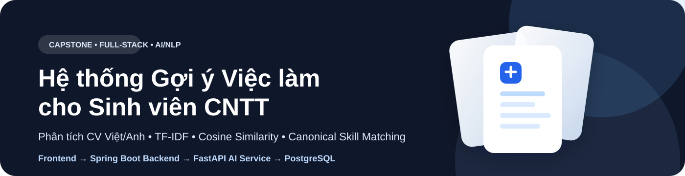
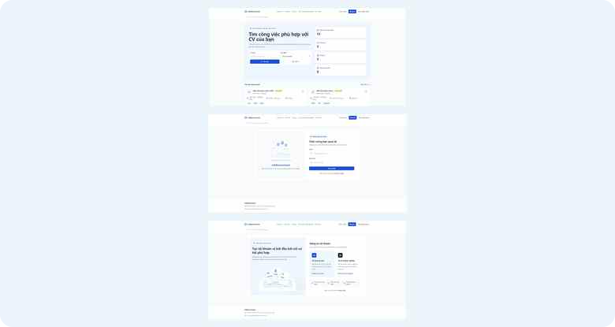
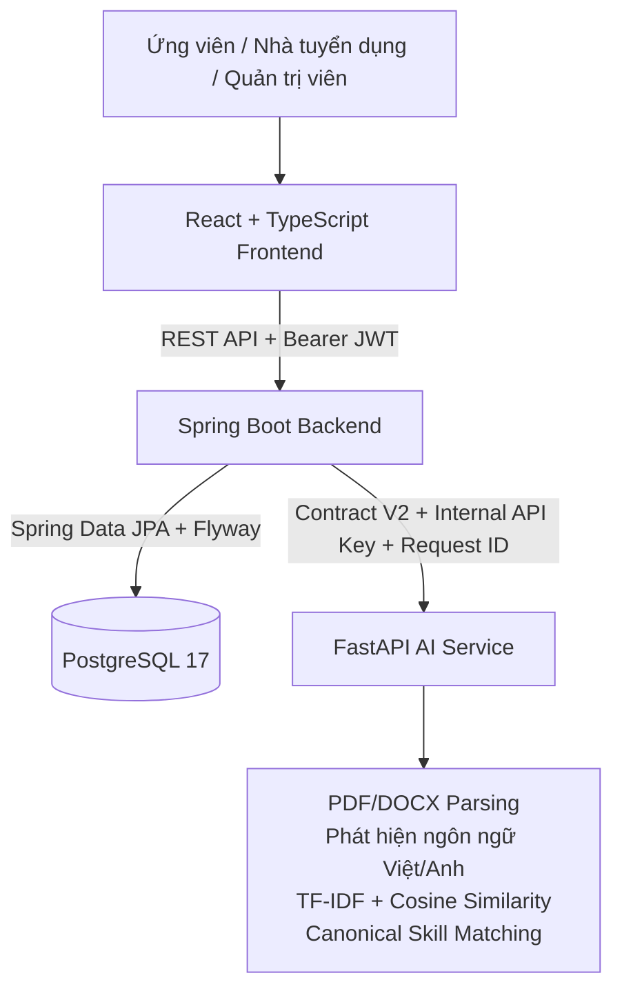
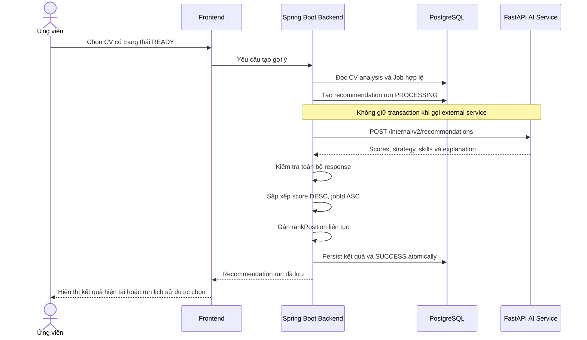

<div align="center">



<br />

[](https://github.com/binkadev/student-job-recommendation-system/actions/workflows/backend-ci.yml)
[](https://github.com/binkadev/student-job-recommendation-system/actions/workflows/ai-ci.yml)
[](https://github.com/binkadev/student-job-recommendation-system/actions/workflows/frontend-ci.yml)
[](https://github.com/binkadev/student-job-recommendation-system/actions/workflows/core-smoke-ci.yml)


### Nền tảng tuyển dụng full-stack dành cho sinh viên CNTT, doanh nghiệp và quản trị viên

**Phân tích CV song ngữ Việt/Anh và gợi ý việc làm có thể giải thích bằng TF-IDF, Cosine Similarity và đối sánh kỹ năng chuẩn hóa.**

**Core stack đã được triển khai và smoke-test · Đánh giá ranking bằng nhãn con người đang hoàn thiện · Chưa tuyên bố production-ready**

<a href="#tong-quan">Tổng quan</a> ·
<a href="#man-hinh-noi-bat">Màn hình</a> ·
<a href="#kien-truc-he-thong">Kiến trúc</a> ·
<a href="#contract-v2-va-thuat-toan-goi-y">Contract V2</a> ·
<a href="#chay-du-an">Khởi chạy</a> ·
<a href="#gap-go-tac-gia">Tác giả</a>

</div>

---

<a id="tong-quan"></a>
## 🎯 Tổng quan

**Hệ thống Gợi ý Việc làm cho Sinh viên CNTT** mô phỏng một nền tảng tuyển dụng hoàn chỉnh cho ba nhóm người dùng:

- **Ứng viên:** quản lý hồ sơ và CV, tìm kiếm việc làm, nhận gợi ý, lưu tin, ứng tuyển và theo dõi trạng thái.
- **Nhà tuyển dụng:** quản lý doanh nghiệp, tin tuyển dụng, ứng viên, pipeline và báo cáo tuyển dụng.
- **Quản trị viên:** quản lý người dùng, doanh nghiệp, tin tuyển dụng, đơn ứng tuyển, danh mục, kỹ năng và thống kê hệ thống.

Điểm khác biệt của dự án không chỉ nằm ở các màn hình CRUD. Hệ thống triển khai một pipeline gợi ý có ranh giới trách nhiệm rõ ràng:

- FastAPI AI Service xử lý PDF/DOCX, phát hiện ngôn ngữ, chuẩn hóa kỹ năng và tính các thành phần điểm.
- Spring Boot Backend là **system of record**, sở hữu xác thực, phân quyền, business rules, lọc Job hợp lệ, kiểm tra phản hồi AI, xếp hạng và persistence.
- Frontend chỉ gọi Backend, không gọi trực tiếp AI Service.
- PostgreSQL lưu trạng thái nghiệp vụ, kết quả phân tích CV và lịch sử recommendation run.

> Hệ thống sử dụng phương pháp **content-based recommendation có tính quyết định**. Dự án không tự nhận là embedding platform, vector search, mô hình ranking được huấn luyện hoặc nền tảng machine learning production.

### Giá trị nổi bật

<table>
<tr>
<td width="33%" valign="top">

#### 🧠 Gợi ý có thể giải thích

Kết quả có thể thể hiện điểm tương đồng văn bản, độ phủ kỹ năng, kỹ năng phù hợp, kỹ năng còn thiếu, chiến lược chấm điểm và lý do được gợi ý.

</td>
<td width="33%" valign="top">

#### 🌏 Song ngữ Việt/Anh

CV và Job được phát hiện ngôn ngữ độc lập. Hệ thống dùng hybrid scoring cho cùng ngôn ngữ và canonical skill matching cho trường hợp khác ngôn ngữ.

</td>
<td width="33%" valign="top">

#### 🛡️ Backend sở hữu sự thật nghiệp vụ

JWT, phân quyền, ownership, transaction, validation, sorting, `rankPosition` và persistence đều nằm tại Spring Boot Backend.

</td>
</tr>
</table>

---

<a id="man-hinh-noi-bat"></a>
## ✨ Màn hình nổi bật

> Các ảnh dưới đây được chụp từ giao diện demo hiện tại. Screenshot minh họa giao diện đã triển khai; chúng không thay thế bằng chứng E2E của một release được đóng băng.

### Featured Screens — Không gian ứng viên và hệ thống gợi ý

<div align="center">
  
</div>

Bộ màn hình thể hiện hành trình chính của ứng viên: tìm việc, quản lý CV, nhận kết quả gợi ý có giải thích và theo dõi lịch sử ứng tuyển. Đây là khu vực thể hiện rõ nhất pipeline **CV → NLP → scoring → ranking → explanation**.

### Gallery khu vực công khai và xác thực

<div align="center">
  
</div>

Luồng công khai giúp người dùng khám phá nền tảng, tìm việc, đăng nhập và lựa chọn đăng ký dưới vai trò ứng viên hoặc doanh nghiệp.

---

## 🧩 Chức năng theo vai trò

| Vai trò | Khả năng hiện có |
|---|---|
| **Ứng viên** | Hồ sơ cá nhân, quản lý nhiều CV, đặt CV active, phân tích lại CV, tìm việc, việc làm gợi ý, lưu việc, lịch sử ứng tuyển và thông báo |
| **Nhà tuyển dụng** | Hồ sơ doanh nghiệp, tạo/sửa/đóng tin, quản lý ứng viên, lưu hồ sơ, pipeline, báo cáo tuyển dụng và xuất CSV |
| **Quản trị viên** | Quản lý người dùng, doanh nghiệp, tin tuyển dụng, đơn ứng tuyển, danh mục, kỹ năng, trạng thái và thống kê hệ thống |

### Quy tắc nghiệp vụ quan trọng

- Mỗi sinh viên có tối đa một CV active; kích hoạt CV mới sẽ vô hiệu hóa CV active trước đó trong transaction.
- Recommendation chỉ được tạo từ CV có trạng thái `READY` và đủ extracted/processed text.
- Sinh viên không thể ứng tuyển cùng một Job hai lần.
- Public Job phải `ACTIVE`, thuộc Company `VERIFIED` và chưa hết hạn.
- Company chỉ được thao tác trên Job, Application, saved candidate và CV thuộc phạm vi sở hữu.
- CV đang được tham chiếu bởi Application hoặc record được bảo vệ không được xóa.
- External AI call không được giữ database transaction đang mở.
- Invalid AI response bị từ chối toàn bộ và không tạo partial persistence.
- Flyway migration đã phát hành không được chỉnh sửa; thay đổi schema phải dùng migration mới.

---

<a id="kien-truc-he-thong"></a>
## 🏗️ Kiến trúc hệ thống


```mermaid
flowchart TB
    U[Ứng viên / Nhà tuyển dụng / Quản trị viên]
    FE[React + TypeScript Frontend]
    BE[Spring Boot Backend]
    DB[(PostgreSQL 17)]
    AI[FastAPI AI Service]
    NLP[PDF/DOCX Parsing<br/>Phát hiện ngôn ngữ Việt/Anh<br/>TF-IDF + Cosine Similarity<br/>Canonical Skill Matching]

    U --> FE
    FE -->|REST API + Bearer JWT| BE
    BE -->|Spring Data JPA + Flyway| DB
    BE -->|Contract V2 + Internal API Key + Request ID| AI
    AI --> NLP
```

| Thành phần | Sở hữu | Không sở hữu |
|---|---|---|
| **Frontend** | Trải nghiệm theo vai trò, form state, gọi Backend API và trình bày runtime state | Gọi AI trực tiếp, production ranking, authorization truth |
| **Spring Boot Backend** | JWT, phân quyền, ownership, business rules, PostgreSQL, Flyway, lọc Job, AI orchestration, validation, sorting, `rankPosition`, transaction và persistence | NLP trực tiếp và semantic alias mapping song ngữ |
| **FastAPI AI Service** | Parse CV, NLP Việt/Anh, canonical skill extraction, component scores, strategy và explanation | Database, user JWT, public authorization, `rankPosition` và persistence |
| **PostgreSQL** | Dữ liệu nghiệp vụ, CV analysis và recommendation history | Secret hoặc dữ liệu evaluation private trong Git |

### Luồng tạo gợi ý


```mermaid
sequenceDiagram
    actor SV as Ứng viên
    participant FE as Frontend
    participant BE as Spring Boot Backend
    participant DB as PostgreSQL
    participant AI as FastAPI AI Service

    SV->>FE: Chọn CV có trạng thái READY
    FE->>BE: Yêu cầu tạo gợi ý
    BE->>DB: Đọc CV analysis và Job hợp lệ
    BE->>DB: Tạo recommendation run PROCESSING
    Note over BE,AI: Không giữ transaction khi gọi external service
    BE->>AI: POST /internal/v2/recommendations
    AI-->>BE: Scores, strategy, skills và explanation
    BE->>BE: Kiểm tra toàn bộ response
    BE->>BE: Sắp xếp score DESC, jobId ASC
    BE->>BE: Gán rankPosition liên tục
    BE->>DB: Persist kết quả và SUCCESS atomically
    BE-->>FE: Recommendation run đã lưu
    FE-->>SV: Hiển thị kết quả hiện tại hoặc run lịch sử được chọn
```

---

<a id="contract-v2-va-thuat-toan-goi-y"></a>
## 🧠 Contract V2 và thuật toán gợi ý

### Internal endpoints

```text
POST /internal/v2/cv/parse
POST /internal/v2/recommendations
```

### Metadata bắt buộc

```text
algorithm         = tfidf-cosine-hybrid
algorithmVersion  = bilingual-recommendation-v2
processingVersion = bilingual-nlp-v2-skills-v1
```

Mọi request tới `/internal/v2/**` phải có `X-Internal-Api-Key`. User JWT không được chuyển tiếp từ Backend sang AI Service.

### Chiến lược chấm điểm

| Cặp CV ↔ Job | Strategy | `textScore` | Điểm cuối |
|---|---|---:|---:|
| Anh ↔ Anh, Job có skills | `SAME_LANGUAGE_HYBRID` | TF-IDF Cosine Similarity | `0.65 × textScore + 0.35 × skillScore` |
| Việt ↔ Việt, Job có skills | `SAME_LANGUAGE_HYBRID` | TF-IDF Cosine Similarity | `0.65 × textScore + 0.35 × skillScore` |
| Cùng ngôn ngữ, Job không có skills | `SAME_LANGUAGE_HYBRID` | TF-IDF Cosine Similarity | `textScore` |
| Khác ngôn ngữ, mixed, unknown hoặc confidence thấp | `CROSS_LANGUAGE_SKILL_BASED` | `null` | `skillScore` |

```text
skillScore = số canonical Job skills xuất hiện trong CV
             -----------------------------------------
             tổng canonical skills của Job
```

AI Service không trả `rank` hoặc `rankPosition`. Backend kiểm tra toàn bộ phản hồi, từ chối response sai contract, sắp xếp `score DESC` rồi `jobId ASC`, gán `rankPosition` từ `1` và persist atomically.

---

## 🔐 Bảo mật và quan sát hệ thống

```text
Client -> Backend: Authorization: Bearer <JWT>
Backend -> AI:     X-Internal-Api-Key
Tracing:           X-Request-Id
```

`X-Request-Id` là metadata tracing, không phải token xác thực và độc lập với body field `requestId` của Contract V2.

Không ghi password, JWT, cookie, internal API key, request/response body, CV bytes, filename, raw CV text, processed text, storage path hoặc environment secret vào log.

---

## 🧰 Công nghệ sử dụng

| Lớp | Công nghệ chính |
|---|---|
| **Frontend** | React 18.3.1, TypeScript, Vite, React Router, Axios, React Hook Form, Zod, Tailwind CSS, Recharts |
| **Backend** | Java 21, Spring Boot 3.5.16, Spring Security, Spring Data JPA, PostgreSQL 17, Flyway, JJWT, Springdoc OpenAPI, Testcontainers |
| **AI Service** | Python 3.11.9, FastAPI 0.139.2, Pydantic, scikit-learn, underthesea, pdfplumber, python-docx, NumPy, pytest |
| **Delivery** | Docker Compose, GitHub Actions, GHCR workflow, request tracing, smoke test và offline evaluation |

---

<a id="chay-du-an"></a>
## 🚀 Chạy dự án

### Yêu cầu

- Docker Desktop và Docker Compose v2.
- Node.js `24` cho Frontend, đồng nhất với CI.
- PowerShell để chạy smoke script.
- Các port `5432`, `8000`, `8080`, `5173` đang trống.

### Khởi động core stack

```powershell
git clone https://github.com/binkadev/student-job-recommendation-system.git
cd student-job-recommendation-system

Copy-Item .env.example .env -Force
docker compose config
docker compose up --build -d
docker compose ps
```

### Chạy smoke test

```powershell
powershell -NoProfile -ExecutionPolicy Bypass -File .\scripts\smoke-core.ps1
```

Marker thành công:

```text
SMOKE RESULT: PASS
```

### Chạy Frontend

```powershell
cd frontend
npm ci
Copy-Item .env.example .env -Force
npm run dev
```

| Thành phần | URL local |
|---|---|
| Frontend | `http://localhost:5173` |
| Backend | `http://localhost:8080` |
| Swagger UI | `http://localhost:8080/swagger-ui/index.html` |
| AI health | `http://localhost:8000/health` |
| AI Swagger | `http://localhost:8000/docs` |

### Tài khoản demo

| Vai trò | Email | Mật khẩu |
|---|---|---|
| Quản trị viên | `admin@example.com` | `123456` |
| Ứng viên | `student@example.com` | `123456` |
| Nhà tuyển dụng | `company@example.com` | `123456` |

> Tài khoản chỉ dành cho local/dev. Không tái sử dụng mật khẩu demo trong staging hoặc production.

---

## ✅ Mức độ hoàn thành có evidence

| Mức độ | Trạng thái |
|---|---|
| Có source code | Có |
| Có automated tests | Có |
| Core stack có automated smoke | Có |
| Frontend đã tích hợp runtime state | Có |
| Có screenshot demo | Có |
| Full manual browser E2E có evidence đóng băng | Chưa hoàn tất |
| Human-labeled ranking metric chính thức | Chưa hoàn tất |
| Monitoring, alerting, backup/restore production | Chưa hoàn tất |
| Production-ready | **Chưa tuyên bố** |

Framework đánh giá offline đã hỗ trợ Precision@5, Recall@5, NDCG@5, các biến thể scoring, independent annotation, disagreement review và manual adjudication. Dataset toy chỉ chứng minh framework chạy đúng, không phải bằng chứng chất lượng sản phẩm.

---

## 🎓 Giá trị khi bảo vệ đồ án

Dự án phù hợp để trình bày:

- Vì sao chọn content-based recommendation thay vì embedding hoặc LLM.
- Cách biểu diễn văn bản bằng TF-IDF và tính Cosine Similarity.
- Cách xử lý hạn chế khác ngôn ngữ bằng canonical skill matching.
- Vì sao Backend phải sở hữu validation, ranking và persistence.
- Cách tránh giữ transaction khi gọi external service.
- Cách quản lý lifecycle của CV analysis và recommendation run.
- Cách phân biệt software testing với đánh giá chất lượng ranking.
- Cách bảo vệ dữ liệu CV và giữ log an toàn.

> Đây không chỉ là website tuyển dụng CRUD. Hệ thống triển khai một pipeline gợi ý song ngữ có contract rõ ràng, kết quả giải thích được, ranking có thể tái lập và ranh giới trách nhiệm giữa Frontend, Backend, AI Service và Database được kiểm soát.

---

## 📚 Tài liệu liên quan

- [AGENTS.md](AGENTS.md) — source of truth về architecture ownership và quy tắc đóng góp.
- [Backend README](backend/README.md) — setup và phạm vi Backend.
- [AI Service README](ai-service/README.md) — NLP, parsing và recommendation contract.
- [Frontend README](frontend/README.md) — setup và runtime state Frontend.
- [API Contract](docs/api-contract.md) — public API và internal Contract V2.
- [Production-readiness Plan](docs/production-readiness-plan.md) — kế hoạch còn lại.
- [Production-readiness Checklist](docs/production-readiness-checklist.md) — evidence gate.
- [Request Tracing](docs/operations/request-tracing.md) — `X-Request-Id` và safe logging.
- [Offline Evaluation](ai-service/evaluation/README.md) — dataset, metrics và annotation workflow.

---

<a id="gap-go-tac-gia"></a>
## 👨‍💻 Gặp gỡ tác giả

<div align="center">

<a href="https://github.com/binkadev">
  
</a>

### [@binkadev](https://github.com/binkadev)

**Tác giả chính · Kiến trúc hệ thống · Backend/AI Integration · Repository Maintainer**

[](https://github.com/binkadev)
[](https://github.com/binkadev/student-job-recommendation-system)

</div>

### Vai trò của tác giả

- Định hướng kiến trúc và business ownership.
- Xây dựng và kiểm soát Backend core.
- Thiết kế tích hợp Backend ↔ AI Service.
- Đóng băng Contract V2 và quy tắc scoring/ranking.
- Thiết kế production-readiness, smoke evidence và documentation.
- Duy trì repository, review thay đổi và chuẩn bị nội dung bảo vệ đồ án.

---

<div align="center">

### Xây dựng có chủ đích · Kiểm chứng bằng evidence · Trình bày trung thực

⭐ Nếu repository hữu ích, hãy đánh dấu Star để theo dõi quá trình hoàn thiện dự án.

</div>
