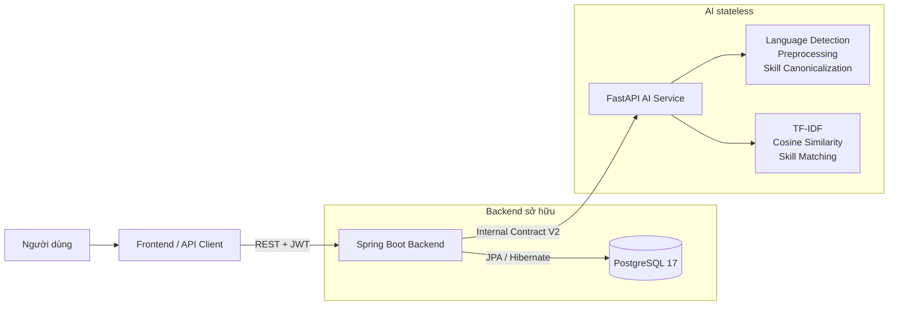
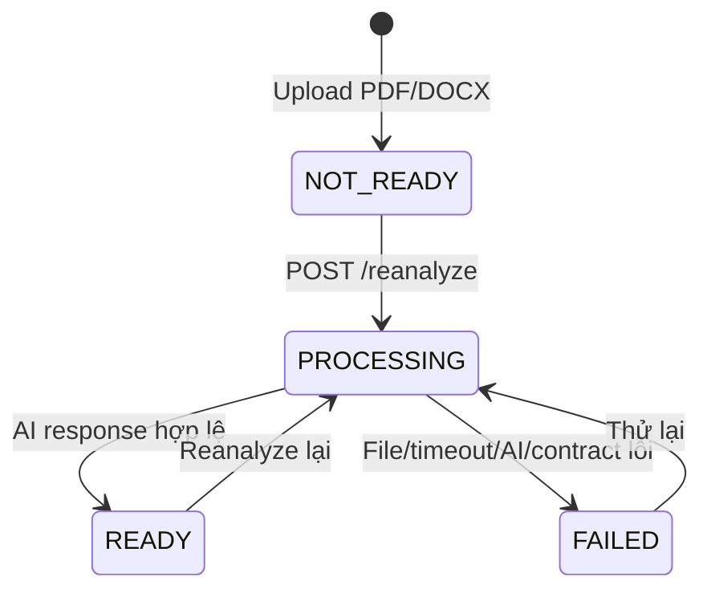

<div align="center">

# 🎯 Hệ thống Gợi ý Việc làm cho Sinh viên CNTT

**Nền tảng tuyển dụng và gợi ý việc làm dựa trên nội dung CV, hỗ trợ tiếng Việt và tiếng Anh bằng Content-Based Filtering, TF-IDF, Cosine Similarity và đối sánh kỹ năng chuẩn hóa.**

[](https://github.com/binkadev/student-job-recommendation-system/actions/workflows/backend-ci.yml)


**Đồ án Thực tập Tốt nghiệp — Giai đoạn 02 — Nhóm C01**  
Học viện Công nghệ Bưu chính Viễn thông

</div>

---

## 📌 Mục lục

- [Giới thiệu](#-giới-thiệu)
- [Trạng thái hiện tại](#-trạng-thái-hiện-tại)
- [Bài toán và đối tượng sử dụng](#-bài-toán-và-đối-tượng-sử-dụng)
- [Chức năng chính](#-chức-năng-chính)
- [Các quy tắc nghiệp vụ quan trọng](#-các-quy-tắc-nghiệp-vụ-quan-trọng)
- [Kiến trúc hệ thống](#-kiến-trúc-hệ-thống)
- [Luồng phân tích CV](#-luồng-phân-tích-cv)
- [Thuật toán gợi ý việc làm](#-thuật-toán-gợi-ý-việc-làm)
- [Công nghệ sử dụng](#-công-nghệ-sử-dụng)
- [Cấu trúc repository](#-cấu-trúc-repository)
- [Hướng dẫn chạy dự án](#-hướng-dẫn-chạy-dự-án)
- [Tài khoản demo](#-tài-khoản-demo)
- [Cấu hình môi trường](#-cấu-hình-môi-trường)
- [Tổng quan API](#-tổng-quan-api)
- [Kiểm thử và CI](#-kiểm-thử-và-ci)
- [Hiệu năng](#-hiệu-năng)
- [Bảo mật và quyền riêng tư](#-bảo-mật-và-quyền-riêng-tư)
- [Hạn chế của MVP](#-hạn-chế-của-mvp)
- [Hướng phát triển](#-hướng-phát-triển)
- [Tài liệu kỹ thuật](#-tài-liệu-kỹ-thuật)
- [Tác giả](#-tác-giả)

---

## 🌟 Giới thiệu

Dự án xây dựng một hệ thống Web hỗ trợ sinh viên Công nghệ Thông tin trong quá trình tìm kiếm và ứng tuyển việc làm. Hệ thống quản lý hồ sơ, kỹ năng, CV, việc làm, đơn ứng tuyển và sử dụng nội dung CV để đề xuất các công việc phù hợp.

Khác với cách gợi ý chỉ dựa trên từ khóa đơn giản, hệ thống kết hợp:

- nội dung văn bản của CV và tin tuyển dụng;
- tập kỹ năng chuẩn hóa của CV và công việc;
- phát hiện ngôn ngữ tiếng Việt, tiếng Anh hoặc nội dung trộn;
- chiến lược tính điểm riêng cho dữ liệu cùng ngôn ngữ và khác ngôn ngữ;
- giải thích kết quả bằng kỹ năng phù hợp, kỹ năng còn thiếu và lý do gợi ý.

Backend là **nguồn dữ liệu và nghiệp vụ chính thức**. AI Service chỉ thực hiện xử lý văn bản và tính toán, không truy cập cơ sở dữ liệu, không nhận JWT của người dùng và không quyết định thứ hạng được lưu chính thức.

---

## 🚦 Trạng thái hiện tại

Nhánh tích hợp chuẩn của dự án là **`master`**. Mọi thay đổi mới cần bắt đầu từ `master` mới nhất và được đưa trở lại thông qua Pull Request đã review.

| Thành phần | Trạng thái |
|---|---|
| Cơ sở dữ liệu và Flyway migration | ✅ Hoàn thành các phần chính, hiện đến V15 |
| Spring Boot Backend | ✅ Hoàn thành các API chính của MVP |
| AI Service Contract V2 | ✅ Đã tích hợp, hỗ trợ Việt–Anh |
| Phân tích PDF/DOCX | ✅ Đã triển khai và kiểm thử |
| Thuật toán gợi ý | ✅ Đã triển khai công thức và contract |
| Backend CI | ✅ Có GitHub Actions |
| AI Service CI | ⚠️ Chưa có workflow riêng |
| Frontend trên `master` | ⚠️ Chưa có mã nguồn frontend chạy được; thư mục hiện chỉ còn file placeholder |
| Prototype frontend lịch sử | ⚠️ Tồn tại trong PR #1 đã đóng, sử dụng mock data và chưa được merge |
| Kiểm thử end-to-end toàn hệ thống | ⚠️ Chưa hoàn tất |
| Đánh giá Precision@K / Recall@K / NDCG@K | ⚠️ Chưa thực hiện đầy đủ |

> **Lưu ý:** Không được xem prototype frontend lịch sử là bằng chứng hệ thống đã tích hợp end-to-end. Các tuyên bố về giao diện phải được xác nhận lại bằng mã nguồn hiện có trên nhánh chuẩn và bằng chứng chạy thực tế.

---

## 🎓 Bài toán và đối tượng sử dụng

### Sinh viên

- Quản lý thông tin cá nhân, hồ sơ học tập và định hướng nghề nghiệp.
- Quản lý kỹ năng và mức độ thành thạo.
- Tải lên, xem, chọn CV active và yêu cầu phân tích lại CV.
- Tìm kiếm, lưu, ứng tuyển và theo dõi trạng thái đơn ứng tuyển.
- Tạo và xem lịch sử gợi ý việc làm theo CV.
- Xem điểm phù hợp, kỹ năng phù hợp, kỹ năng còn thiếu và lý do gợi ý.

### Doanh nghiệp

- Quản lý hồ sơ công ty.
- Tạo, chỉnh sửa, gửi duyệt và đóng tin tuyển dụng.
- Xem danh sách ứng viên thuộc các tin do công ty quản lý.
- Xem file CV thông qua application thuộc quyền sở hữu.
- Cập nhật trạng thái đơn ứng tuyển.
- Lưu ứng viên tiềm năng và ghi chú tuyển dụng.

### Quản trị viên

- Quản lý tài khoản người dùng.
- Xác minh hoặc chặn doanh nghiệp.
- Quản lý trạng thái việc làm.
- Xem toàn bộ đơn ứng tuyển.
- Quản lý danh mục kỹ năng.

### Người dùng công khai

- Xem công ty đã được xác minh.
- Xem việc làm đang hoạt động và còn hạn.
- Xem thống kê tổng quan của nền tảng.

---

## 🧩 Chức năng chính

### Xác thực và phân quyền

- Đăng ký tài khoản `STUDENT` hoặc `COMPANY`.
- Đăng nhập bằng email và mật khẩu.
- Xác thực stateless bằng JWT Bearer Token.
- Kiểm soát truy cập theo vai trò `STUDENT`, `COMPANY`, `ADMIN`.
- Từ chối token của tài khoản `INACTIVE` hoặc `BLOCKED`.
- Đổi mật khẩu sau khi xác nhận mật khẩu hiện tại.

### Hồ sơ và kỹ năng sinh viên

- Cập nhật thông tin sinh viên và hồ sơ mở rộng.
- Quản lý danh sách kỹ năng theo cơ chế thay thế toàn bộ.
- Lưu mức độ thành thạo, số năm kinh nghiệm và nguồn kỹ năng.

### Quản lý CV

- Upload PDF hoặc DOCX.
- Xem danh sách, metadata và stream file an toàn.
- Chọn một CV làm active.
- Xóa CV khi không bị application hoặc dữ liệu bảo vệ tham chiếu.
- Xem trạng thái và kết quả phân tích.
- Yêu cầu phân tích lại từ file gốc.

### Việc làm và ứng tuyển

- Tìm kiếm việc làm theo từ khóa, địa điểm, loại công việc và hình thức làm việc.
- Lưu và bỏ lưu việc làm.
- Lưu bộ lọc tìm kiếm.
- Ứng tuyển bằng một CV thuộc sở hữu của sinh viên.
- Theo dõi và cập nhật trạng thái theo đúng vai trò.

### Gợi ý việc làm

- Chọn CV đã phân tích thành công.
- Tạo một recommendation run độc lập.
- Lưu thuật toán, phiên bản, số việc làm đã quét và trạng thái chạy.
- Lưu điểm tổng, điểm văn bản, điểm kỹ năng, chiến lược, kỹ năng phù hợp, kỹ năng còn thiếu và lý do.
- Xem lịch sử, chi tiết từng lần chạy và kết quả thành công mới nhất.

### Thông báo

- Lưu thông báo trong ứng dụng.
- Đếm thông báo chưa đọc.
- Đánh dấu một hoặc toàn bộ thông báo là đã đọc.
- Quản lý cấu hình nhận thông báo theo từng loại.
- Hiện tại chỉ `APPLICATION_STATUS_CHANGED` có producer tự động.

---

## 📐 Các quy tắc nghiệp vụ quan trọng

1. **Nguồn chuẩn:** `master` là nhánh tích hợp chính thức; branch cá nhân cũ không được dùng làm nguồn nghiệp vụ.
2. **Phân quyền theo chủ sở hữu:** sinh viên chỉ thao tác dữ liệu của mình; doanh nghiệp chỉ thao tác công ty, job và application thuộc mình.
3. **Một CV active:** mỗi sinh viên chỉ có tối đa một CV active tại một thời điểm.
4. **Không ứng tuyển trùng:** một sinh viên không thể ứng tuyển cùng một việc làm hai lần.
5. **Điều kiện ứng tuyển:** job phải `ACTIVE` và chưa hết hạn.
6. **Điều kiện hiển thị public:** job phải `ACTIVE`, thuộc công ty `VERIFIED` và có deadline rỗng, hôm nay hoặc trong tương lai.
7. **Xóa CV có bảo vệ:** CV đang được application hoặc dữ liệu nghiệp vụ tham chiếu trả về `409 CV_IN_USE`.
8. **Saved Candidate:** doanh nghiệp lưu **ứng viên**, không phải lưu từng application. Unique constraint là `company_id + student_id`; `application_id` chỉ ghi nhận nguồn hồ sơ ban đầu.
9. **Dữ liệu gợi ý theo CV:** recommendation chỉ dùng snapshot phân tích đã lưu của CV được chọn và có trạng thái `READY`; không fallback sang `student_skills`.
10. **AI call ngoài transaction:** Backend không giữ database transaction trong thời gian đọc file hoặc gọi AI Service.
11. **Response AI phải được xác thực:** một kết quả sai contract làm toàn bộ run `FAILED`; không lưu kết quả một phần.
12. **Backend sở hữu ranking:** AI không trả `rank` hoặc `rankPosition`; Backend sắp xếp và gán thứ hạng chính thức.
13. **Quyền riêng tư:** API không trả password hash, đường dẫn lưu file, stored filename hoặc thư mục vật lý nội bộ.
14. **Chỉnh sửa extracted text:** endpoint tương thích vẫn tồn tại nhưng trả `501 FEATURE_NOT_SUPPORTED`; MVP không hỗ trợ sửa thủ công nội dung trích xuất.

### Định dạng response chung

```json
{
  "success": true,
  "message": "Success",
  "errorCode": null,
  "data": {}
}
```

```json
{
  "success": false,
  "message": "Error message",
  "errorCode": "ERROR_CODE",
  "data": null
}
```

Các API phân trang dùng `page` bắt đầu từ **1**:

```json
{
  "items": [],
  "page": 1,
  "size": 10,
  "totalItems": 0,
  "totalPages": 0
}
```

Ngoại lệ duy nhất là response stream file CV thành công trả raw bytes; response lỗi của các endpoint này vẫn dùng envelope JSON chuẩn.

---

## 🏗 Kiến trúc hệ thống


```mermaid
flowchart LR
    U[Người dùng] --> FE[Frontend / API Client]
    FE -->|REST + JWT| BE[Spring Boot Backend]
    BE -->|JPA / Hibernate| DB[(PostgreSQL 17)]
    BE -->|Internal Contract V2| AI[FastAPI AI Service]
    AI --> NLP[Language Detection\nPreprocessing\nSkill Canonicalization]
    AI --> REC[TF-IDF\nCosine Similarity\nSkill Matching]

    subgraph Backend sở hữu
      BE
      DB
    end

    subgraph AI stateless
      AI
      NLP
      REC
    end
```

### Backend chịu trách nhiệm

- JWT authentication và role authorization.
- Business rule, ownership và visibility.
- PostgreSQL persistence và Flyway migration.
- Quản lý file CV thông qua storage abstraction.
- Lọc eligible job corpus.
- Gọi AI Service, kiểm tra contract và chuẩn hóa lỗi.
- Quản lý trạng thái recommendation run.
- Sắp xếp, gán `rankPosition` và lưu kết quả.

### AI Service chịu trách nhiệm

- Đọc nội dung PDF và DOCX.
- Phát hiện tiếng Việt, tiếng Anh, mixed hoặc unknown.
- Tiền xử lý văn bản theo ngôn ngữ.
- Giữ các token kỹ thuật như `C++`, `C#`, `.NET`, `Node.js`, `CI/CD`.
- Trích xuất và chuẩn hóa alias kỹ năng.
- Tính `textScore`, `skillScore`, `score` và giải thích.

AI Service **không**:

- truy cập PostgreSQL;
- nhận JWT người dùng;
- quản lý quyền truy cập;
- lưu recommendation run;
- quyết định thứ hạng public chính thức.

---

## 📄 Luồng phân tích CV


```mermaid
stateDiagram-v2
    [*] --> NOT_READY: Upload PDF/DOCX
    NOT_READY --> PROCESSING: POST /reanalyze
    PROCESSING --> READY: AI response hợp lệ
    PROCESSING --> FAILED: File/timeout/AI/contract lỗi
    READY --> PROCESSING: Reanalyze lại
    FAILED --> PROCESSING: Thử lại
```

Quy trình chi tiết:

1. Sinh viên upload CV; Backend lưu file và metadata với trạng thái `NOT_READY`.
2. Upload **không tự động gọi AI Service**.
3. Khi gọi `POST /api/students/me/cv/{cvId}/reanalyze`, Backend kiểm tra ownership.
4. Backend commit trạng thái `PROCESSING` và xóa dữ liệu phân tích cũ.
5. Backend đọc lại file gốc và gửi multipart field `file` tới `POST /internal/v2/cv/parse`.
6. AI Service kiểm tra file, trích xuất văn bản, phát hiện ngôn ngữ, tiền xử lý và trích xuất kỹ năng.
7. Backend kiểm tra toàn bộ response.
8. Response hợp lệ được lưu với trạng thái `READY`; lỗi được lưu độc lập với trạng thái `FAILED` và thông báo đã làm sạch.

Một CV chỉ được dùng tạo gợi ý khi:

- thuộc sinh viên hiện tại;
- có trạng thái `READY`;
- có `extractedText` và `processedText` không rỗng.

---

## 🧠 Thuật toán gợi ý việc làm

### Contract hiện hành

- Endpoint phân tích: `POST /internal/v2/cv/parse`
- Endpoint gợi ý: `POST /internal/v2/recommendations`
- Algorithm: `tfidf-cosine-hybrid`
- Algorithm version: `bilingual-recommendation-v2`
- Processing version: `bilingual-nlp-v2-skills-v1`

Contract V1 vẫn được giữ để tương thích và regression test, nhưng Backend hiện tại gọi Contract V2.

### Dữ liệu đầu vào

Backend gửi:

- `cv.text`: nội dung gốc đã trích xuất của CV, không phải `processedText`;
- `cv.skills`: kỹ năng canonical của chính CV đó;
- corpus job hợp lệ đã được Backend lọc;
- nội dung job ghép theo thứ tự `TITLE`, `DESCRIPTION`, `REQUIREMENTS`, `SKILLS`;
- `threshold` và `limit`.

Backend không gửi JWT, mật khẩu, thông tin cá nhân không cần thiết hoặc quyền truy cập database cho AI Service.

### TF-IDF và Cosine Similarity

- `TfidfVectorizer` được fit trên corpus các job trong request.
- CV được transform vào cùng không gian vector.
- Sử dụng unigram và bigram: `ngram_range=(1, 2)`.
- Sử dụng sublinear term frequency.
- Cosine Similarity tạo `textScore` trong khoảng `[0, 1]`.

### Điểm kỹ năng

```text
skillScore = |CVSkills ∩ JobSkills| / |JobSkills|
```

Nếu job không khai báo kỹ năng:

```text
skillScore = 0
```

### Chiến lược cùng ngôn ngữ

Áp dụng cho English ↔ English hoặc Vietnamese ↔ Vietnamese khi độ tin cậy đủ cao:

```text
scoringStrategy = SAME_LANGUAGE_HYBRID
score = 0.65 × textScore + 0.35 × skillScore
```

Nếu job cùng ngôn ngữ nhưng không khai báo kỹ năng:

```text
skillScore = 0
score = textScore
```

### Chiến lược khác ngôn ngữ

Áp dụng cho English ↔ Vietnamese, Vietnamese ↔ English, mixed hoặc confidence không đủ:

```text
scoringStrategy = CROSS_LANGUAGE_SKILL_BASED
textScore = null
score = skillScore
```

### Quyền sở hữu thứ hạng

AI Service có thể sắp xếp tạm để cắt theo `limit`, nhưng không trả `rank` hoặc `rankPosition`.

Backend thực hiện thứ hạng chính thức:

```text
1. score giảm dần
2. jobId tăng dần khi bằng điểm
3. rankPosition liên tục từ 1
```

Nếu eligible corpus rỗng, Backend không gọi AI; run vẫn hoàn thành `SUCCESS` với `totalJobsScanned = 0` và `results = []`.

Endpoint latest chỉ lấy lần chạy `SUCCESS` mới nhất. Một run `FAILED` hoặc `PROCESSING` mới hơn không che mất kết quả thành công gần nhất.

---

## 🛠 Công nghệ sử dụng

| Lớp | Công nghệ | Vai trò |
|---|---|---|
| Backend | Java 21, Spring Boot 3.5.x | REST API và nghiệp vụ |
| Security | Spring Security, JWT | Xác thực và phân quyền |
| Persistence | Spring Data JPA, Hibernate | Truy cập dữ liệu |
| Database | PostgreSQL 17 | Lưu trữ dữ liệu |
| Migration | Flyway | Quản lý schema |
| API Docs | Swagger / OpenAPI | Tài liệu và kiểm thử API |
| Backend Test | JUnit, Spring Boot Test, Testcontainers | Unit và integration test |
| AI Service | Python 3.11, FastAPI | CV parsing và recommendation |
| AI Contract | Pydantic V2 | Strict validation |
| NLP | underthesea | Tiền xử lý tiếng Việt |
| Machine Learning | scikit-learn | TF-IDF và Cosine Similarity |
| File Parsing | pdfplumber, python-docx | Đọc PDF và DOCX |
| AI Test | pytest | Contract và regression test |
| Performance | k6, pg_stat_statements | Benchmark và query-count evidence |
| Local Infrastructure | Docker Compose | PostgreSQL development |

---

## 📁 Cấu trúc repository

```text
student-job-recommendation-system/
├── .github/workflows/
│   └── backend-ci.yml
├── ai-service/
│   ├── main.py
│   ├── v2/
│   ├── tests/
│   ├── resources/
│   ├── requirements.in
│   ├── requirements.lock
│   └── README.md
├── backend/
│   ├── src/main/java/com/tttn/jobrecommendation/
│   ├── src/main/resources/db/migration/
│   ├── src/test/
│   ├── pom.xml
│   └── README.md
├── docs/
│   ├── api-contract.md
│   └── postman-regression.md
├── frontend/
│   └── code FE                  # placeholder rỗng trên master hiện tại
├── performance/
│   ├── config/
│   ├── scripts/
│   ├── sql/
│   ├── results/
│   └── README.md
├── .env.example
├── AGENTS.md
├── docker-compose.yml
└── README.md
```

> Prototype React/TypeScript/Vite lịch sử nằm trong PR #1 đã đóng và chưa được merge. Khi khôi phục frontend, chỉ nên lấy thư mục frontend vào một branch mới từ `master`, sau đó thay mock/localStorage bằng API thật và kiểm thử lại toàn bộ.

---

## 🚀 Hướng dẫn chạy dự án

### Yêu cầu

- Git
- Java 21
- Python 3.11
- Docker Desktop hoặc Docker Engine có Compose v2
- PowerShell trên Windows hoặc shell tương đương trên Linux/macOS

### 1. Clone repository

```bash
git clone https://github.com/binkadev/student-job-recommendation-system.git
cd student-job-recommendation-system
git switch master
```

### 2. Chuẩn bị biến môi trường

Windows PowerShell:

```powershell
Copy-Item .env.example .env
```

Linux/macOS:

```bash
cp .env.example .env
```

Các thông tin trong `.env.example` chỉ dành cho môi trường local development.

### 3. Khởi động PostgreSQL

Tại thư mục gốc:

```powershell
docker compose up -d postgres
docker compose ps
```

Mặc định:

| Thuộc tính | Giá trị |
|---|---|
| Host | `localhost` |
| Port | `5432` |
| Database | `student_job_recommendation` |
| Username | `postgres` |
| Password | `123456` |

### 4. Cài đặt và chạy AI Service

Windows PowerShell:

```powershell
cd ai-service
py -3.11 -m venv .venv
.\.venv\Scripts\Activate.ps1
python -m pip install --upgrade pip
python -m pip install --require-hashes -r requirements.lock
python -m pip check
python -m uvicorn main:app --host 0.0.0.0 --port 8000
```

Linux/macOS:

```bash
cd ai-service
python3.11 -m venv .venv
source .venv/bin/activate
python -m pip install --upgrade pip
python -m pip install --require-hashes -r requirements.lock
python -m pip check
python -m uvicorn main:app --host 0.0.0.0 --port 8000
```

Kiểm tra:

- Health: `http://localhost:8000/health`
- OpenAPI: `http://localhost:8000/docs`

### 5. Chạy Backend

Mở terminal mới:

```powershell
cd backend
.\mvnw.cmd spring-boot:run -Dspring-boot.run.profiles=dev
```

Linux/macOS:

```bash
cd backend
./mvnw spring-boot:run -Dspring-boot.run.profiles=dev
```

Backend development profile sẽ:

- kết nối PostgreSQL local;
- chạy Flyway migration;
- dùng `ddl-auto=validate`;
- seed các tài khoản và dữ liệu demo còn thiếu;
- không reset mật khẩu, role hoặc status đã tồn tại.

Kiểm tra:

- Backend: `http://localhost:8080`
- Swagger UI: `http://localhost:8080/swagger-ui.html`
- OpenAPI JSON: `http://localhost:8080/v3/api-docs`

### 6. Dừng môi trường

```powershell
docker compose down
```

Xóa cả volume dữ liệu local khi thật sự cần reset:

```powershell
docker compose down -v
```

---

## 👤 Tài khoản demo

Tất cả tài khoản demo development dùng mật khẩu:

```text
123456
```

| Vai trò | Email |
|---|---|
| Admin | `admin@example.com` |
| Sinh viên | `student@example.com` |
| Doanh nghiệp | `company@example.com` |

> Không sử dụng tài khoản hoặc mật khẩu demo trong môi trường thật.

---

## ⚙ Cấu hình môi trường

### Backend

| Biến | Mặc định | Ý nghĩa |
|---|---|---|
| `SERVER_PORT` | `8080` | Cổng Backend |
| `SPRING_DATASOURCE_URL` | `jdbc:postgresql://localhost:5432/student_job_recommendation` | JDBC URL |
| `SPRING_DATASOURCE_USERNAME` | `postgres` | Database user |
| `SPRING_DATASOURCE_PASSWORD` | `123456` | Database password local |
| `APP_JWT_SECRET` | Development default | JWT signing secret — bắt buộc thay khi deploy |
| `APP_JWT_EXPIRATION_MS` | `86400000` | Thời gian sống access token |
| `APP_CV_UPLOAD_DIR` | `uploads/cvs` | Thư mục lưu CV |
| `APP_CV_MAX_FILE_SIZE_BYTES` | `10485760` | Giới hạn file CV phía Backend |
| `APP_AI_SERVICE_BASE_URL` | `http://localhost:8000` | URL AI Service |
| `APP_AI_SERVICE_CONNECT_TIMEOUT` | `2s` | Connect timeout |
| `APP_AI_SERVICE_READ_TIMEOUT` | `15s` | Read timeout |
| `APP_AI_RECOMMENDATION_ALGORITHM` | `tfidf-cosine-hybrid` | Tên thuật toán lưu trong run |
| `APP_AI_RECOMMENDATION_ALGORITHM_VERSION` | `bilingual-recommendation-v2` | Phiên bản thuật toán |

### AI Service

| Biến | Mặc định | Ý nghĩa |
|---|---|---|
| `AI_CV_MAX_FILE_SIZE_BYTES` | `10485760` | Giới hạn file CV Contract V2 |

CORS hiện chỉ cho phép `http://localhost:3000` và `http://localhost:5173`; cần chuyển sang cấu hình bằng environment trước khi triển khai thực tế.

---

## 🔌 Tổng quan API

### Public và Auth

| Phương thức | Endpoint | Chức năng |
|---|---|---|
| `POST` | `/api/auth/register` | Đăng ký STUDENT hoặc COMPANY |
| `POST` | `/api/auth/login` | Đăng nhập và nhận JWT |
| `GET` | `/api/auth/me` | Lấy người dùng hiện tại |
| `PATCH` | `/api/users/me/password` | Đổi mật khẩu |
| `GET` | `/api/public/jobs` | Danh sách việc làm public |
| `GET` | `/api/public/jobs/{jobId}` | Chi tiết việc làm public |
| `GET` | `/api/public/companies` | Danh sách công ty VERIFIED |
| `GET` | `/api/public/companies/{id}` | Chi tiết công ty public |
| `GET` | `/api/public/statistics` | Thống kê nền tảng |

### Sinh viên

| Nhóm | Endpoint tiêu biểu |
|---|---|
| Hồ sơ | `/api/students/me`, `/api/students/me/profile` |
| Kỹ năng | `/api/students/me/skills` |
| CV | `/api/students/me/cv`, `/active`, `/{id}`, `/{id}/file`, `/{id}/analysis`, `/{id}/reanalyze` |
| Việc làm đã lưu | `/api/students/me/saved-jobs` |
| Bộ lọc đã lưu | `/api/students/me/saved-searches` |
| Ứng tuyển | `/api/jobs/{jobId}/apply`, `/api/students/me/applications` |
| Gợi ý | `/api/students/me/recommendations/generate`, `/recommendation-runs`, `/recommendation-results/latest` |

### Doanh nghiệp

| Nhóm | Endpoint tiêu biểu |
|---|---|
| Hồ sơ công ty | `/api/companies/me` |
| Việc làm | `/api/jobs`, `/api/jobs/{id}`, `/api/jobs/{id}/status` |
| Ứng viên | `/api/companies/me/applications`, `/{applicationId}/cv/file` |
| Lưu ứng viên | `/api/companies/me/saved-candidates` |

### Quản trị viên

| Nhóm | Endpoint tiêu biểu |
|---|---|
| Người dùng | `/api/admin/users`, `/api/admin/users/{id}/status` |
| Công ty | `/api/admin/companies`, `/api/admin/companies/{id}/status` |
| Ứng tuyển | `/api/admin/applications` |
| Kỹ năng | `/api/skills` |

### AI Service nội bộ

| Phương thức | Endpoint | Trạng thái |
|---|---|---|
| `GET` | `/health` | Health và metadata |
| `POST` | `/internal/v1/cv/parse` | Tương thích V1 |
| `POST` | `/internal/v1/recommendations` | Tương thích V1 |
| `POST` | `/internal/v2/cv/parse` | Contract hiện hành |
| `POST` | `/internal/v2/recommendations` | Contract hiện hành |

Chi tiết request, response, enum, validation, ownership và error code xem tại [`docs/api-contract.md`](docs/api-contract.md).

---

## ✅ Kiểm thử và CI

### Backend fast tests

```powershell
cd backend
.\mvnw.cmd -B -ntp test
```

### Backend full integration lifecycle

Yêu cầu Docker để chạy PostgreSQL Testcontainers:

```powershell
cd backend
.\mvnw.cmd -B -ntp clean verify
```

Quá trình này kiểm tra:

- unit và API integration test;
- PostgreSQL thật qua Testcontainers;
- Flyway migration;
- Hibernate schema validation;
- ownership, security và error contract;
- AI client bằng HTTP stub có kiểm soát;
- recommendation persistence và ranking.

### AI Service

```powershell
cd ai-service
.\.venv\Scripts\Activate.ps1
python -m pip check
python -m pytest
```

Bộ test bao phủ:

- strict Pydantic V2 contract;
- đọc PDF và DOCX;
- xử lý tiếng Việt và tiếng Anh;
- canonical skill alias;
- same-language hybrid scoring;
- cross-language skill scoring;
- corpus isolation;
- deterministic ordering và explanation;
- V1 regression;
- sanitized HTTP errors.

Kết quả được ghi nhận gần nhất khi merge Contract V2 song ngữ:

```text
424 passed, 1 deprecation warning
```

Cảnh báo hiện tại liên quan đến Starlette/httpx và không làm test thất bại.

### GitHub Actions

- Có workflow `Backend CI` chạy Java 21 và `./mvnw -B -ntp clean verify`.
- Chưa có workflow tự động cho AI Service.
- Chưa có workflow frontend vì frontend chưa được tích hợp vào `master`.

---

## ⚡ Hiệu năng

Thư mục [`performance/`](performance/) chứa môi trường benchmark PostgreSQL độc lập, dataset xác định trước, k6 workload, query-count bằng `pg_stat_statements` và EXPLAIN evidence.

Nguyên tắc quan trọng:

- chỉ chạy trên database `student_job_recommendation_perf`;
- không trỏ script performance vào database development hoặc production;
- dùng PostgreSQL container và user riêng;
- tách smoke correctness, query-count và load test;
- không lưu JWT, mật khẩu hoặc secret trong kết quả.

Các tối ưu đã loại bỏ query fan-out ở danh sách việc làm, application công ty, saved jobs và recommendation runs. Chi tiết cách tái lập và evidence xem tại [`performance/README.md`](performance/README.md).

---

## 🔐 Bảo mật và quyền riêng tư

- JWT stateless và phân quyền theo role.
- Ownership được suy ra từ người dùng đã xác thực, không nhận `studentId` hoặc `companyId` tùy ý từ client ở các API cá nhân.
- Password hash không bao giờ được trả về API.
- Public company API không trả tax code, số điện thoại hoặc dữ liệu user nội bộ.
- CV được stream qua endpoint có kiểm tra ownership; không công khai đường dẫn vật lý.
- Stored filename, upload directory và absolute path không được expose.
- Doanh nghiệp chỉ xem CV thông qua application thuộc job của chính công ty.
- AI Service không nhận JWT hoặc database credential.
- Backend làm sạch thông báo lỗi trước khi lưu hoặc trả cho client.
- Không commit `.env`, `.venv`, upload runtime, build output hoặc IDE config.

> JWT hiện chưa có refresh-token persistence hoặc revocation. Access token đã cấp trước khi đổi mật khẩu vẫn hợp lệ đến khi hết hạn.

---

## ⚠ Hạn chế của MVP

- Frontend chưa được tích hợp vào nhánh `master`.
- Prototype frontend lịch sử còn sử dụng mock data và localStorage ở nhiều module.
- Chưa có kiểm thử end-to-end đầy đủ từ giao diện đến AI và database.
- Chưa có AI CI và Frontend CI.
- Docker Compose gốc mới chạy PostgreSQL, chưa orchestration toàn bộ Backend và AI Service.
- CORS vẫn hard-code các origin localhost.
- Chưa có authentication nội bộ production giữa Backend và AI Service.
- Chưa hỗ trợ OCR cho CV dạng ảnh hoặc scan.
- Chưa có hàng đợi bất đồng bộ cho CV analysis và recommendation generation.
- Chưa có cơ chế chống hai lần reanalysis đồng thời.
- Chưa có immutable snapshot đầy đủ của CV/job corpus lịch sử.
- Chưa hỗ trợ chỉnh sửa thủ công extracted text.
- `importance` và `minLevel` của job skill chưa tham gia AI V2 scoring.
- Chưa sử dụng embedding, semantic search hoặc vector database.
- Chưa có tập dữ liệu gán nhãn đủ lớn để đánh giá chất lượng ranking.
- Thông báo mới là persistent in-app, chưa có WebSocket, SSE, push hoặc email delivery.

---

## 🗺 Hướng phát triển

- [ ] Khôi phục frontend từ prototype lịch sử vào branch mới xuất phát từ `master`.
- [ ] Thay mock data/localStorage bằng Backend API thật.
- [ ] Tích hợp đúng CV analysis, application và Recommendation API.
- [ ] Thêm Frontend CI: `npm ci`, lint và build.
- [ ] Thêm AI CI: Python 3.11, lock install, `pip check`, `pytest`.
- [ ] Bật branch protection và required status checks cho `master`.
- [ ] Cấu hình CORS bằng environment.
- [ ] Bổ sung API key, mTLS hoặc network policy giữa Backend và AI Service.
- [ ] Hoàn thiện Docker Compose cho PostgreSQL, AI Service và Backend.
- [ ] Bổ sung OCR và background queue.
- [ ] Bổ sung concurrent reanalysis control.
- [ ] Đưa `importance` và `minLevel` vào contract scoring mới.
- [ ] Xây dựng dataset đánh giá và đo Precision@K, Recall@K, NDCG@K.
- [ ] Nghiên cứu sentence embedding, semantic search và vector database.
- [ ] Bổ sung realtime notification và email khi có yêu cầu nghiệp vụ.

---

## 📚 Tài liệu kỹ thuật

- [Backend README](backend/README.md)
- [AI Service README](ai-service/README.md)
- [API Contract](docs/api-contract.md)
- [Postman Regression](docs/postman-regression.md)
- [Performance Environment](performance/README.md)
- [Quy tắc đóng góp và source of truth](AGENTS.md)

---

## 👥 Tác giả

| Sinh viên | Mã sinh viên |
|---|---|
| **Đào Xuân Bảo** | `N22DCCN005` |
| **Đỗ Thị Diễm Thi** | `N22DCCN079` |
| **Trần Hoàng Hải** | `N22DCCN124` |

- **Nhóm:** C01
- **Giảng viên hướng dẫn:** Bùi Tiến Đức
- **Đơn vị:** Học viện Công nghệ Bưu chính Viễn thông
- **Giai đoạn báo cáo:** 02
- **Thời gian:** Tháng 07/2026

---

## 🤝 Quy ước đóng góp

1. Cập nhật local `master` trước khi bắt đầu.
2. Tạo branch theo mục đích: `feat/`, `fix/`, `docs/`, `test/`, `perf/`, `chore/`.
3. Không sửa migration Flyway đã phát hành; luôn thêm migration mới.
4. Không thay đổi nghiệp vụ ngoài phạm vi PR.
5. Không expose secret, file path nội bộ hoặc dữ liệu riêng tư.
6. Chạy test phù hợp trước khi mở Pull Request.
7. Mô tả rõ contract, migration, backward compatibility và cách kiểm thử.
8. Chỉ merge khi review và CI đạt yêu cầu.

---

<div align="center">

**Dự án phục vụ mục đích học tập và nghiên cứu. Chưa sẵn sàng cho môi trường production nếu chưa xử lý đầy đủ các giới hạn bảo mật, hạ tầng và kiểm thử nêu trên.**

</div>
