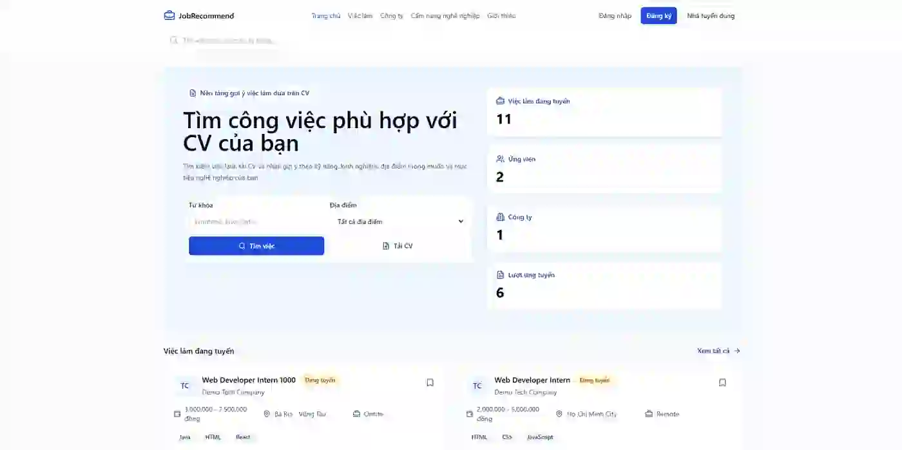
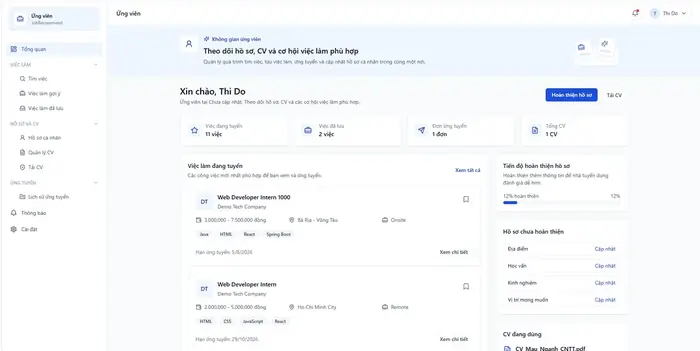
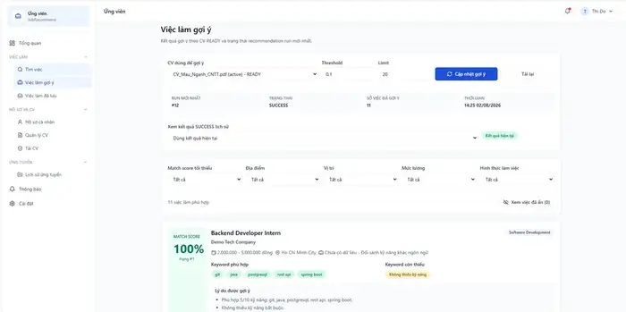
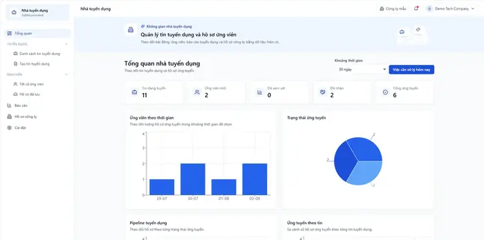
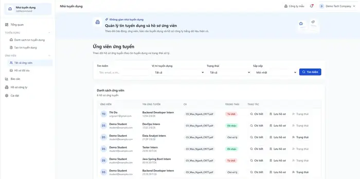
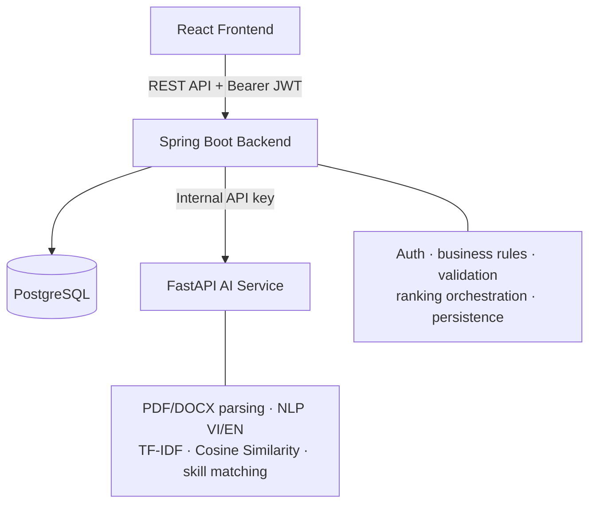

<div align="center">

# Student Job Recommendation System

### Hệ thống hỗ trợ tuyển dụng cho sinh viên CNTT với xử lý CV song ngữ và xếp hạng có thể giải thích

**React + TypeScript · Spring Boot · FastAPI · PostgreSQL · TF-IDF · Cosine Similarity · Canonical Skills**

[](https://github.com/binkadev/student-job-recommendation-system/actions/workflows/backend-ci.yml)
[](https://github.com/binkadev/student-job-recommendation-system/actions/workflows/ai-ci.yml)
[](https://github.com/binkadev/student-job-recommendation-system/actions/workflows/frontend-ci.yml)



</div>

## Tổng quan

Student Job Recommendation System là đồ án full-stack hỗ trợ hành trình tuyển dụng của sinh viên CNTT, doanh nghiệp và quản trị viên. Hệ thống nhận CV PDF/DOCX, phân tích tiếng Việt hoặc tiếng Anh, chuẩn hóa kỹ năng, gợi ý công việc cho sinh viên và xếp hạng các ứng viên đã nộp vào một tin tuyển dụng.

Spring Boot Backend là nguồn quyết định nghiệp vụ và dữ liệu chính: xác thực, phân quyền, kiểm tra ownership/eligibility, điều phối AI, kiểm tra phản hồi, thứ tự chính thức, thứ hạng và persistence. FastAPI AI Service là dịch vụ tính toán stateless: không truy cập PostgreSQL, không nhận JWT người dùng và không tự quyết định thứ hạng chính thức.

Kết quả xếp hạng chỉ hỗ trợ sàng lọc; không thay thế đánh giá của con người trong tuyển dụng.

## Bài toán và điểm nổi bật

Đồ án áp dụng Content-Based Filtering cho bài toán ghép nối Student ↔ Job. Thay vì dùng embeddings, transformer hay LLM ranking, hệ thống dùng biểu diễn văn bản đã tiền xử lý, TF-IDF, Cosine Similarity và đối sánh canonical skills để tạo kết quả có thể diễn giải.

- Phân tích CV PDF/DOCX song ngữ Việt/Anh và lưu snapshot phân tích.
- Chuẩn hóa kỹ năng theo catalog/alias để giảm khác biệt cách viết.
- Recommendation V3 phân biệt rõ kết quả phù hợp tổng thể và kết quả chỉ đối sánh kỹ năng.
- Candidate Ranking V3 chỉ xếp hạng corpus Application của một Job, theo CV đã nộp cùng Application.
- Backend kiểm tra nghiêm ngặt contract AI trước khi lưu kết quả, giữ thứ tự deterministic và lịch sử các lần chạy.
- Có automated tests, CI và các runner Real API/stack E2E cho hai luồng ranking V3.

## Giao diện

<p align="center">
  
  <br /><strong>Dashboard sinh viên và trạng thái hồ sơ</strong>
</p>

<table>
<tr>
<td width="50%" valign="top">
  
  <p align="center"><strong>Quản lý CV và trạng thái phân tích</strong></p>
</td>
<td width="50%" valign="top">
  
  <p align="center"><strong>Gợi ý việc làm từ CV được chọn</strong></p>
</td>
</tr>
<tr>
<td width="50%" valign="top">
  
  <p align="center"><strong>Dashboard tuyển dụng</strong></p>
</td>
<td width="50%" valign="top">
  
  <p align="center"><strong>Ứng viên và CV đã nộp</strong></p>
</td>
</tr>
</table>

## Kiến trúc hệ thống


```mermaid
flowchart TD
    FE[React Frontend] -->|REST API + Bearer JWT| BE[Spring Boot Backend]
    BE --> DB[(PostgreSQL)]
    BE -->|Internal API key| AI[FastAPI AI Service]
    BE --- B1[Auth · business rules · validation<br/>ranking orchestration · persistence]
    AI --- A1[PDF/DOCX parsing · NLP VI/EN<br/>TF-IDF · Cosine Similarity · skill matching]
```

- Frontend chỉ gọi Backend. Backend áp dụng JWT, authorization theo role, ownership và các quy tắc nghiệp vụ.
- Backend gọi AI bằng internal API key và request ID. Lời gọi AI không chạy trong database transaction đang mở.
- AI xử lý parsing/preprocessing, phát hiện ngôn ngữ cho Job, tính điểm thành phần và trả dữ liệu kỹ thuật. Backend xác thực dữ liệu đó trước khi persistence.
- AI không có quyền truy cập database và không trả `rankPosition` hoặc `tierRankPosition` chính thức.

## Công nghệ

| Lớp | Công nghệ |
|---|---|
| Frontend | React 18, TypeScript, Vite, React Router, Axios, React Hook Form, Zod, Tailwind CSS, Vitest |
| Backend | Java 21, Spring Boot 3.5, Spring Security/JWT, Spring Data JPA, Hibernate, Flyway, Springdoc OpenAPI, Testcontainers |
| AI/NLP | Python 3.11, FastAPI, Pydantic, scikit-learn, underthesea, pdfplumber, python-docx, pytest |
| Dữ liệu và hạ tầng | PostgreSQL 17, Docker Compose, GitHub Actions |

## Chức năng theo vai trò

| Vai trò | Chức năng đã có |
|---|---|
| Sinh viên | Quản lý profile, kỹ năng và custom skill; upload/phân tích CV; chọn CV để tạo recommendation; xem kết quả theo tier; tìm/lưu Job; ứng tuyển, xem lịch sử và ứng tuyển lại sau khi bị từ chối; quản lý CV theo trạng thái có thể xóa. |
| Doanh nghiệp | Quản lý hồ sơ công ty và Job thuộc sở hữu; xem Application, thay đổi trạng thái theo flow hiện có; tạo Candidate Ranking V3, cấu hình giới hạn từng tier, xem lịch sử và hạng trong tier. |
| Quản trị viên | Quản lý người dùng, công ty, Job, Application, danh mục/kỹ năng và các thống kê theo các endpoint quản trị hiện có. |
| Khách | Xem Job/công ty công khai, đăng ký và đăng nhập. |

## Student Recommendation V3

Endpoint công khai dành cho sinh viên:

```http
POST /api/students/me/recommendations/generate
```

```json
{
  "cvId": 10,
  "threshold": 0.3,
  "limit": 20
}
```

Sinh viên chọn `cvId` cho từng lần chạy; recommendation không buộc phải dùng CV đang được đánh dấu hoạt động. `limit` là một giới hạn toàn cục từ 1 đến 100; request này không có giới hạn tách riêng theo tier.

### CV sẵn sàng cho V3

CV được chấm điểm khi snapshot phân tích đã lưu thỏa tất cả điều kiện:

- `status = READY`;
- `processedText` không rỗng;
- có `languageCode` và `languageConfidence` hợp lệ trong khoảng 0–1;
- `processingVersion = bilingual-nlp-v2-skills-v1`.

`extractedText` không phải đầu vào hay điều kiện readiness của scoring V3. V3 dùng `processedText`, canonical/extracted skills và metadata ngôn ngữ đã persist; không phát hiện ngôn ngữ hay tiền xử lý lại nội dung CV.

### Hai tier và ý nghĩa điểm

| Tier | Strategy | Điểm và nhãn hiển thị |
|---|---|---|
| PRIMARY | `SAME_LANGUAGE_HYBRID` | `rankingScore = overallScore`; UI hiển thị **Phù hợp tổng thể** và **Match Score**. |
| FALLBACK | `CROSS_LANGUAGE_SKILL_BASED` | `overallScore = null`, `textScore = null`, `rankingScore = skillScore`; UI hiển thị **Đối sánh kỹ năng** và **Skill Match**. |

Với PRIMARY có canonical skills của Job:

```text
overallScore = 0.65 × textScore + 0.35 × skillScore
rankingScore = overallScore
```

Nếu Job không có canonical skills, `skillScore = 0` và `overallScore = rankingScore = textScore`. Với FALLBACK, `skillScore` là mức phủ các kỹ năng canonical được Job khai báo. **Skill Match 100% không đồng nghĩa hồ sơ phù hợp tổng thể 100%.**

Backend sắp xếp mỗi tier theo `rankingScore` giảm dần, sau đó `jobId` tăng dần; PRIMARY luôn đứng trước FALLBACK, rồi mới áp dụng một `limit` toàn cục. `rankPosition` là thứ hạng trong toàn bộ danh sách; `tierRankPosition` bắt đầu lại trong từng tier. Do hai tier mang hai ngữ nghĩa khác nhau, không diễn giải hoặc so sánh trực tiếp điểm của PRIMARY và FALLBACK như một thang điểm tổng thể duy nhất.

### Kết quả lịch sử

Một số record cũ có thể có `rankingTier = null` và `tierRankPosition = null`. Frontend hiển thị chúng là **Kết quả lịch sử** với **Điểm lịch sử**. Backend không tự gán các record này thành PRIMARY hoặc FALLBACK.

## Company Candidate Ranking V3

Candidate Ranking chỉ xét các Application của Job thuộc doanh nghiệp đang đăng nhập.

```http
POST /api/companies/me/jobs/{jobId}/candidate-ranking-runs
```

```json
{
  "threshold": 0.3,
  "primaryLimit": 20,
  "fallbackLimit": 20
}
```

`threshold` nằm trong 0–1. Mỗi tier limit nằm trong 0–100 và tổng hai limit phải nằm trong 1–100. Ví dụ hợp lệ: `50 / 0`, `0 / 50`, `20 / 20`; không hợp lệ: `0 / 0`, `60 / 60`. Trường `limit` đơn lẻ không thuộc public create request V3.

Candidate đủ điều kiện là Application `PENDING` hoặc `REVIEWED`, với đúng CV đã submit cùng Application. Các Application `ACCEPTED`, `REJECTED`, `WITHDRAWN`, CV thiếu hoặc snapshot CV chưa sẵn sàng bị loại. Candidate V3 dùng `processedText`, skills canonical, metadata ngôn ngữ và processing version đã persist của CV nộp kèm; không thay bằng CV đang hoạt động hiện tại, không dùng profile text, không reparse CV và không phụ thuộc vào `extractedText`.

AI phát hiện/preprocess Job một lần. Với PRIMARY, AI fit một shared TF-IDF vectorizer trên corpus `processedText` của các candidate cùng ngôn ngữ, transform Job một lần rồi tính cosine similarity. Với FALLBACK, AI dùng đối sánh kỹ năng. Backend kiểm tra toàn bộ phản hồi, áp dụng top-K độc lập:

```text
PRIMARY: lọc theo threshold → rankingScore DESC, applicationId ASC → primaryLimit
FALLBACK: lọc theo threshold → rankingScore DESC, applicationId ASC → fallbackLimit
```

`tierRankPosition` được đánh độc lập cho từng tier. `rankPosition` vẫn được lưu theo thứ tự deterministic phục vụ audit: toàn bộ PRIMARY trước, sau đó FALLBACK. Lịch sử V3 lưu `requestedLimit = null`, `requestedPrimaryLimit` và `requestedFallbackLimit`; các run V2 lịch sử giữ `requestedLimit` theo semantics cũ.

## Quy tắc nghiệp vụ quan trọng

### Ứng tuyển lại

Lịch sử Application luôn được giữ. Quy tắc dựa trên Application mới nhất của sinh viên với Job:

| Trạng thái | Kết quả |
|---|---|
| Chưa có lịch sử | Được ứng tuyển. |
| `REJECTED` | Được ứng tuyển lại; tạo Application `PENDING` mới, không cập nhật record bị từ chối cũ. |
| `PENDING`, `REVIEWED`, `ACCEPTED`, `WITHDRAWN` | Bị chặn. |

Database cũng bảo vệ uniqueness của Application đang xử lý; trường hợp tranh chấp trả `APPLICATION_ALREADY_ACTIVE`.

### Kỹ năng tùy chỉnh

`PUT /api/students/me/skills` persist kỹ năng ở Backend. Mỗi item dùng đúng một trong hai hình thức:

- Kỹ năng có sẵn trong catalog: `skillId` cùng `proficiencyLevel`, `yearsOfExperience`, `source`.
- Kỹ năng tùy chỉnh: `skillName`, `category` cùng `proficiencyLevel`, `yearsOfExperience`, `source`.

Backend chuẩn hóa tên, tránh trùng lặp và tạo hoặc dùng lại catalog skill một cách an toàn; custom skill không chỉ nằm trong localStorage của Frontend.

### Vòng đời và xóa CV

API CV trả `deletable` và `deleteBlockedReason`. CV bị chặn xóa khi đang được Application, Recommendation run hoặc Candidate Ranking result tham chiếu, bảo toàn tính truy vết của nghiệp vụ. Trạng thái đang hoạt động không tự nó quyết định CV có được xóa hay không. Backend kiểm tra lại khi xóa và trả `CV_IN_USE` nếu phát sinh race condition.

## Database và migrations

Flyway migrations tiếp tục phát triển schema thay vì sửa migration đã phát hành:

- `V17__add_v3_ranking_semantics.sql` bổ sung semantic fields V3 cho kết quả recommendation/candidate ranking: `overall_score` nullable, `ranking_tier`, `tier_rank_position`, ràng buộc tier/score và giới hạn tier cho Candidate Ranking run.
- `V18__allow_reapplication_after_rejection.sql` bỏ unique constraint cũ không phù hợp, cho phép giữ lịch sử bị từ chối và enforce uniqueness có điều kiện cho các Application đang xử lý (`PENDING`, `REVIEWED`, `ACCEPTED`).

Migration V17 chỉ backfill các record lịch sử có semantics đủ điều kiện; record không đầy đủ vẫn có thể không có tier semantics.

## API overview

Mọi JSON API công khai dùng `ApiResponse<T>`; endpoint tải CV là ngoại lệ trả raw file stream. Một số route chính:

| Mục đích | Route |
|---|---|
| Tạo recommendation sinh viên | `POST /api/students/me/recommendations/generate` |
| Xem recommendation mới nhất/lịch sử | `GET /api/students/me/recommendation-results/latest`, `GET /api/students/me/recommendation-runs` |
| Tạo Candidate Ranking run | `POST /api/companies/me/jobs/{jobId}/candidate-ranking-runs` |
| Xem lịch sử Candidate Ranking run | `GET /api/companies/me/jobs/{jobId}/candidate-ranking-runs` |
| Xem chi tiết Candidate Ranking run | `GET /api/companies/me/jobs/{jobId}/candidate-ranking-runs/{runId}` |
| Quản lý CV sinh viên | `/api/students/me/cv` |
| Cập nhật kỹ năng sinh viên | `PUT /api/students/me/skills` |
| Ứng tuyển Job | `POST /api/jobs/{jobId}/apply` |

Internal AI API không công khai cho browser:

```text
POST /internal/v2/cv/parse
POST /internal/v3/recommendations
POST /internal/v3/candidate-rankings
```

CV parsing vẫn dùng endpoint V2; hai luồng ranking đang dùng V3. Identifiers hiện hành là `algorithm = tfidf-cosine-hybrid`, `processingVersion = bilingual-nlp-v2-skills-v1`, Student `algorithmVersion = bilingual-recommendation-v3` và Company `algorithmVersion = bilingual-candidate-ranking-v3`.

## Kiểm thử và xác minh

Baseline chức năng được kiểm chứng trước thay đổi tài liệu tại commit `dec684d7a36fdb447291f3aeed24afae31bb9400`:

| Hạng mục | Evidence |
|---|---|
| Backend unit | 246/246 pass, 0 failure/error theo Surefire XML hiện có. |
| Backend integration | 210/210 pass, 0 failure/error theo Failsafe XML hiện có. |
| AI Service | 827/827 pass khi chạy `python -m pytest` (1 warning deprecation của Starlette). |
| Frontend | 70/70 pass trong 10 test files khi chạy `npm.cmd run test:run`. |

Repository có hai runner **Real API/stack E2E** dùng PostgreSQL + AI Service + Backend cô lập. Đây là API/stack E2E, không phải bằng chứng browser UI E2E hoàn chỉnh.

- `scripts/run-recommendation-real-e2e.ps1` assert một PRIMARY tiếng Anh và một FALLBACK tiếng Việt qua `/internal/v3/recommendations`; global rank lần lượt `1/2`, tier rank lần lượt `1/1`; FALLBACK có `overallScore = null`, `textScore = null`, `skillScore = 1.0`, `rankingScore = 1.0`.
- `scripts/run-candidate-ranking-real-e2e.ps1` tạo run với `threshold = 0`, `primaryLimit = 2`, `fallbackLimit = 1` và assert 2 PRIMARY, 1 FALLBACK cùng các tier limit độc lập qua `/internal/v3/candidate-rankings`.

Có thể chạy lại các kiểm tra chính:

```powershell
# Backend: unit + PostgreSQL integration lifecycle
cd backend
.\mvnw.cmd -B -ntp clean verify

# AI Service
cd ..\ai-service
python -m pip install --require-hashes -r requirements.lock
python -m pip check
python -m pytest

# Frontend
cd ..\frontend
npm.cmd ci
npm.cmd run test:run
npm.cmd run lint
npm.cmd run build

# Real API/stack E2E
cd ..
powershell -NoProfile -ExecutionPolicy Bypass -File .\scripts\run-recommendation-real-e2e.ps1
powershell -NoProfile -ExecutionPolicy Bypass -File .\scripts\run-candidate-ranking-real-e2e.ps1
```

## Chạy dự án

### Core stack

```powershell
git clone https://github.com/binkadev/student-job-recommendation-system.git
cd student-job-recommendation-system
Copy-Item .env.example .env
docker compose up --build -d
docker compose ps
```

Core Compose chạy PostgreSQL, AI Service và Backend.

| Dịch vụ | URL mặc định |
|---|---|
| Backend API | `http://localhost:8080/api` |
| Swagger UI | `http://localhost:8080/swagger-ui.html` |
| AI health | `http://localhost:8000/health` |
| AI docs | `http://localhost:8000/docs` |

### Frontend

```powershell
cd frontend
npm.cmd ci
Copy-Item .env.example .env.local
npm.cmd run dev
```

Vite thường chạy tại `http://localhost:5173` và proxy `/api` đến Backend. Không commit `.env`, JWT secret, password hoặc internal API key thật.

## Cấu trúc repository

```text
student-job-recommendation-system/
├── .github/workflows/       # CI workflows
├── backend/                 # Spring Boot system of record
├── ai-service/              # FastAPI AI Service stateless
│   └── evaluation/          # Công cụ đánh giá offline
├── frontend/                # React + TypeScript
├── docs/                    # Contract, runbook và evidence
├── scripts/                 # Smoke và Real API/stack E2E runners
├── performance/             # Tooling/evidence hiệu năng
├── docker-compose.yml       # Core stack
├── docker-compose.e2e.yml   # Override cho E2E cô lập
└── .env.example             # Mẫu cấu hình local
```

## Giới hạn và phạm vi

- Đây là Content-Based Filtering; chưa có Collaborative Filtering.
- Chưa dùng embeddings, vector database, deep learning hay LLM ranking.
- Chưa có tập dữ liệu relevance gán nhãn đủ lớn để kết luận Precision@K/NDCG trên dữ liệu tuyển dụng thực tế.
- CV scan/image-only chưa được hỗ trợ OCR.
- Chất lượng phụ thuộc vào parsing, language detection, canonical skill catalog và dữ liệu CV/Job đầu vào.
- Recommendation/ranking hiện synchronous, chưa có queue hoặc worker phân tán.
- Repository chưa cung cấp đầy đủ evidence để tuyên bố production-ready, vận hành ở quy mô phân tán hoặc browser E2E hoàn chỉnh cho mọi vai trò.

## Tài liệu liên quan

- [Contract Recommendation & Ranking V3](docs/recommendation-ranking-v3-contract.md)
- [Các giới hạn đã biết](docs/known-limitations.md)
