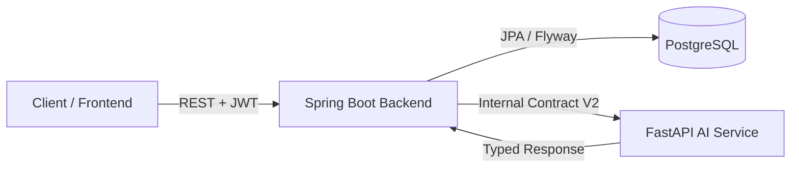
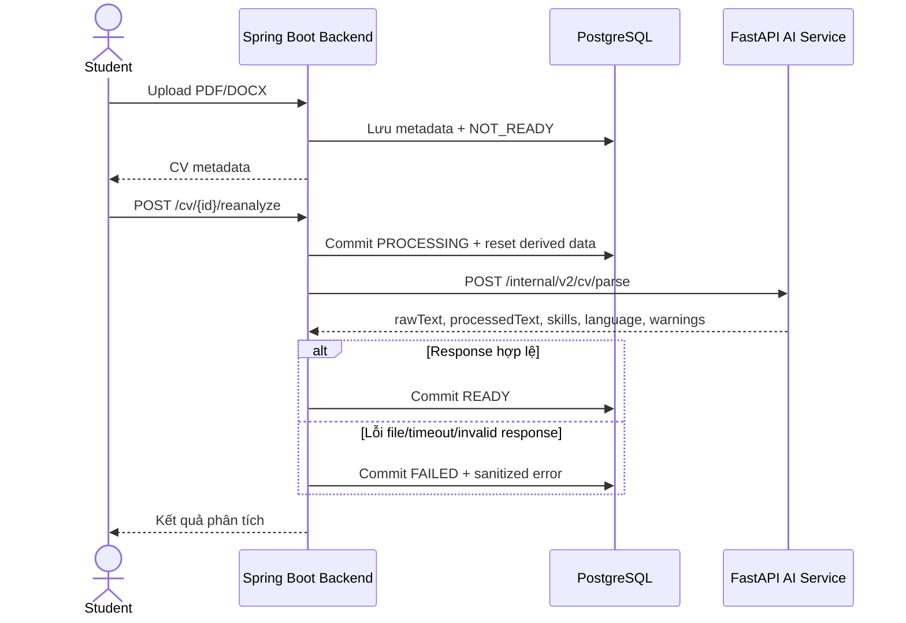

<div align="center">

# 🎯 Hệ thống Gợi ý Việc làm cho Sinh viên CNTT

**Nền tảng tuyển dụng và gợi ý việc làm dựa trên nội dung CV, hỗ trợ tiếng Việt và tiếng Anh bằng Content-Based Filtering, TF-IDF, Cosine Similarity và đối sánh kỹ năng chuẩn hóa.**

[](https://github.com/binkadev/student-job-recommendation-system/actions/workflows/backend-ci.yml)


**Phát triển bởi [Trần Hoàng Hải](https://github.com/binkadev)**

</div>

---

## 📌 Mục lục

- [Giới thiệu](#-giới-thiệu)
- [Trạng thái hiện tại](#-trạng-thái-hiện-tại)
- [Đối tượng sử dụng](#-đối-tượng-sử-dụng)
- [Chức năng chính](#-chức-năng-chính)
- [Quy tắc nghiệp vụ quan trọng](#-quy-tắc-nghiệp-vụ-quan-trọng)
- [Kiến trúc hệ thống](#-kiến-trúc-hệ-thống)
- [Luồng phân tích CV](#-luồng-phân-tích-cv)
- [Thuật toán gợi ý việc làm](#-thuật-toán-gợi-ý-việc-làm)
- [Công nghệ sử dụng](#-công-nghệ-sử-dụng)
- [Cấu trúc repository](#-cấu-trúc-repository)
- [Hướng dẫn chạy dự án](#-hướng-dẫn-chạy-dự-án)
- [Tài khoản demo](#-tài-khoản-demo)
- [Cấu hình môi trường](#-cấu-hình-môi-trường)
- [Tổng quan API](#-tổng-quan-api)
- [Kiểm thử và CI](#-kiểm-thử-và-ci)
- [Hiệu năng](#-hiệu-năng)
- [Bảo mật và quyền riêng tư](#-bảo-mật-và-quyền-riêng-tư)
- [Hạn chế của MVP](#-hạn-chế-của-mvp)
- [Hướng phát triển](#-hướng-phát-triển)
- [Tài liệu kỹ thuật](#-tài-liệu-kỹ-thuật)
- [Tác giả](#-tác-giả)

---

## 🌟 Giới thiệu

Dự án xây dựng một hệ thống Web hỗ trợ sinh viên Công nghệ Thông tin trong quá trình tìm kiếm và ứng tuyển việc làm. Hệ thống quản lý hồ sơ, kỹ năng, CV, việc làm, đơn ứng tuyển và sử dụng nội dung CV để đề xuất các công việc phù hợp.

Hệ thống kết hợp:

- nội dung văn bản của CV và tin tuyển dụng;
- tập kỹ năng chuẩn hóa của CV và công việc;
- phát hiện ngôn ngữ tiếng Việt, tiếng Anh hoặc nội dung trộn;
- chiến lược tính điểm riêng cho dữ liệu cùng ngôn ngữ và khác ngôn ngữ;
- giải thích kết quả bằng kỹ năng phù hợp, kỹ năng còn thiếu và lý do gợi ý.

Backend là **nguồn dữ liệu và nghiệp vụ chính thức**. AI Service chỉ thực hiện xử lý văn bản và tính toán, không truy cập cơ sở dữ liệu, không nhận JWT của người dùng và không quyết định thứ hạng được lưu chính thức.

---

## 🚦 Trạng thái hiện tại

Nhánh tích hợp chuẩn của dự án là **`master`**. Mọi thay đổi mới cần bắt đầu từ `master` mới nhất và được đưa trở lại thông qua Pull Request đã review.

| Thành phần | Trạng thái |
|---|---|
| Cơ sở dữ liệu và Flyway migration | ✅ Hoàn thành các phần chính, hiện đến V15 |
| Spring Boot Backend | ✅ Hoàn thành các API chính của MVP |
| AI Service Contract V2 | ✅ Đã tích hợp, hỗ trợ Việt–Anh |
| Phân tích PDF/DOCX | ✅ Đã triển khai và kiểm thử |
| Thuật toán gợi ý | ✅ Đã triển khai công thức và contract |
| Backend CI | ✅ Có GitHub Actions |
| AI Service CI | ⚠️ Chưa có workflow riêng |
| Frontend trên `master` | ⚠️ Chưa có mã nguồn frontend chạy được; thư mục hiện chỉ còn file placeholder |
| Prototype frontend lịch sử | ⚠️ Tồn tại trong PR #1 đã đóng, sử dụng mock data và chưa được merge |
| Kiểm thử end-to-end toàn hệ thống | ⚠️ Chưa hoàn tất |
| Đánh giá Precision@K / Recall@K / NDCG@K | ⚠️ Chưa thực hiện đầy đủ |

> **Lưu ý:** Prototype frontend lịch sử không phải bằng chứng hệ thống đã tích hợp end-to-end. Mọi tuyên bố về giao diện cần được xác nhận bằng source hiện có trên nhánh chuẩn và bằng chứng chạy thực tế.

---

## 👥 Đối tượng sử dụng

### Sinh viên

- Quản lý thông tin cá nhân, hồ sơ và định hướng nghề nghiệp.
- Quản lý kỹ năng và mức độ thành thạo.
- Tải lên, xem, chọn CV active và yêu cầu phân tích lại CV.
- Tìm kiếm, lưu, ứng tuyển và theo dõi trạng thái đơn ứng tuyển.
- Tạo và xem lịch sử gợi ý việc làm theo CV.
- Xem điểm phù hợp, kỹ năng phù hợp, kỹ năng còn thiếu và lý do gợi ý.

### Doanh nghiệp

- Quản lý hồ sơ công ty.
- Tạo, chỉnh sửa, gửi duyệt và đóng tin tuyển dụng.
- Xem danh sách ứng viên thuộc các tin do công ty quản lý.
- Xem file CV thông qua application thuộc quyền sở hữu.
- Cập nhật trạng thái đơn ứng tuyển.
- Lưu ứng viên tiềm năng và ghi chú tuyển dụng.

### Quản trị viên

- Quản lý tài khoản người dùng.
- Xác minh hoặc chặn doanh nghiệp.
- Quản lý trạng thái việc làm.
- Xem toàn bộ đơn ứng tuyển.
- Quản lý danh mục kỹ năng.

### Người dùng công khai

- Xem công ty đã được xác minh.
- Xem việc làm đang hoạt động và còn hạn.
- Xem thống kê tổng quan của nền tảng.

---

## 🧩 Chức năng chính

### Xác thực và phân quyền

- Đăng ký tài khoản `STUDENT` hoặc `COMPANY`.
- Đăng nhập bằng email và mật khẩu.
- Xác thực stateless bằng JWT Bearer Token.
- Kiểm soát truy cập theo vai trò `STUDENT`, `COMPANY`, `ADMIN`.
- Từ chối token của tài khoản `INACTIVE` hoặc `BLOCKED`.
- Đổi mật khẩu sau khi xác nhận mật khẩu hiện tại.

### Hồ sơ và kỹ năng sinh viên

- Cập nhật thông tin sinh viên và hồ sơ mở rộng.
- Quản lý danh sách kỹ năng theo cơ chế thay thế toàn bộ.
- Lưu mức độ thành thạo, số năm kinh nghiệm và nguồn kỹ năng.

### Quản lý CV

- Upload PDF hoặc DOCX.
- Xem danh sách, metadata và stream file an toàn.
- Chọn một CV làm active.
- Xóa CV khi không bị application hoặc dữ liệu bảo vệ tham chiếu.
- Xem trạng thái và kết quả phân tích.
- Yêu cầu phân tích lại từ file gốc.

### Việc làm và ứng tuyển

- Tìm kiếm việc làm theo từ khóa, địa điểm, loại công việc và hình thức làm việc.
- Lưu và bỏ lưu việc làm.
- Lưu bộ lọc tìm kiếm.
- Ứng tuyển bằng một CV thuộc sở hữu của sinh viên.
- Theo dõi và cập nhật trạng thái theo đúng vai trò.

### Gợi ý việc làm

- Chọn CV đã phân tích thành công.
- Tạo một recommendation run độc lập.
- Lưu thuật toán, phiên bản, số việc làm đã quét và trạng thái chạy.
- Lưu điểm tổng, điểm văn bản, điểm kỹ năng, chiến lược, kỹ năng phù hợp, kỹ năng còn thiếu và lý do.
- Xem lịch sử, chi tiết từng lần chạy và kết quả thành công mới nhất.

### Thông báo

- Lưu thông báo trong ứng dụng.
- Đếm thông báo chưa đọc.
- Đánh dấu một hoặc toàn bộ thông báo là đã đọc.
- Quản lý cấu hình nhận thông báo theo từng loại.
- Hiện tại chỉ `APPLICATION_STATUS_CHANGED` có producer tự động.

---

## 📐 Quy tắc nghiệp vụ quan trọng

1. **Nguồn chuẩn:** `master` là nhánh tích hợp chính thức; branch cá nhân cũ không được dùng làm nguồn nghiệp vụ.
2. **Phân quyền theo chủ sở hữu:** sinh viên chỉ thao tác dữ liệu của mình; doanh nghiệp chỉ thao tác công ty, job và application thuộc mình.
3. **Một CV active:** mỗi sinh viên chỉ có tối đa một CV active tại một thời điểm.
4. **Không ứng tuyển trùng:** một sinh viên không thể ứng tuyển cùng một việc làm hai lần.
5. **Điều kiện ứng tuyển:** job phải `ACTIVE` và chưa hết hạn.
6. **Điều kiện hiển thị public:** job phải `ACTIVE`, thuộc công ty `VERIFIED` và có deadline rỗng, hôm nay hoặc trong tương lai.
7. **Xóa CV có bảo vệ:** CV đang được application hoặc dữ liệu nghiệp vụ tham chiếu trả về `409 CV_IN_USE`.
8. **Saved Candidate:** doanh nghiệp lưu **ứng viên**, không phải lưu từng application. Unique constraint là `company_id + student_id`; `application_id` chỉ ghi nhận nguồn hồ sơ ban đầu.
9. **Dữ liệu gợi ý theo CV:** recommendation chỉ dùng phân tích đã lưu của CV được chọn và có trạng thái `READY`; không fallback sang `student_skills`.
10. **AI call ngoài transaction:** Backend không giữ database transaction trong thời gian đọc file hoặc gọi AI Service.
11. **Response AI phải được xác thực:** một kết quả sai contract làm toàn bộ run `FAILED`; không lưu kết quả một phần.
12. **Backend sở hữu ranking:** AI không trả `rank` hoặc `rankPosition`; Backend sắp xếp và gán thứ hạng chính thức.
13. **Quyền riêng tư:** API không trả password hash, đường dẫn lưu file, stored filename hoặc thư mục vật lý nội bộ.
14. **Chỉnh sửa extracted text:** endpoint tương thích vẫn tồn tại nhưng trả `501 FEATURE_NOT_SUPPORTED`; MVP không hỗ trợ sửa thủ công nội dung trích xuất.

### Định dạng response chung

Thành công:

```json
{
  "success": true,
  "message": "Success",
  "errorCode": null,
  "data": {}
}
```

Thất bại:

```json
{
  "success": false,
  "message": "Error message",
  "errorCode": "ERROR_CODE",
  "data": null
}
```

Các API phân trang sử dụng `page` bắt đầu từ `1`.

---

## 🏗 Kiến trúc hệ thống


```mermaid
flowchart LR
    Client[Client / Frontend]
    Backend[Spring Boot Backend]
    DB[(PostgreSQL)]
    AI[FastAPI AI Service]

    Client -->|REST + JWT| Backend
    Backend -->|JPA / Flyway| DB
    Backend -->|Internal Contract V2| AI
    AI -->|Typed Response| Backend
```

### Trách nhiệm của Backend

- Xác thực và phân quyền.
- Nghiệp vụ sinh viên, doanh nghiệp, việc làm, application, CV và thông báo.
- PostgreSQL, Flyway và transaction boundary.
- Lọc tập việc làm hợp lệ trước khi gửi sang AI.
- Gọi AI Service ngoài database transaction.
- Kiểm tra toàn bộ response AI.
- Sắp xếp, gán `rankPosition` và lưu recommendation.
- Cung cấp public API contract cho client.

### Trách nhiệm của AI Service

- Đọc file PDF và DOCX.
- Phát hiện ngôn ngữ tiếng Việt, tiếng Anh, mixed hoặc unknown.
- Tiền xử lý văn bản theo từng ngôn ngữ.
- Chuẩn hóa alias và trích xuất kỹ năng.
- Tính TF-IDF, Cosine Similarity và Skill Score.
- Trả matched skills, missing skills và reason.
- Không truy cập database.
- Không nhận JWT người dùng.
- Không lưu recommendation run.
- Không quyết định thứ hạng chính thức.

---

## 📄 Luồng phân tích CV

Upload và phân tích là hai bước riêng biệt.


```mermaid
sequenceDiagram
    actor Student
    participant BE as Spring Boot Backend
    participant DB as PostgreSQL
    participant AI as FastAPI AI Service

    Student->>BE: Upload PDF/DOCX
    BE->>DB: Lưu metadata + NOT_READY
    BE-->>Student: CV metadata

    Student->>BE: POST /cv/{id}/reanalyze
    BE->>DB: Commit PROCESSING + reset derived data
    BE->>AI: POST /internal/v2/cv/parse
    AI-->>BE: rawText, processedText, skills, language, warnings
    alt Response hợp lệ
        BE->>DB: Commit READY
    else Lỗi file/timeout/invalid response
        BE->>DB: Commit FAILED + sanitized error
    end
    BE-->>Student: Kết quả phân tích
```

Trạng thái:

```text
NOT_READY -> PROCESSING -> READY
                        -> FAILED
```

CV chỉ được dùng tạo gợi ý khi:

- thuộc sinh viên hiện tại;
- trạng thái đã lưu là `READY`;
- `extractedText` và `processedText` không rỗng.

Endpoint chỉnh sửa extracted data hiện trả:

```text
501 FEATURE_NOT_SUPPORTED
```

Reanalysis luôn đọc lại file PDF/DOCX gốc.

---

## 🧠 Thuật toán gợi ý việc làm

### Contract đang sử dụng

```text
POST /internal/v2/cv/parse
POST /internal/v2/recommendations
```

Metadata hiện tại:

```text
algorithm         = tfidf-cosine-hybrid
algorithmVersion  = bilingual-recommendation-v2
processingVersion = bilingual-nlp-v2-skills-v1
```

V1 vẫn được giữ cho mục đích tương thích và regression, nhưng Backend hiện gọi V2.

### Dữ liệu Backend gửi sang AI

Backend chỉ gửi:

- `requestId` UUID;
- nội dung gốc đã trích xuất của CV;
- kỹ năng canonical của chính CV đó;
- tập job hợp lệ đã được Backend lọc;
- `threshold`;
- `limit`.

Tập job hợp lệ gồm các job:

- có trạng thái `ACTIVE`;
- thuộc công ty `VERIFIED`;
- deadline rỗng, hôm nay hoặc trong tương lai.

JWT, database credential, salary, company identifier và dữ liệu riêng tư không được gửi sang AI Service.

### TF-IDF và Cosine Similarity

Trong chiến lược cùng ngôn ngữ:

1. AI tiền xử lý CV và từng job theo ngôn ngữ tương ứng.
2. `TfidfVectorizer` được fit trên corpus job.
3. CV được transform vào cùng không gian vector.
4. Cấu hình sử dụng unigram/bigram và sublinear term frequency.
5. Cosine Similarity tạo ra `textScore` trong khoảng `[0,1]`.

### Skill Score

```text
skillScore = số kỹ năng job xuất hiện trong CV / tổng số kỹ năng của job
```

Nếu job không khai báo kỹ năng:

```text
skillScore = 0
```

### Chiến lược cùng ngôn ngữ

```text
SAME_LANGUAGE_HYBRID
```

Khi job có skills:

```text
score = 0.65 * textScore + 0.35 * skillScore
```

Khi job không có skills:

```text
score = textScore
```

### Chiến lược khác ngôn ngữ

```text
CROSS_LANGUAGE_SKILL_BASED
```

Áp dụng khi CV và job khác ngôn ngữ hoặc confidence không đủ:

```text
textScore = null
score = skillScore
```

### Quyền sở hữu thứ hạng

AI trả:

- `jobId`;
- `score`;
- `textScore`;
- `skillScore`;
- `scoringStrategy`;
- `matchedSkills`;
- `missingSkills`;
- `reason`.

AI **không trả** `rank` hoặc `rankPosition`.

Sau khi toàn bộ response hợp lệ, Backend:

1. sắp xếp `score DESC`;
2. dùng `jobId ASC` để xử lý trường hợp bằng điểm;
3. gán `rankPosition` liên tục từ `1`;
4. lưu `recommendation_runs` và `recommendation_results`.

Nếu một phần tử vi phạm contract, toàn bộ run được chuyển thành `FAILED` và không lưu kết quả một phần.

---

## 🛠 Công nghệ sử dụng

### Backend

- Java 21
- Spring Boot 3.5.x
- Spring Security + JWT
- Spring Data JPA / Hibernate
- Flyway
- Maven
- Swagger / OpenAPI
- Testcontainers

### AI Service

- Python 3.11
- FastAPI
- Pydantic V2
- scikit-learn
- underthesea
- pdfplumber
- python-docx
- pytest

### Dữ liệu và công cụ

- PostgreSQL 17
- Docker Compose
- Postman
- k6
- `pg_stat_statements`
- GitHub Actions

---

## 📁 Cấu trúc repository

```text
student-job-recommendation-system/
├── .github/
│   └── workflows/
│       └── backend-ci.yml
├── ai-service/
│   ├── main.py
│   ├── v2/
│   ├── resources/
│   ├── tests/
│   ├── requirements.in
│   ├── requirements.lock
│   └── README.md
├── backend/
│   ├── src/main/java/
│   ├── src/main/resources/
│   │   └── db/migration/
│   ├── src/test/
│   ├── pom.xml
│   └── README.md
├── docs/
│   ├── api-contract.md
│   └── postman-regression.md
├── frontend/
│   └── code FE
├── performance/
│   ├── config/
│   ├── scripts/
│   ├── sql/
│   ├── results/
│   ├── docker-compose.yml
│   └── README.md
├── .env.example
├── AGENTS.md
├── docker-compose.yml
└── README.md
```

> `frontend/` trên `master` hiện chưa chứa ứng dụng frontend chạy được. Prototype lịch sử nằm trong PR #1 đã đóng và chưa merge.

---

## 🚀 Hướng dẫn chạy dự án

### Yêu cầu

- Java 21
- Python 3.11
- Docker Desktop hoặc Docker Engine có Compose
- Git
- PowerShell trên Windows hoặc shell tương đương

### 1. Clone repository

```bash
git clone https://github.com/binkadev/student-job-recommendation-system.git
cd student-job-recommendation-system
```

### 2. Khởi động PostgreSQL

```powershell
docker compose up -d postgres
docker compose ps
```

Giá trị development mặc định:

| Thuộc tính | Giá trị |
|---|---|
| Host | `localhost` |
| Port | `5432` |
| Database | `student_job_recommendation` |
| Username | `postgres` |
| Password | `123456` |

Các giá trị trên chỉ dành cho môi trường local.

### 3. Khởi động AI Service

```powershell
cd ai-service
py -3.11 -m venv .venv
.\.venv\Scripts\Activate.ps1
python -m pip install --upgrade pip
python -m pip install --require-hashes -r requirements.lock
python -m pip check
python -m uvicorn main:app --host 0.0.0.0 --port 8000
```

AI Service:

```text
Health:  http://localhost:8000/health
OpenAPI: http://localhost:8000/docs
```

### 4. Khởi động Backend

Mở terminal khác:

```powershell
cd backend
.\mvnw.cmd spring-boot:run -Dspring-boot.run.profiles=dev
```

Backend:

```text
Base URL:  http://localhost:8080
Swagger:   http://localhost:8080/swagger-ui.html
OpenAPI:   http://localhost:8080/v3/api-docs
```

Profile `dev` chạy demo seeder và chỉ tạo các dữ liệu còn thiếu.

### 5. Dừng database

```powershell
docker compose down
```

Xóa cả volume local khi thực sự muốn reset toàn bộ dữ liệu:

```powershell
docker compose down -v
```

---

## 🔑 Tài khoản demo

Tất cả tài khoản demo dùng mật khẩu:

```text
123456
```

| Vai trò | Email |
|---|---|
| Admin | `admin@example.com` |
| Sinh viên | `student@example.com` |
| Doanh nghiệp | `company@example.com` |

> Không sử dụng các tài khoản hoặc mật khẩu này trong production.

---

## ⚙ Cấu hình môi trường

### PostgreSQL

```powershell
$env:SPRING_DATASOURCE_URL="jdbc:postgresql://localhost:5432/student_job_recommendation"
$env:SPRING_DATASOURCE_USERNAME="postgres"
$env:SPRING_DATASOURCE_PASSWORD="123456"
```

### AI Client trong Backend

```powershell
$env:APP_AI_SERVICE_BASE_URL="http://localhost:8000"
$env:APP_AI_SERVICE_CONNECT_TIMEOUT="2s"
$env:APP_AI_SERVICE_READ_TIMEOUT="15s"
$env:APP_AI_RECOMMENDATION_ALGORITHM="tfidf-cosine-hybrid"
$env:APP_AI_RECOMMENDATION_ALGORITHM_VERSION="bilingual-recommendation-v2"
```

### Giới hạn upload AI V2

```powershell
$env:AI_CV_MAX_FILE_SIZE_BYTES="10485760"
```

Mặc định là 10 MiB.

### Lưu trữ CV

```powershell
$env:APP_CV_UPLOAD_DIR="C:\path\to\private\cv-storage"
```

Không commit `.env`, secret, upload runtime hoặc đường dẫn máy cá nhân.

---

## 🌐 Tổng quan API

### Public và xác thực

```text
POST  /api/auth/register
POST  /api/auth/login
GET   /api/auth/me
PATCH /api/users/me/password
GET   /api/public/jobs
GET   /api/public/jobs/{jobId}
GET   /api/public/companies
GET   /api/public/companies/{id}
GET   /api/public/statistics
```

### Sinh viên

```text
GET   /api/students/me
PUT   /api/students/me
GET   /api/students/me/profile
PUT   /api/students/me/profile
GET   /api/students/me/skills
PUT   /api/students/me/skills

POST  /api/students/me/saved-jobs/{jobId}
GET   /api/students/me/saved-jobs
DELETE /api/students/me/saved-jobs/{jobId}

GET   /api/students/me/saved-searches
POST  /api/students/me/saved-searches
PUT   /api/students/me/saved-searches/{savedSearchId}
DELETE /api/students/me/saved-searches/{savedSearchId}

POST  /api/students/me/cv
GET   /api/students/me/cv
GET   /api/students/me/cv/active
GET   /api/students/me/cv/{cvId}
GET   /api/students/me/cv/{cvId}/file
PATCH /api/students/me/cv/{cvId}/active
DELETE /api/students/me/cv/{cvId}
GET   /api/students/me/cv/{cvId}/analysis
POST  /api/students/me/cv/{cvId}/reanalyze

POST  /api/jobs/{jobId}/apply
GET   /api/students/me/applications
GET   /api/students/me/applications/{id}

POST  /api/students/me/recommendations/generate
GET   /api/students/me/recommendation-runs
GET   /api/students/me/recommendation-runs/{runId}
GET   /api/students/me/recommendation-results/latest
```

### Doanh nghiệp

```text
GET   /api/companies/me
PUT   /api/companies/me
GET   /api/companies/me/applications
GET   /api/companies/me/applications/{id}
GET   /api/companies/me/applications/{applicationId}/cv/file
GET   /api/companies/me/jobs/{jobId}/applications
GET   /api/companies/me/saved-candidates
POST  /api/companies/me/saved-candidates
DELETE /api/companies/me/saved-candidates/{id}
```

### Việc làm, kỹ năng và ứng tuyển

```text
GET   /api/jobs
GET   /api/jobs/{id}
POST  /api/jobs
PUT   /api/jobs/{id}
PATCH /api/jobs/{id}/status
DELETE /api/jobs/{id}
PATCH /api/applications/{id}/status

GET   /api/skills
GET   /api/skills/{id}
POST  /api/skills
PUT   /api/skills/{id}
```

### Quản trị viên

```text
GET   /api/admin/users
GET   /api/admin/users/{id}
PATCH /api/admin/users/{id}/status
GET   /api/admin/companies
GET   /api/admin/companies/{id}
PATCH /api/admin/companies/{id}/status
GET   /api/admin/applications
GET   /api/admin/applications/{applicationId}
```

### Thông báo

```text
GET   /api/notifications
GET   /api/notifications/unread-count
PATCH /api/notifications/{id}/read
PATCH /api/notifications/read-all
GET   /api/users/me/notification-settings
PUT   /api/users/me/notification-settings
```

Chi tiết request, response, enum, quyền truy cập và error code xem tại [`docs/api-contract.md`](docs/api-contract.md).

---

## 🧪 Kiểm thử và CI

### Backend

Fast test:

```powershell
cd backend
.\mvnw.cmd -B -ntp test
```

Toàn bộ lifecycle với PostgreSQL integration test:

```powershell
cd backend
.\mvnw.cmd -B -ntp clean verify
```

`clean verify` sử dụng Testcontainers, chạy PostgreSQL 17, áp dụng Flyway migration và kiểm tra Hibernate mapping.

### AI Service

```powershell
cd ai-service
.\.venv\Scripts\Activate.ps1
python -m pip check
python -m pytest
```

Bộ test bao phủ:

- strict Pydantic V2 contract;
- đọc PDF và DOCX;
- xử lý tiếng Việt và tiếng Anh;
- canonical skill alias;
- same-language hybrid scoring;
- cross-language skill scoring;
- corpus isolation;
- deterministic ordering và explanation;
- V1 regression;
- sanitized HTTP errors.

Kết quả gần nhất được ghi nhận:

```text
424 passed, 1 deprecation warning
```

Cảnh báo hiện tại liên quan đến Starlette/httpx và không làm test thất bại.

### GitHub Actions

- Có workflow `Backend CI` chạy Java 21 và `./mvnw -B -ntp clean verify`.
- Chưa có workflow tự động cho AI Service.
- Chưa có workflow frontend vì frontend chưa được tích hợp vào `master`.

---

## ⚡ Hiệu năng

Thư mục [`performance/`](performance/) chứa môi trường benchmark PostgreSQL độc lập, dataset xác định trước, k6 workload, query-count bằng `pg_stat_statements` và EXPLAIN evidence.

Nguyên tắc quan trọng:

- chỉ chạy trên database `student_job_recommendation_perf`;
- không trỏ script performance vào database development hoặc production;
- dùng PostgreSQL container và user riêng;
- tách smoke correctness, query-count và load test;
- không lưu JWT, mật khẩu hoặc secret trong kết quả.

Các tối ưu đã loại bỏ query fan-out ở danh sách việc làm, application công ty, saved jobs và recommendation runs. Chi tiết xem tại [`performance/README.md`](performance/README.md).

---

## 🔐 Bảo mật và quyền riêng tư

- JWT stateless và phân quyền theo role.
- Ownership được suy ra từ người dùng đã xác thực, không nhận `studentId` hoặc `companyId` tùy ý từ client ở các API cá nhân.
- Password hash không bao giờ được trả về API.
- Public company API không trả tax code, số điện thoại hoặc dữ liệu user nội bộ.
- CV được stream qua endpoint có kiểm tra ownership; không công khai đường dẫn vật lý.
- Stored filename, upload directory và absolute path không được expose.
- Doanh nghiệp chỉ xem CV thông qua application thuộc job của chính công ty.
- AI Service không nhận JWT hoặc database credential.
- Backend làm sạch thông báo lỗi trước khi lưu hoặc trả cho client.
- Không commit `.env`, `.venv`, upload runtime, build output hoặc IDE config.

> JWT hiện chưa có refresh-token persistence hoặc revocation. Access token đã cấp trước khi đổi mật khẩu vẫn hợp lệ đến khi hết hạn.

---

## ⚠ Hạn chế của MVP

- Frontend chưa được tích hợp vào nhánh `master`.
- Prototype frontend lịch sử còn sử dụng mock data và localStorage ở nhiều module.
- Chưa có kiểm thử end-to-end đầy đủ từ giao diện đến AI và database.
- Chưa có AI CI và Frontend CI.
- Docker Compose gốc mới chạy PostgreSQL, chưa orchestration toàn bộ Backend và AI Service.
- CORS vẫn hard-code các origin localhost.
- Chưa có authentication nội bộ production giữa Backend và AI Service.
- Chưa hỗ trợ OCR cho CV dạng ảnh hoặc scan.
- Chưa có hàng đợi bất đồng bộ cho CV analysis và recommendation generation.
- Chưa có cơ chế chống hai lần reanalysis đồng thời.
- Chưa có immutable snapshot đầy đủ của CV/job corpus lịch sử.
- Chưa hỗ trợ chỉnh sửa thủ công extracted text.
- `importance` và `minLevel` của job skill chưa tham gia AI V2 scoring.
- Chưa sử dụng embedding, semantic search hoặc vector database.
- Chưa có tập dữ liệu gán nhãn đủ lớn để đánh giá chất lượng ranking.
- Thông báo mới là persistent in-app, chưa có WebSocket, SSE, push hoặc email delivery.

---

## 🗺 Hướng phát triển

- [ ] Khôi phục frontend từ prototype lịch sử vào branch mới xuất phát từ `master`.
- [ ] Thay mock data/localStorage bằng Backend API thật.
- [ ] Tích hợp đúng CV analysis, application và Recommendation API.
- [ ] Thêm Frontend CI: `npm ci`, lint và build.
- [ ] Thêm AI CI: Python 3.11, lock install, `pip check`, `pytest`.
- [ ] Bật branch protection và required status checks cho `master`.
- [ ] Cấu hình CORS bằng environment.
- [ ] Bổ sung API key, mTLS hoặc network policy giữa Backend và AI Service.
- [ ] Hoàn thiện Docker Compose cho PostgreSQL, AI Service và Backend.
- [ ] Bổ sung OCR và background queue.
- [ ] Bổ sung concurrent reanalysis control.
- [ ] Đưa `importance` và `minLevel` vào contract scoring mới.
- [ ] Xây dựng dataset đánh giá và đo Precision@K, Recall@K, NDCG@K.
- [ ] Nghiên cứu sentence embedding, semantic search và vector database.
- [ ] Bổ sung realtime notification và email khi có yêu cầu nghiệp vụ.

---

## 📚 Tài liệu kỹ thuật

- [Backend README](backend/README.md)
- [AI Service README](ai-service/README.md)
- [API Contract](docs/api-contract.md)
- [Postman Regression](docs/postman-regression.md)
- [Performance Environment](performance/README.md)
- [Quy tắc đóng góp và source of truth](AGENTS.md)

---

## 👤 Tác giả

**Trần Hoàng Hải**  
GitHub: [@binkadev](https://github.com/binkadev)

---

## 🤝 Quy ước đóng góp

1. Cập nhật local `master` trước khi bắt đầu.
2. Tạo branch theo mục đích: `feat/`, `fix/`, `docs/`, `test/`, `perf/`, `chore/`.
3. Không sửa migration Flyway đã phát hành; luôn thêm migration mới.
4. Không thay đổi nghiệp vụ ngoài phạm vi PR.
5. Không expose secret, file path nội bộ hoặc dữ liệu riêng tư.
6. Chạy test phù hợp trước khi mở Pull Request.
7. Mô tả rõ contract, migration, backward compatibility và cách kiểm thử.
8. Chỉ merge khi review và CI đạt yêu cầu.

---

<div align="center">

**Dự án do Trần Hoàng Hải phát triển. Chưa sẵn sàng cho môi trường production nếu chưa xử lý đầy đủ các giới hạn bảo mật, hạ tầng và kiểm thử nêu trên.**

</div>
