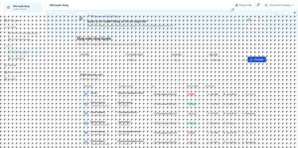
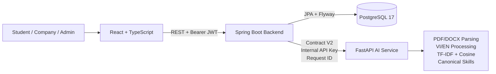
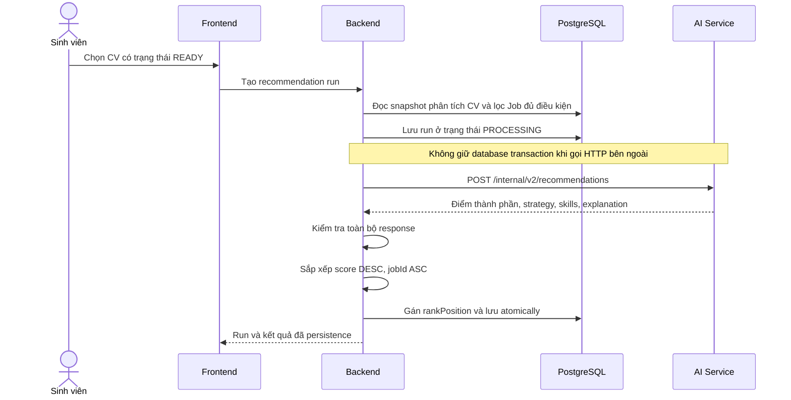

<div align="center">

# HỆ THỐNG GỢI Ý VIỆC LÀM CHO SINH VIÊN CNTT

### Nền tảng tuyển dụng full-stack có xử lý CV song ngữ, gợi ý việc làm và xếp hạng ứng viên có thể giải thích

**React + TypeScript · Spring Boot · FastAPI · PostgreSQL · TF-IDF · Cosine Similarity · Đối sánh kỹ năng chuẩn hóa**

[](https://github.com/binkadev/student-job-recommendation-system/actions/workflows/backend-ci.yml)
[](https://github.com/binkadev/student-job-recommendation-system/actions/workflows/ai-ci.yml)
[](https://github.com/binkadev/student-job-recommendation-system/actions/workflows/frontend-ci.yml)
[](https://github.com/binkadev/student-job-recommendation-system/actions/workflows/core-smoke-ci.yml)


**Core Backend–AI đã triển khai và có bằng chứng smoke/E2E · Phù hợp demo đồ án có kiểm soát · Chưa tuyên bố sẵn sàng production**

<br />

<a href="#tong-quan">Tổng quan</a> ·
<a href="#giao-dien">Giao diện</a> ·
<a href="#kien-truc">Kiến trúc</a> ·
<a href="#co-che-goi-y">Cơ chế gợi ý</a> ·
<a href="#khoi-chay">Khởi chạy</a> ·
<a href="#kiem-thu">Kiểm thử</a> ·
<a href="#trang-thai">Trạng thái</a>

<br />


</div>

---

<a id="tong-quan"></a>

## 1. Tổng quan dự án

**Student Job Recommendation System** là hệ thống tuyển dụng dành cho sinh viên CNTT, doanh nghiệp và quản trị viên. Dự án không dừng ở các màn hình CRUD: hệ thống tiếp nhận CV PDF/DOCX, phân tích nội dung tiếng Việt hoặc tiếng Anh, chuẩn hóa kỹ năng kỹ thuật, gợi ý việc làm cho sinh viên và xếp hạng ứng viên đã ứng tuyển theo từng tin tuyển dụng.

Điểm quan trọng nhất của kiến trúc là **Backend Spring Boot giữ quyền sở hữu dữ liệu và quyết định nghiệp vụ**. AI Service chỉ là dịch vụ tính toán stateless: đọc tài liệu, tiền xử lý ngôn ngữ, trích xuất kỹ năng và tính các thành phần điểm. AI Service không truy cập PostgreSQL, không nhận JWT của người dùng và không tự tạo thứ hạng chính thức.

### Giá trị kỹ thuật nổi bật

| Năng lực | Cách dự án thể hiện |
|---|---|
| **Full-stack application** | Giao diện phân quyền bằng React/TypeScript, REST API Spring Boot, PostgreSQL và FastAPI AI Service |
| **Xử lý CV thực tế** | Nhận PDF/DOCX, trích xuất văn bản, phát hiện ngôn ngữ, lưu trạng thái phân tích và dữ liệu đã chuẩn hóa |
| **NLP song ngữ có thể giải thích** | TF-IDF, Cosine Similarity, đối sánh kỹ năng chuẩn hóa, kỹ năng phù hợp/thiếu và chiến lược chấm điểm rõ ràng |
| **Thiết kế service boundary** | Frontend chỉ gọi Backend; Backend xác thực, lọc dữ liệu đủ điều kiện, gọi AI, kiểm tra toàn bộ phản hồi, xếp hạng và lưu kết quả |
| **Production-minded engineering** | Flyway, JWT, internal API key, request tracing, Docker Compose, CI, Testcontainers, smoke test và E2E harness |
| **Trung thực về bằng chứng** | Phân biệt rõ code đã có, automated test, bằng chứng chạy liên dịch vụ, giới hạn hiện tại và các hạng mục chưa hoàn thành |

> Hệ thống sử dụng thuật toán content-based xác định và có thể tái lập. Đây **không phải** mô hình học máy đã huấn luyện, hệ thống embedding, vector database hay công cụ tự động đưa ra quyết định tuyển dụng.

---

<a id="giao-dien"></a>

## 2. Giao diện hệ thống

Các ảnh được chọn từ bộ ảnh giao diện hiện tại của dự án. Ảnh minh họa phạm vi sản phẩm đã xây dựng; bằng chứng runtime và E2E được trình bày riêng trong phần kiểm thử.

<table>
<tr>
<td width="50%" valign="top">
  
  <p align="center"><strong>Sinh viên — Quản lý và phân tích CV</strong></p>
</td>
<td width="50%" valign="top">
  
  <p align="center"><strong>Doanh nghiệp — Quản lý ứng viên</strong></p>
</td>
</tr>
</table>

<p align="center">
  
  <br />
  <strong>Quản trị viên — Tổng quan hệ thống</strong>
</p>

### Phạm vi theo vai trò

| Vai trò | Chức năng chính |
|---|---|
| **Sinh viên** | Quản lý hồ sơ và kỹ năng; tải lên, kích hoạt, mở, phân tích lại và xóa CV hợp lệ; tìm kiếm/lưu việc làm; ứng tuyển; theo dõi đơn; nhận thông báo; tạo và xem lịch sử gợi ý |
| **Doanh nghiệp** | Quản lý hồ sơ công ty; tạo và quản lý tin tuyển dụng thuộc sở hữu; xem ứng viên và CV được phép; lưu hồ sơ ứng viên; theo dõi báo cáo; chạy xếp hạng ứng viên theo từng tin |
| **Quản trị viên** | Quản lý người dùng, doanh nghiệp, tin tuyển dụng, đơn ứng tuyển, danh mục, kỹ năng, trạng thái và thống kê nền tảng |
| **Khách truy cập** | Xem trang chủ, việc làm, doanh nghiệp, nội dung giới thiệu/cẩm nang; đăng ký và đăng nhập |

---

<a id="kien-truc"></a>

## 3. Kiến trúc hệ thống


```mermaid
flowchart LR
    U[Student / Company / Admin]
    FE[React + TypeScript]
    BE[Spring Boot Backend]
    DB[(PostgreSQL 17)]
    AI[FastAPI AI Service]
    NLP[PDF/DOCX Parsing<br/>VI/EN Processing<br/>TF-IDF + Cosine<br/>Canonical Skills]

    U --> FE
    FE -->|REST + Bearer JWT| BE
    BE -->|JPA + Flyway| DB
    BE -->|Contract V2<br/>Internal API Key<br/>Request ID| AI
    AI --> NLP
```

### Quyền sở hữu trách nhiệm

| Thành phần | Chịu trách nhiệm | Không chịu trách nhiệm |
|---|---|---|
| **Frontend** | Trải nghiệm theo vai trò, form state, điều hướng và hiển thị dữ liệu Backend | Gọi AI trực tiếp, phân quyền thật, xếp hạng chính thức |
| **Spring Boot Backend** | JWT, authorization, ownership, business rules, PostgreSQL, Flyway, lọc corpus, orchestration, validation, transaction, sorting, `rankPosition`, persistence | NLP trực tiếp và mapping alias ngôn ngữ |
| **FastAPI AI Service** | Parsing PDF/DOCX, phát hiện ngôn ngữ, tiền xử lý VI/EN, canonical skill, điểm thành phần và chiến lược chấm điểm | Database, JWT người dùng, public authorization, rank chính thức, persistence |
| **PostgreSQL** | Dữ liệu tuyển dụng, trạng thái phân tích CV, recommendation run và candidate ranking run | Dữ liệu đánh giá riêng tư hoặc secrets runtime trong Git |

### Ranh giới bảo mật

```text
Client -> Backend
Authorization: Bearer <JWT>

Backend -> AI Service
X-Internal-Api-Key: <shared-secret>
X-Request-Id: <safe-tracing-id>
```

Frontend không nhận hoặc gửi internal API key. JWT của người dùng không được chuyển tiếp sang AI Service. `X-Request-Id` chỉ dùng để correlation/tracing, không phải cơ chế cấp quyền.

---

<a id="co-che-goi-y"></a>

## 4. Cơ chế gợi ý và xếp hạng

### 4.1. Gợi ý việc làm cho sinh viên


```mermaid
sequenceDiagram
    actor S as Sinh viên
    participant F as Frontend
    participant B as Backend
    participant D as PostgreSQL
    participant A as AI Service

    S->>F: Chọn CV có trạng thái READY
    F->>B: Tạo recommendation run
    B->>D: Đọc snapshot phân tích CV và lọc Job đủ điều kiện
    B->>D: Lưu run ở trạng thái PROCESSING
    Note over B,A: Không giữ database transaction khi gọi HTTP bên ngoài
    B->>A: POST /internal/v2/recommendations
    A-->>B: Điểm thành phần, strategy, skills, explanation
    B->>B: Kiểm tra toàn bộ response
    B->>B: Sắp xếp score DESC, jobId ASC
    B->>D: Gán rankPosition và lưu atomically
    B-->>F: Run và kết quả đã persistence
```

Quy trình phân tích CV sử dụng endpoint nội bộ `POST /internal/v2/cv/parse`. Recommendation Contract V2 sử dụng `POST /internal/v2/recommendations`. Mọi request `/internal/v2/**` phải có `X-Internal-Api-Key`.

Metadata hiện tại:

```text
algorithm         = tfidf-cosine-hybrid
algorithmVersion  = bilingual-recommendation-v2
processingVersion = bilingual-nlp-v2-skills-v1
```

### 4.2. Xếp hạng ứng viên cho doanh nghiệp

Candidate Ranking chỉ xếp hạng **các Application đủ điều kiện của một Job thuộc doanh nghiệp đang đăng nhập**. Đây không phải tìm kiếm ứng viên toàn hệ thống.

Một Application chỉ được đưa vào corpus khi:

1. Job thuộc doanh nghiệp hiện tại.
2. Application thuộc đúng Job đó.
3. Trạng thái là `PENDING` hoặc `REVIEWED`.
4. Application có `cv_file_id` đã nộp.
5. CV thuộc đúng sinh viên của Application.
6. CV có trạng thái phân tích `READY`.
7. `extractedText` và `processedText` không rỗng.

Backend chuẩn bị toàn bộ corpus đủ điều kiện, thực hiện **một bulk request** tới `POST /internal/v2/candidate-rankings`, kiểm tra phản hồi và gán thứ hạng chính thức theo `score DESC, applicationId ASC`. AI không trả `rankPosition` và không truy cập database.

### 4.3. Công thức chấm điểm

| Cặp ngôn ngữ | Strategy | Điểm cuối |
|---|---|---|
| CV và Job cùng ngôn ngữ, Job có kỹ năng | `SAME_LANGUAGE_HYBRID` | `0.65 × textScore + 0.35 × skillScore` |
| Cùng ngôn ngữ, Job không có kỹ năng | `SAME_LANGUAGE_HYBRID` | `textScore` |
| Khác ngôn ngữ, mixed hoặc confidence không đủ | `CROSS_LANGUAGE_SKILL_BASED` | `skillScore` và `textScore = null` |

```text
skillScore = số kỹ năng canonical của Job xuất hiện trong CV
             ------------------------------------------------
                    tổng kỹ năng canonical của Job
```

AI chỉ trả các thành phần điểm và danh sách kỹ năng. Backend xác thực request ID, metadata, số lượng kết quả, ID, duplicate, score range, threshold, strategy semantics và giới hạn dữ liệu. Chỉ một kết quả sai cũng khiến **toàn bộ response bị từ chối**; hệ thống không lưu một phần kết quả không hợp lệ.

### Vì sao chưa dùng embedding/vector database?

Phạm vi hiện tại ưu tiên thuật toán dễ giải thích, có thể tái lập và phù hợp thời gian đồ án. TF-IDF/Cosine mạnh ở lexical matching nhưng chưa hiểu đầy đủ ngữ nghĩa, seniority hoặc transferable skills. Embedding, vector search hoặc learned ranking là hướng mở rộng, không được mô tả như tính năng đã hoàn thành.

---

## 5. Quy tắc nghiệp vụ quan trọng

- Mỗi sinh viên chỉ có tối đa một CV active; kích hoạt CV mới sẽ vô hiệu CV active cũ trong transaction.
- Recommendation chỉ sử dụng snapshot phân tích `READY` của CV được chọn, không fallback sang `student_skills`.
- Sinh viên không thể ứng tuyển cùng một Job hai lần.
- Job công khai phải `ACTIVE`, thuộc Company `VERIFIED` và chưa hết hạn hoặc không có deadline.
- Doanh nghiệp chỉ thao tác trên Job, Application, Candidate và CV thuộc phạm vi sở hữu được xác thực.
- Saved Candidate có uniqueness theo `company_id + student_id`.
- CV đang được tham chiếu bởi Application hoặc bản ghi nghiệp vụ được bảo vệ không thể bị xóa.
- External AI call không chạy trong database transaction đang mở.
- Flyway migration đã phát hành là immutable; thay đổi schema phải tạo migration mới.
- Lịch sử SUCCESS chỉ được hiển thị như dữ liệu lịch sử khi người dùng chủ động chọn; không thay thế trạng thái run mới nhất đang `FAILED` hoặc `PROCESSING`.

> Trên `master` hiện tại, Company có thể đổi Job thuộc sở hữu sang `ACTIVE`; một cổng phê duyệt Job chỉ dành cho Admin chưa được Backend bắt buộc đầy đủ và không được tuyên bố là đã hoàn thành.

---

## 6. Công nghệ sử dụng

### Frontend

| Công nghệ | Phiên bản / vai trò |
|---|---|
| React / React DOM | `18.3.1` |
| TypeScript | `~5.6.3` |
| Vite | `^6.0.5` |
| React Router DOM | `^6.28.0` |
| Axios | `^1.7.9` |
| React Hook Form / Zod | Form và validation |
| Tailwind CSS | `^3.4.17` |
| Recharts | `^3.9.2` |
| Vitest / Testing Library | Automated frontend tests |

### Backend

| Công nghệ | Phiên bản / vai trò |
|---|---|
| Java | `21` |
| Spring Boot | `3.5.16` |
| Spring Security + JWT | Authentication và role authorization |
| Spring Data JPA / Hibernate | Persistence |
| PostgreSQL | `17` |
| Flyway | Migration đến baseline hiện tại `V16` |
| Springdoc OpenAPI | `2.8.17` |
| Testcontainers | PostgreSQL integration lifecycle |
| Maven Wrapper | Build, unit test và integration test |

### AI Service và hạ tầng

| Công nghệ | Phiên bản / vai trò |
|---|---|
| Python | `3.11.9` trong CI |
| FastAPI / Uvicorn | `0.139.2` / `0.51.0` |
| Pydantic | Strict Contract V2 models |
| scikit-learn | `1.9.0`, TF-IDF và Cosine Similarity |
| underthesea | Tiền xử lý tiếng Việt |
| pdfplumber / python-docx | Đọc PDF và DOCX |
| pytest | AI automated tests |
| Docker Compose | PostgreSQL + AI Service + Backend |
| GitHub Actions | Backend, AI, Frontend, core smoke và container workflow |

---

## 7. Cấu trúc repository

```text
student-job-recommendation-system/
├── .github/workflows/       # CI và container workflows
├── ai-service/              # FastAPI AI Service stateless
│   └── evaluation/          # Offline metrics và human annotation tooling
├── backend/                 # Spring Boot system of record
├── frontend/                # React + TypeScript application
├── docs/                    # Contract, runbook, verification, operations
│   └── images/readme/       # Ảnh giao diện dùng trong README
├── performance/             # Benchmark tooling và evidence
├── scripts/                 # Smoke và Candidate Ranking real E2E
├── docker-compose.yml       # Core stack
├── docker-compose.e2e.yml   # Isolated E2E overrides
├── .env.example             # Mẫu cấu hình local
├── AGENTS.md                # Quy tắc source of truth và đóng góp
└── README.md
```

---

<a id="khoi-chay"></a>

## 8. Khởi chạy nhanh

### Yêu cầu

- Git
- Docker Desktop hoặc Docker Engine có Docker Compose V2
- PowerShell 5.1+ hoặc PowerShell 7 để chạy smoke/E2E scripts
- Node.js 24 và npm khi chạy Frontend riêng

### 1. Clone và tạo cấu hình

```powershell
git clone https://github.com/binkadev/student-job-recommendation-system.git
cd student-job-recommendation-system
if (-not (Test-Path .env)) {
    Copy-Item .env.example .env
}
```

Điền `POSTGRES_PASSWORD` và `AI_INTERNAL_API_KEY` trong `.env`. Không commit `.env`, JWT secret, password hoặc API key thật.

### 2. Khởi động core stack

```powershell
docker compose up --build -d
docker compose ps
```

| Dịch vụ | Địa chỉ mặc định |
|---|---|
| Backend API | `http://localhost:8080/api` |
| Swagger UI | `http://localhost:8080/swagger-ui.html` |
| AI health | `http://localhost:8000/health` |
| AI OpenAPI | `http://localhost:8000/docs` |

Core Compose khởi động PostgreSQL, AI Service và Backend; Frontend chạy riêng.

### 3. Chạy acceptance smoke

```powershell
powershell -NoProfile -ExecutionPolicy Bypass -File .\scripts\smoke-core.ps1
```

Kết quả thành công kết thúc bằng:

```text
SMOKE RESULT: PASS
```

### 4. Chạy Frontend

```powershell
cd frontend
npm.cmd ci
if (-not (Test-Path .env.local)) {
    Copy-Item .env.example .env.local
}
npm.cmd run dev
```

Vite thường chạy tại `http://localhost:5173` và proxy `/api` tới Backend.

<details>
<summary><strong>Tài khoản demo local</strong></summary>

Mật khẩu chung: `123456` — chỉ dùng cho profile `dev` và demo local.

| Vai trò | Email |
|---|---|
| Admin | `admin@example.com` |
| Student | `student@example.com` |
| Company | `company@example.com` |

</details>

---

<a id="kiem-thu"></a>

## 9. Kiểm thử và bằng chứng

### Lệnh kiểm thử

```powershell
# Backend
cd backend
.\mvnw.cmd -B -ntp test
.\mvnw.cmd -B -ntp clean verify

# AI Service
cd ..\ai-service
python -m pip install --require-hashes --only-binary=:all: -r requirements.lock
python -m pip check
python -m pytest

# Frontend
cd ..\frontend
npm.cmd ci
npm.cmd run test:run
npm.cmd run lint
npm.cmd run build
```

### Candidate Ranking real E2E

```powershell
powershell.exe -NoProfile -ExecutionPolicy Bypass -File .\scripts\run-candidate-ranking-real-e2e.ps1
```

Runner dùng stack cô lập, đăng ký/đăng nhập Company, gọi create/list/detail Candidate Ranking, thực hiện một bulk AI request thật, kiểm tra ba kết quả được persistence theo thứ tự xác định và dọn container/network/volume sau khi chạy.

### Mốc xác minh đã ghi nhận

Hồ sơ tại `docs/final-verification.md` ghi nhận ngày **03/08/2026**, gắn với commit `56a21db4e99815dbcfd25d4da6ca9f7bd404cd69`:

| Hạng mục | Kết quả đã ghi nhận |
|---|---|
| Backend | `388` tests, không failure/error/skip |
| AI Service | `646` tests pass, `pip check` pass |
| Frontend | `51` tests pass, lint pass, production build pass |
| Docker Compose | Normal và E2E config validation pass |
| Candidate Ranking real E2E | Pass |

Branch README này được tạo từ `master` tại `f4160893799e1ce75ac4cf76e869f3c8c6e95812`. Các số test trên là snapshot gắn với commit xác minh, không phải tuyên bố rằng số lượng test sẽ luôn giữ nguyên ở mọi commit sau đó.

Bằng chứng trên xác nhận software behavior, contract, deterministic ordering và khả năng chạy liên dịch vụ. Nó **không thay thế** full manual Student–Company–Admin browser E2E và **không chứng minh** chất lượng xếp hạng theo đánh giá con người.

---

## 10. Đánh giá ngoại tuyến

Repository có framework đánh giá recommendation với:

- dataset validation cho `cvs.json`, `jobs.json`, `judgments.csv`;
- `Precision@5`, `Recall@5`, `NDCG@5`;
- các mode `production_hybrid`, `text_only`, `skill_only`;
- tạo annotation packet độc lập;
- kiểm tra mức đồng thuận, xuất disagreement và adjudication thủ công.

Toy dataset chỉ chứng minh framework chạy đúng. Trước khi kết luận chất lượng thuật toán cần corpus Job đại diện, CV được phép sử dụng và ẩn danh, ít nhất hai người gán nhãn độc lập, adjudication đầy đủ và ground truth được đóng băng. Thuật toán không được tự tạo nhãn chuẩn cho chính nó.

---

<a id="trang-thai"></a>

## 11. Trạng thái dự án

| Hạng mục | Trạng thái | Biên bằng chứng |
|---|---|---|
| Backend core, JWT, public/protected API | Đã triển khai | Source, unit/integration tests, Backend CI |
| PostgreSQL và Flyway đến V16 | Đã triển khai | Migration và Testcontainers lifecycle |
| FastAPI Contract V2 | Đã triển khai | Strict schema, tests, smoke |
| Parsing PDF/DOCX VI/EN | Đã triển khai | Parser và automated tests |
| Student-to-Job recommendation | Đã triển khai | Backend–AI contract, persistence, smoke |
| Recruiter Candidate Ranking | Đã triển khai | Backend/AI/Frontend tests và isolated real E2E |
| Docker Compose core stack | Đã triển khai | PostgreSQL + AI + Backend |
| Backend/AI/Frontend CI | Đã triển khai | GitHub Actions workflows |
| Offline evaluation framework | Đã triển khai | Framework không đồng nghĩa quality evidence |
| Full manual browser E2E ba vai trò | Chưa hoàn tất | Chưa có tuyên bố PASS toàn bộ journey |
| Human-labeled ranking metrics | Chưa hoàn tất | Chưa có P@5/R@5/NDCG@5 chính thức |
| Production monitoring/alerting | Chưa hoàn tất | Request tracing chưa phải full observability |
| Backup/restore và rollback drill | Chưa hoàn tất | Có tài liệu, thiếu execution evidence đầy đủ |
| Production-ready | Chưa được phê duyệt | Các gate vận hành và chất lượng còn mở |

### Giới hạn hiện tại

- Chưa có OCR cho CV scan hoặc image-only.
- Chưa có embedding, multilingual semantic model hoặc vector database.
- Chưa có trained recommender/learned ranking và online training.
- CV analysis, recommendation và Candidate Ranking còn synchronous; chưa dùng queue/worker.
- TF-IDF phụ thuộc từ vựng, chất lượng parsing, phát hiện ngôn ngữ và kỹ năng được khai báo.
- Cross-language hoặc confidence thấp dùng skill-only scoring.
- Chưa lưu full immutable snapshot của CV/Job/corpus lịch sử.
- Chưa chứng minh production deployment, monitoring, alerting, backup/restore và rollback drill.
- Chưa có kết quả đánh giá xếp hạng dựa trên ground truth do con người gán nhãn.

---

## 12. Kịch bản demo đề xuất

1. Khởi động core stack và chạy smoke để chứng minh Backend–AI contract.
2. Đăng nhập Student, tải CV PDF/DOCX, theo dõi trạng thái phân tích đến `READY`.
3. Chạy gợi ý việc làm, mở score breakdown, matched/missing skills và lịch sử run.
4. Đăng nhập Company, chọn Job có Application hợp lệ và chạy Candidate Ranking.
5. Giải thích vì sao Backend sở hữu eligibility, validation, rank và persistence.
6. Mở Swagger hoặc database record để chứng minh dữ liệu thật được lưu.
7. Đăng nhập Admin để trình bày phạm vi quản trị.
8. Kết thúc bằng ma trận trạng thái và các giới hạn chưa hoàn thành.

---

## 13. Tài liệu kỹ thuật

| Chủ đề | Tài liệu |
|---|---|
| Candidate Ranking contract | [`docs/candidate-ranking-contract.md`](docs/candidate-ranking-contract.md) |
| Trạng thái và evidence matrix | [`docs/project-status.md`](docs/project-status.md) |
| Hướng dẫn chạy Windows | [`docs/runbook.md`](docs/runbook.md) |
| Kịch bản demo | [`docs/demo-runbook.md`](docs/demo-runbook.md) |
| Hướng dẫn bảo vệ | [`docs/defense-guide.md`](docs/defense-guide.md) |
| Giới hạn đã biết | [`docs/known-limitations.md`](docs/known-limitations.md) |
| Bằng chứng xác minh cuối | [`docs/final-verification.md`](docs/final-verification.md) |
| API contract | [`docs/api-contract.md`](docs/api-contract.md) |
| Request tracing | [`docs/operations/request-tracing.md`](docs/operations/request-tracing.md) |
| Production readiness | [`docs/production-readiness-plan.md`](docs/production-readiness-plan.md) |
| Ranking evaluation | [`ai-service/evaluation/README.md`](ai-service/evaluation/README.md) |
| Quy tắc repository | [`AGENTS.md`](AGENTS.md) |

---

## 14. Lưu ý học thuật

Đây là dự án tốt nghiệp/capstone. Automated tests, smoke test và E2E evidence chứng minh hành vi phần mềm, tính nhất quán hợp đồng và khả năng tái lập trong phạm vi đã kiểm tra. Chúng không tự động chứng minh rằng thứ hạng phản ánh đúng đánh giá tuyển dụng của con người. Kết luận đó cần bộ dữ liệu đại diện, gán nhãn độc lập, adjudication và báo cáo metric có kiểm soát.

<div align="center">

**Hợp đồng xác định · Chấm điểm có thể giải thích · Phân tách trách nhiệm rõ ràng · Bằng chứng trung thực**

</div>
