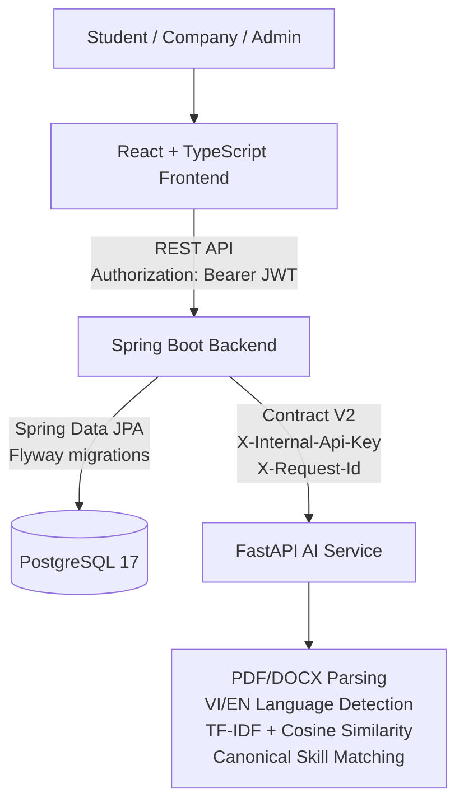
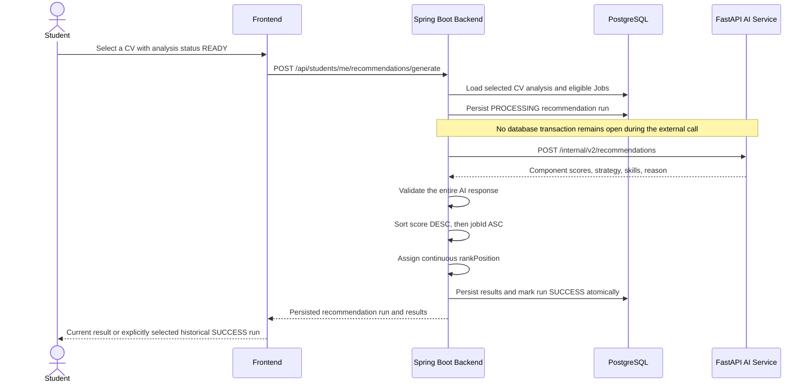

<div align="center">

# Student Job Recommendation System

### Explainable bilingual CV–Job matching with clear service ownership

**A full-stack recruitment platform for IT students, companies, and administrators, featuring bilingual CV parsing and deterministic content-based job recommendation using TF-IDF, Cosine Similarity, and canonical skill matching.**

[](https://github.com/binkadev/student-job-recommendation-system/actions/workflows/backend-ci.yml)
[](https://github.com/binkadev/student-job-recommendation-system/actions/workflows/ai-ci.yml)
[](https://github.com/binkadev/student-job-recommendation-system/actions/workflows/frontend-ci.yml)
[](https://github.com/binkadev/student-job-recommendation-system/actions/workflows/core-smoke-ci.yml)
[](https://github.com/binkadev/student-job-recommendation-system/actions/workflows/container-images.yml)


**Core stack implemented and smoke-verified · Human-labeled ranking evaluation pending · Not production-ready**

<br />

<a href="#overview">Overview</a> ·
<a href="#system-architecture">Architecture</a> ·
<a href="#recommendation-contract-v2">Contract V2</a> ·
<a href="#quick-start">Quick Start</a> ·
<a href="#testing-and-verified-evidence">Verification</a> ·
<a href="#documentation">Documentation</a>

</div>

---

## Overview

The **Student Job Recommendation System** supports the recruitment journey for three platform roles:

- **Students** manage CVs, discover jobs, generate recommendations, save jobs, apply, and track applications.
- **Companies** manage company information, owned job postings, applicants, application states, and saved candidates.
- **Administrators** manage users, companies, jobs, applications, categories, skills, and platform-level status changes.

Its recommendation pipeline is deterministic and contract-driven. The FastAPI AI Service parses CVs and computes recommendation components; the Spring Boot Backend remains the system of record and owns eligibility filtering, validation, ranking, transactions, and persistence.

<table>
<tr>
<td width="33%" valign="top">

### Explainable matching

Results can expose text similarity, skill coverage, matched skills, missing skills, scoring strategy, and a deterministic explanation.

</td>
<td width="33%" valign="top">

### Vietnamese and English

Language is detected independently for each CV and Job. The pipeline selects same-language hybrid scoring or cross-language canonical-skill matching.

</td>
<td width="33%" valign="top">

### Backend-owned truth

Authentication, authorization, ownership, business rules, sorting, `rankPosition`, and persistence remain in Spring Boot.

</td>
</tr>
</table>

### Why this project

Many student recruitment demos stop at CRUD screens or profile-based keyword filters. This repository demonstrates a fuller engineering boundary:

- real PDF and DOCX ingestion;
- bilingual deterministic NLP rather than a trained recommendation model;
- canonical technical-skill aliases across Vietnamese and English;
- explicit service-to-service contracts and failure handling;
- persisted recommendation runs with Backend-owned ranking;
- role and ownership rules for Student, Company, and Admin workflows;
- reproducible Docker acceptance smoke, CI, container publishing automation, and evaluation tooling;
- honest separation between **software correctness evidence** and **human-judged ranking quality**.

---

## Key Capabilities

| Area | Current capability |
|---|---|
| CV processing | PDF/DOCX upload, bilingual parsing, language detection, deterministic preprocessing, canonical skill extraction |
| Recommendation | Same-language TF-IDF/Cosine hybrid scoring and cross-language skill-based scoring |
| Explainability | Component scores, scoring strategy, matched skills, missing skills, and reason |
| Student workflow | CV management, recommendation generation/history, job discovery, saved jobs, applications, notifications |
| Company workflow | Owned company profile, jobs, applicants, application status, saved candidates, reports |
| Admin workflow | Users, companies, jobs, applications, categories, skills, statistics, status administration |
| Platform engineering | PostgreSQL/Flyway, JWT, internal API-key authentication, request tracing, Docker Compose, CI, GHCR workflow |
| Evaluation | Toy dataset, offline runner, Precision@5, Recall@5, NDCG@5, independent annotation and adjudication workflow |

---

## System Architecture


```mermaid
flowchart TB
    U[Student / Company / Admin]
    FE[React + TypeScript Frontend]
    BE[Spring Boot Backend]
    DB[(PostgreSQL 17)]
    AI[FastAPI AI Service]
    NLP[PDF/DOCX Parsing<br/>VI/EN Language Detection<br/>TF-IDF + Cosine Similarity<br/>Canonical Skill Matching]

    U --> FE
    FE -->|REST API<br/>Authorization: Bearer JWT| BE
    BE -->|Spring Data JPA<br/>Flyway migrations| DB
    BE -->|Contract V2<br/>X-Internal-Api-Key<br/>X-Request-Id| AI
    AI --> NLP
```

```text
Frontend
    |
    v
Spring Boot Backend
    |               |
    v               v
PostgreSQL      FastAPI AI Service
```

### Ownership boundaries

| Component | Owns | Does not own |
|---|---|---|
| **Frontend** | Role-based user experience, form state, Backend API consumption, runtime presentation | AI calls, scoring, production ranking, authorization truth |
| **Spring Boot Backend** | JWT authentication, authorization, ownership, business rules, PostgreSQL, Flyway, eligible-job filtering, AI orchestration, full-response validation, sorting, `rankPosition`, transactions, recommendation persistence | Bilingual semantic alias mapping or direct document NLP |
| **FastAPI AI Service** | Stateless PDF/DOCX parsing, VI/EN NLP, canonical skill extraction, component scores, scoring strategy, explanations | PostgreSQL access, user JWTs, public authorization, rank creation, `rankPosition`, recommendation persistence |
| **PostgreSQL** | Durable recruitment, CV-analysis, and recommendation data | Private evaluation files or runtime secrets committed to Git |

The Frontend calls only the Spring Boot Backend. It never calls the AI Service directly and never receives or sends the internal AI API key.

### Recommendation sequence


```mermaid
sequenceDiagram
    actor Student
    participant Frontend
    participant Backend as Spring Boot Backend
    participant Database as PostgreSQL
    participant AI as FastAPI AI Service

    Student->>Frontend: Select a CV with analysis status READY
    Frontend->>Backend: POST /api/students/me/recommendations/generate
    Backend->>Database: Load selected CV analysis and eligible Jobs
    Backend->>Database: Persist PROCESSING recommendation run
    Note over Backend,AI: No database transaction remains open during the external call
    Backend->>AI: POST /internal/v2/recommendations
    AI-->>Backend: Component scores, strategy, skills, reason
    Backend->>Backend: Validate the entire AI response
    Backend->>Backend: Sort score DESC, then jobId ASC
    Backend->>Backend: Assign continuous rankPosition
    Backend->>Database: Persist results and mark run SUCCESS atomically
    Backend-->>Frontend: Persisted recommendation run and results
    Frontend-->>Student: Current result or explicitly selected historical SUCCESS run
```

---

## Recommendation Pipeline

```text
Original PDF/DOCX
        |
        v
Backend-owned CV storage
        |
        v
POST /internal/v2/cv/parse
        |
        v
rawText + processedText + language + canonical skills
        |
        v
Persisted CV analysis status READY
        |
        v
Backend filters eligible Jobs
        |
        v
POST /internal/v2/recommendations
        |
        v
AI component scores and explanation
        |
        v
Backend validation -> sorting -> rankPosition -> persistence
```

The system is content-based and deterministic. It is **not** an embedding platform, semantic vector-search system, trained recommender model, or online machine-learning service.

---

## Recommendation Contract V2

### Frozen internal endpoints

| Purpose | Endpoint | Request shape |
|---|---|---|
| CV parsing | `POST /internal/v2/cv/parse` | Multipart form data with field `file` |
| Recommendation | `POST /internal/v2/recommendations` | Strict JSON containing one CV and the Backend-filtered eligible Job corpus |

### Frozen metadata

```text
algorithm         = tfidf-cosine-hybrid
algorithmVersion  = bilingual-recommendation-v2
processingVersion = bilingual-nlp-v2-skills-v1
```

Unknown Contract V2 fields are rejected at the AI boundary. Every `/internal/v2/**` request must include `X-Internal-Api-Key`.

### Language and scoring strategies

| CV ↔ Job pair | Strategy | `textScore` | Final `score` |
|---|---|---:|---:|
| English ↔ English, Job has canonical skills | `SAME_LANGUAGE_HYBRID` | TF-IDF Cosine Similarity | `0.65 × textScore + 0.35 × skillScore` |
| Vietnamese ↔ Vietnamese, Job has canonical skills | `SAME_LANGUAGE_HYBRID` | TF-IDF Cosine Similarity | `0.65 × textScore + 0.35 × skillScore` |
| Same language, Job has no canonical skills | `SAME_LANGUAGE_HYBRID` | TF-IDF Cosine Similarity | `textScore` |
| Cross-language, mixed, unknown, or insufficient confidence | `CROSS_LANGUAGE_SKILL_BASED` | `null` | `skillScore` |

For a same-language Job without skills:

```text
skillScore = 0
score      = textScore
```

Canonical skill coverage is calculated as:

```text
skillScore = canonical Job skills found in the CV
             ------------------------------------
             total canonical skills of the Job
```

### Backend ranking guarantees

The AI Service does not return `rank` or `rankPosition`. The Backend:

1. validates the response request ID, metadata, result count, Job IDs, duplicate IDs, score ranges, threshold, strategy semantics, skills, and explanation limits;
2. rejects the **entire response** when any result is malformed or semantically invalid;
3. persists no partial recommendation result set from an invalid response;
4. sorts accepted results by `score DESC`, then `jobId ASC`;
5. assigns continuous `rankPosition` values starting at `1`;
6. persists recommendation results and the final successful run state transactionally.

The current master implementation persists component scores as PostgreSQL `DECIMAL(8,5)` values and applies `HALF_UP` rounding to scale `5` before persistence.

---

## Roles and Business Workflow

<table>
<tr>
<td width="33%" valign="top">

### Student

- Manage personal profile and skills.
- Upload, activate, open, reanalyze, and delete eligible CVs.
- Generate recommendations from a selected `READY` CV.
- View the current run state and explicit successful-run history.
- Discover, save, and apply to public Jobs.
- Track applications and notifications.

</td>
<td width="33%" valign="top">

### Company

- Manage the authenticated company's profile.
- Create and edit Jobs owned by that Company.
- View owned applicants and authorized CV files.
- Update supported application states.
- Save a Student once per Company.
- Access supported recruitment reports and settings.

</td>
<td width="33%" valign="top">

### Administrator

- Manage users and account statuses.
- Verify, block, or return Companies to pending status.
- Manage Jobs, applications, categories, and skills.
- Access platform statistics and protected administration screens.

</td>
</tr>
</table>

> **Current Job-status behavior:** on `master`, both `COMPANY` and `ADMIN` may call the Job status endpoint; a Company is ownership-scoped but can currently set an owned Job to `ACTIVE`. A separate admin-only Job approval gate is not enforced by the current Backend implementation and must not be claimed as complete.

### Core business invariants

- Each Student may have at most one active CV; activating one deactivates the previous active CV transactionally.
- Recommendation generation requires the selected CV analysis to be `READY`, with non-blank extracted and processed text.
- Recommendations use the selected CV's persisted analysis data and extracted canonical skills; they do not fall back to `student_skills`.
- Entering `PROCESSING` clears previous derived analysis fields before file or HTTP work begins.
- A `FAILED` CV analysis clears stale processed text, derived skills, language/version metadata, warnings, and analysis timestamp; only a sanitized error remains.
- A Student cannot apply to the same Job twice.
- A public Job must be `ACTIVE`, belong to a `VERIFIED` Company, and have a null, current, or future deadline.
- Companies may manage only their own Jobs, applications, saved candidates, and authorized application CV files.
- Saved Candidate uniqueness is `company_id + student_id`; an application identifies the source and does not redefine the bookmark domain.
- A CV referenced by an Application or another protected business record cannot be deleted.
- External AI calls execute without an open database transaction.
- Any invalid recommendation result causes the Backend to reject the complete AI response.
- An invalid response never produces partial recommendation-result persistence.
- Released Flyway migrations are immutable; schema changes require a new migration.
- The current Frontend does not present an older successful run as the current result when the newest run is `FAILED` or `PROCESSING`.
- A historical successful run is shown only after explicit user selection and is labeled as historical context.

---

## Technology Stack

### Frontend

| Technology | Version / role |
|---|---|
| React / React DOM | `18.3.1` |
| TypeScript | `~5.6.3` |
| Vite | `^6.0.5` |
| React Router DOM | `^6.28.0` |
| Axios | `^1.7.9` |
| React Hook Form | `^7.81.0` |
| Zod | `^4.4.3` |
| Tailwind CSS | `^3.4.17` |
| Recharts | `^3.9.2` |
| Supporting UI | dnd-kit, date-fns, Lucide React |

### Backend

| Technology | Version / role |
|---|---|
| Java | `21` |
| Spring Boot | `3.5.16` |
| Spring Security | JWT authentication and role authorization |
| Spring Data JPA / Hibernate | Persistence and entity mapping |
| PostgreSQL | `17` |
| Flyway | Versioned schema migrations through the current `V15` baseline |
| JJWT | `0.13.0` |
| Springdoc OpenAPI | `2.8.17` |
| Testcontainers | PostgreSQL integration lifecycle |
| Maven Wrapper | Build, unit tests, integration tests |

### AI Service

| Technology | Version / role |
|---|---|
| Python | `3.11.9` in CI |
| FastAPI | `0.139.2` |
| Uvicorn | `0.51.0` |
| Pydantic | `2.13.4` |
| scikit-learn | `1.9.0` |
| underthesea | `9.5.0` |
| pdfplumber | `0.11.10` |
| python-docx | `1.2.0` |
| NumPy | `2.4.6` |
| pytest | `9.1.1` |

### Infrastructure and Delivery

- Docker and Docker Compose
- GitHub Actions for Backend, AI, Frontend, core smoke, and container images
- GitHub Container Registry workflow for Backend and AI images
- PostgreSQL named volume and Backend-owned CV upload volume
- `X-Request-Id` correlation across Backend and AI

---

## Quick Start

### Prerequisites

- Git
- Docker Desktop or Docker Engine with Docker Compose V2
- Windows PowerShell 5.1+ or PowerShell 7 for the repository smoke script
- Node.js 24 and npm only when running the Frontend separately

### 1. Clone and configure

```powershell
git clone https://github.com/binkadev/student-job-recommendation-system.git
cd student-job-recommendation-system
Copy-Item .env.example .env -Force
```

`.env.example` contains local-development placeholders only. Never reuse them in staging or production, and never commit `.env`.

### 2. Start the core Docker stack

```powershell
docker compose up --build -d
docker compose ps
```

The core Compose stack starts **PostgreSQL, the FastAPI AI Service, and the Spring Boot Backend**. It does not start the Frontend.

| Core service | Local URL |
|---|---|
| Backend API base | `http://localhost:8080/api` |
| Backend Swagger UI | `http://localhost:8080/swagger-ui.html` |
| AI health | `http://localhost:8000/health` |
| AI OpenAPI | `http://localhost:8000/docs` |

### 3. Run the acceptance smoke

From the repository root:

```powershell
powershell -NoProfile -ExecutionPolicy Bypass -File .\scripts\smoke-core.ps1
```

A successful run ends with:

```text
SMOKE RESULT: PASS
```

### 4. Run the Frontend separately

```powershell
cd frontend
npm ci
Copy-Item .env.example .env -Force
npm run dev
```

The Vite development server normally starts at `http://localhost:5173` and proxies `/api` to the Backend at `http://127.0.0.1:8080`.

<details>
<summary><strong>Local demo accounts</strong></summary>

The Backend `dev` profile seeds these accounts when missing. All use password `123456`.

| Role | Email |
|---|---|
| Admin | `admin@example.com` |
| Student | `student@example.com` |
| Company | `company@example.com` |

These credentials are for **local development and demonstration only**. Never reuse the demo password or demo secrets in production.

</details>

---

## Local Development

### Backend

```powershell
cd backend
.\mvnw.cmd spring-boot:run -Dspring-boot.run.profiles=dev
```

### AI Service

```powershell
cd ai-service
python -m venv .venv
.\.venv\Scripts\Activate.ps1
python -m pip install --require-hashes -r requirements.lock
python -m pip check
python -m uvicorn main:app --host 0.0.0.0 --port 8000 --reload
```

### Frontend

```powershell
cd frontend
npm ci
npm run dev
```

---

## Configuration

Important local configuration keys are documented in [`.env.example`](.env.example).

| Area | Variables |
|---|---|
| PostgreSQL | `POSTGRES_DB`, `POSTGRES_USER`, `POSTGRES_PASSWORD`, `POSTGRES_PORT` |
| Backend | `BACKEND_PORT`, `APP_JWT_SECRET`, `APP_JWT_EXPIRATION_MS`, `APP_CV_MAX_FILE_SIZE_BYTES` |
| AI Service | `AI_PORT`, `AI_CV_MAX_FILE_SIZE_BYTES`, `AI_INTERNAL_API_KEY` |
| Backend → AI | `APP_AI_SERVICE_CONNECT_TIMEOUT`, `APP_AI_SERVICE_READ_TIMEOUT` |
| Multipart | `SPRING_SERVLET_MULTIPART_MAX_FILE_SIZE`, `SPRING_SERVLET_MULTIPART_MAX_REQUEST_SIZE` |

The Backend uses `APP_AI_SERVICE_INTERNAL_API_KEY` at runtime and must send the same secret configured as `AI_INTERNAL_API_KEY` in the AI Service. Docker Compose wires this value from the single local `AI_INTERNAL_API_KEY` entry.

---

## Security and Observability

### Authentication boundaries

```text
Client -> Backend
Authorization: Bearer <JWT>

Backend -> AI Service
X-Internal-Api-Key: <shared internal secret>

Client -> Backend -> AI Service
X-Request-Id: <safe tracing identifier>
```

- `Authorization: Bearer <JWT>` authenticates protected public Backend requests.
- The user JWT is never forwarded to the AI Service.
- `X-Internal-Api-Key` authenticates Backend-to-AI Contract V2 calls.
- `X-Request-Id` is tracing metadata, **not authentication** and never grants access.
- The Backend validates an incoming request ID or creates a UUID, returns it to the client, and propagates it to AI calls.
- Transport header `X-Request-Id` is distinct from the Contract V2 JSON field `requestId`, which identifies a recommendation business request.

### Logging policy

Completion logs are limited to safe metadata such as request ID, HTTP method, URI path, response status, and duration. Logs must not contain:

- passwords or password hashes;
- JWTs or `Authorization` headers;
- cookies;
- `X-Internal-Api-Key` or environment secrets;
- request or response bodies;
- multipart bytes or uploaded file contents;
- raw CV data;
- extracted or processed CV text;
- full Job text;
- recommendation payload fields;
- filenames, stored filenames, configured storage directories, private storage paths, or absolute paths.

See [Request Tracing](docs/operations/request-tracing.md) for validation rules and operational guidance.

---

## Testing and Verified Evidence

### Backend

```powershell
cd backend
.\mvnw.cmd -B -ntp test
.\mvnw.cmd -B -ntp clean verify
```

The full lifecycle includes PostgreSQL 17 through Testcontainers, Flyway migrations, Hibernate validation, API integration tests, and controlled AI HTTP stubs.

### AI Service

```powershell
cd ai-service
python -m pip install --require-hashes -r requirements.lock
python -m pip check
python -m pytest
```

### Frontend

```powershell
cd frontend
npm ci
npm run lint
npm run build
```

### Verified integration evidence

The latest recorded core smoke on `master` reports:

```text
SMOKE RESULT: PASS
CV language: vi
Eligible Jobs scanned: 11
Persisted results: 11
Rank sequence: 1..11
Strategies: SAME_LANGUAGE_HYBRID, CROSS_LANGUAGE_SKILL_BASED
Backend -> AI requestId propagation: confirmed
```

The recorded output did not print passwords, JWTs, raw CV text, or storage paths.

This evidence verifies the core Backend–AI contract, orchestration, eligible-corpus flow, deterministic sorting, rank creation, and persistence. It does **not** replace full manual Student/Company/Admin browser E2E evidence or prove ranking quality according to human judgment.

### CI workflows

| Workflow | Scope |
|---|---|
| [Backend CI](.github/workflows/backend-ci.yml) | Java 21, Maven `clean verify` |
| [AI Service CI](.github/workflows/ai-ci.yml) | Python 3.11.9, locked install, `pip check`, pytest |
| [Frontend CI](.github/workflows/frontend-ci.yml) | Node 24, locked install, ESLint, production build |
| [Core Smoke CI](.github/workflows/core-smoke-ci.yml) | Clean Docker Compose acceptance flow |
| [Container Images](.github/workflows/container-images.yml) | Backend and AI image build; publish on eligible pushes/tags |

No fixed test-count claim is included here because counts can change as the suites evolve.

---

## Offline Ranking Evaluation

The repository includes an offline evaluation framework and a separate independent human-annotation workflow.

### Implemented

- a synthetic toy dataset for framework verification only;
- strict dataset validation for `cvs.json`, `jobs.json`, and complete `judgments.csv`;
- `Precision@5`, `Recall@5`, and `NDCG@5`;
- comparison modes:
  - `production_hybrid`;
  - `text_only`;
  - `skill_only`;
- independent annotation packet generation;
- agreement review and disagreement export;
- manual adjudication and finalization tooling;
- privacy rules for private CVs and work-in-progress annotations.

### Still required before ranking-quality conclusions

- review and freeze a representative real `jobs.json` corpus;
- use only authorized and anonymized CV inputs;
- collect independent judgments from two or three human annotators;
- manually adjudicate every disagreement;
- freeze the complete human-labeled ground truth;
- calculate and report final human-labeled metrics;
- document dataset limitations, reviewer subjectivity, and possible bias.

The algorithm must never generate its own ground truth. Toy labels and toy metrics must never be presented as evidence of product quality.

See [Offline Recommendation Evaluation](ai-service/evaluation/README.md).

---

## Project Status

| Area | Status | Evidence boundary |
|---|---|---|
| Spring Boot Backend core and public API | Implemented | Source, tests, Backend CI |
| PostgreSQL and Flyway through current V15 baseline | Implemented | Migrations and integration lifecycle |
| FastAPI Contract V2 | Implemented | Strict V2 models, service tests, integration smoke |
| PDF/DOCX parsing | Implemented | AI parser and tests |
| Bilingual VI/EN recommendation | Implemented | Same-language and cross-language strategies |
| Backend-owned validation, sorting, rank, persistence | Implemented | Validator, transaction services, smoke evidence |
| Docker Compose core stack | Implemented | PostgreSQL + AI + Backend |
| Backend CI | Implemented | GitHub Actions workflow |
| AI Service CI | Implemented | GitHub Actions workflow |
| Frontend CI | Implemented | Node 24 lint/build workflow |
| Automated core smoke | Implemented and recorded PASS | Functional integration evidence only |
| GHCR workflow and container runbook | Implemented | Package access, pull, release, and rollback verification still pending |
| Production profile hardening | Implemented in configuration scope | Does not constitute a deployed production environment |
| Backend–AI internal API-key authentication | Implemented | `/internal/v2/**` protection |
| Backend → AI request tracing | Implemented | `X-Request-Id` propagation and safe completion logs |
| Offline evaluation framework | Implemented | Framework availability is not quality evidence |
| Human annotation workflow | Implemented | Real annotations and adjudication pending |
| Frontend API integration and latest candidate runtime-state fixes | Merged | Full manual browser E2E remains pending |
| Full Student/Company/Admin manual E2E | Pending | No complete PASS declaration yet |
| Human-labeled ranking-quality metrics | Pending | No final P@5, R@5, or NDCG@5 claim |
| Production monitoring and alerting | Pending | Request tracing alone is not full observability |
| Backup/restore and rollback drills | Pending | Runbook exists; execution evidence incomplete |
| Production-ready declaration | Not approved | Required gates remain open |

---

## Current Limitations

- No OCR for scanned or image-only CVs.
- No embeddings, semantic vector model, or vector database.
- No trained recommendation model or online model training.
- CV analysis and recommendation generation are synchronous; no queue is used.
- Historical CV text, Job documents, and eligible corpora are not immutable snapshots.
- Job-skill importance and minimum proficiency are not included in Contract V2 scoring.
- The current Backend does not enforce an admin-only Job approval gate for Company-owned Job activation.
- Full manual browser E2E evidence is incomplete.
- Production monitoring, alerting, log-retention review, backup/restore drills, and rollback drills are incomplete.
- GHCR workflow existence does not prove target-environment package access or successful image pull.
- Human-labeled ranking-quality results are not yet available.

---

## Repository Structure

```text
student-job-recommendation-system/
├── .github/workflows/       # Backend, AI, Frontend, smoke, and image workflows
├── ai-service/              # Stateless FastAPI AI Service
│   └── evaluation/          # Offline metrics and human-annotation tooling
├── backend/                 # Spring Boot system of record
├── frontend/                # React + TypeScript application
├── docs/                    # Contracts, operations, testing, and runbooks
├── performance/             # Benchmark tooling and evidence
├── scripts/smoke-core.ps1   # Reproducible Backend-to-AI acceptance flow
├── docker-compose.yml       # PostgreSQL + AI Service + Backend core stack
├── .env.example             # Local configuration template
├── AGENTS.md                # Repository source-of-truth and contribution rules
└── README.md
```

---

## Documentation

| Topic | Document |
|---|---|
| Documentation index | [`docs/README.md`](docs/README.md) |
| Repository rules and architecture | [`AGENTS.md`](AGENTS.md) |
| Backend | [`backend/README.md`](backend/README.md) |
| AI Service | [`ai-service/README.md`](ai-service/README.md) |
| Frontend | [`frontend/README.md`](frontend/README.md) |
| Public and internal API contract | [`docs/api-contract.md`](docs/api-contract.md) |
| Docker core stack | [`docs/docker-core.md`](docs/docker-core.md) |
| Request tracing | [`docs/operations/request-tracing.md`](docs/operations/request-tracing.md) |
| Container images and rollback | [`docs/container-images.md`](docs/container-images.md) |
| Production-readiness plan | [`docs/production-readiness-plan.md`](docs/production-readiness-plan.md) |
| Production checklist | [`docs/production-readiness-checklist.md`](docs/production-readiness-checklist.md) |
| Postman regression | [`docs/postman-regression.md`](docs/postman-regression.md) |
| Manual E2E checklist | [`docs/testing/e2e-demo-checklist.md`](docs/testing/e2e-demo-checklist.md) |
| Performance tooling | [`performance/README.md`](performance/README.md) |
| Ranking evaluation | [`ai-service/evaluation/README.md`](ai-service/evaluation/README.md) |

---

## Contribution Workflow

1. Update local `master` before creating a focused branch.
2. Use a clear prefix such as `feat/`, `fix/`, `docs/`, `test/`, `perf/`, or `chore/`.
3. Keep one concern per pull request and avoid unrelated file changes.
4. Never modify a released Flyway migration; add a new migration.
5. Do not change Contract V2, scoring, or service ownership outside an explicitly reviewed scope.
6. Never commit secrets, `.env`, uploaded CVs, private evaluation data, generated annotation work, build output, or IDE caches.
7. Run the relevant test suites and `git diff --check` before opening a pull request.
8. Merge only after review and the required checks pass.

---

## Vietnamese Summary

Đây là hệ thống tuyển dụng full-stack dành cho sinh viên CNTT, doanh nghiệp và quản trị viên. Hệ thống đọc CV PDF/DOCX tiếng Việt hoặc tiếng Anh, chuẩn hóa kỹ năng, tính điểm gợi ý bằng TF-IDF, Cosine Similarity và đối sánh kỹ năng canonical. Backend Spring Boot là nguồn dữ liệu chính thức, chịu trách nhiệm xác thực, nghiệp vụ, kiểm tra kết quả AI, xếp hạng và lưu dữ liệu; AI Service chỉ xử lý parsing/NLP/scoring và không truy cập database.

---

## Academic Notice

This repository is developed as a graduation/capstone project. Automated tests and smoke evidence demonstrate software behavior, contract compliance, and reproducibility; they do not by themselves prove that recommendation rankings match human judgment. That conclusion requires the pending independent, human-labeled offline evaluation.

<div align="center">

**Deterministic contracts · Explainable scoring · Clear service ownership**

</div>
