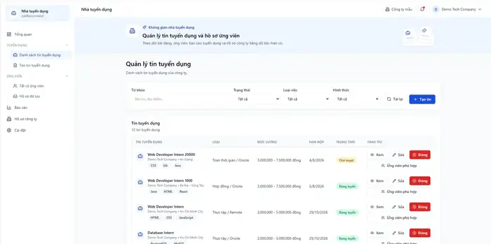
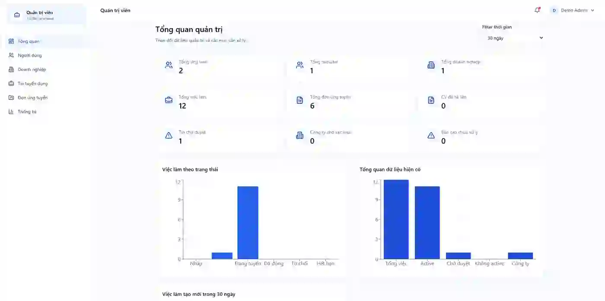

<div align="center">

# 🎓 STUDENT JOB RECOMMENDATION SYSTEM

### Nền tảng tuyển dụng Full-stack với CV Parsing song ngữ, gợi ý việc làm và xếp hạng ứng viên có thể giải thích

**React + TypeScript · Spring Boot · FastAPI · PostgreSQL · TF-IDF · Cosine Similarity · Canonical Skills**

[](https://github.com/binkadev/student-job-recommendation-system/actions/workflows/backend-ci.yml)
[](https://github.com/binkadev/student-job-recommendation-system/actions/workflows/ai-ci.yml)
[](https://github.com/binkadev/student-job-recommendation-system/actions/workflows/frontend-ci.yml)
[](https://github.com/binkadev/student-job-recommendation-system/actions/workflows/core-smoke-ci.yml)


**Tác giả:** [Bindev](https://github.com/binkadev) · Thi

<br />

<a href="#tong-quan">Tổng quan</a> ·
<a href="#diem-noi-bat">Điểm nổi bật</a> ·
<a href="#giao-dien">Giao diện</a> ·
<a href="#kien-truc">Kiến trúc</a> ·
<a href="#recommendation-ranking">Recommendation & Ranking</a> ·
<a href="#kiem-thu">Kiểm thử</a> ·
<a href="#khoi-chay">Khởi chạy</a>

<br />


</div>

---

<a id="tong-quan"></a>

## 🎯 Tổng quan

**Student Job Recommendation System** hỗ trợ hành trình tuyển dụng cho sinh viên CNTT, doanh nghiệp và quản trị viên. Hệ thống tiếp nhận CV PDF/DOCX, phân tích tiếng Việt hoặc tiếng Anh, chuẩn hóa kỹ năng, gợi ý việc làm phù hợp và xếp hạng các ứng viên đã ứng tuyển theo từng Job cụ thể.

Điểm cốt lõi của thiết kế là **Backend Spring Boot sở hữu toàn bộ quyết định nghiệp vụ**. AI Service hoạt động stateless, chỉ xử lý tài liệu/NLP và trả về các thành phần điểm; không truy cập database, không nhận JWT người dùng và không quyết định thứ hạng chính thức.

> Hệ thống hỗ trợ sàng lọc và ra quyết định tuyển dụng; kết quả không tự động thay thế đánh giá của con người.

<a id="diem-noi-bat"></a>

## ✨ Điểm nổi bật

| Năng lực | Giá trị kỹ thuật |
|---|---|
| **CV Parsing song ngữ** | Đọc PDF/DOCX, phát hiện ngôn ngữ, tiền xử lý Việt/Anh và trích xuất canonical skills |
| **Student-to-Job Recommendation** | Gợi ý Job từ CV active với lịch sử run, điểm thành phần, matched skills và missing skills |
| **Recruiter Candidate Ranking** | Xếp hạng đúng corpus Application của một Job bằng một bulk AI request |
| **Explainable scoring** | Công khai `textScore`, `skillScore`, strategy, kỹ năng khớp/thiếu và lý do |
| **Backend-owned ranking** | Backend lọc eligibility, validate phản hồi, sort, gán `rankPosition` và persistence |
| **Engineering evidence** | Docker Compose, CI, Backend/AI/Frontend tests, core smoke và Candidate Ranking real E2E |

---

<a id="giao-dien"></a>

## 🖼️ Giao diện hệ thống

Ảnh được chọn trực tiếp từ bộ giao diện hiện tại và tối ưu WebP để hiển thị rõ, tải nhanh trên GitHub.

### Public

<p align="center">
  
  <br />
  <strong>Trang chủ công khai và khám phá cơ hội việc làm</strong>
</p>

### Student

<p align="center">
  
  <br />
  <strong>Dashboard sinh viên và trạng thái hồ sơ</strong>
</p>

<table>
<tr>
<td width="50%" valign="top">
  
  <p align="center"><strong>Quản lý CV và trạng thái phân tích</strong></p>
</td>
<td width="50%" valign="top">
  
  <p align="center"><strong>Kết quả gợi ý việc làm từ CV</strong></p>
</td>
</tr>
</table>

### Company

<p align="center">
  
  <br />
  <strong>Dashboard tuyển dụng và thống kê doanh nghiệp</strong>
</p>

<table>
<tr>
<td width="50%" valign="top">
  
  <p align="center"><strong>Quản lý tin tuyển dụng thuộc sở hữu</strong></p>
</td>
<td width="50%" valign="top">
  
  <p align="center"><strong>Quản lý ứng viên và CV đã ứng tuyển</strong></p>
</td>
</tr>
</table>

### Admin

<p align="center">
  
  <br />
  <strong>Tổng quan vận hành toàn hệ thống</strong>
</p>

<p align="center">
  
  <br />
  <strong>Quản lý người dùng và trạng thái tài khoản</strong>
</p>

---

<a id="kien-truc"></a>

## 🏗️ Kiến trúc

```text
React + TypeScript Frontend
            |
            v
Spring Boot Backend
       |          |
       v          v
PostgreSQL   FastAPI AI Service
```

- **Frontend chỉ gọi Backend** qua REST API và Bearer JWT.
- **Backend là system of record**: authentication, authorization, ownership, business rules, corpus filtering, validation, sorting, `rankPosition`, transaction và persistence.
- **AI Service stateless**: PDF/DOCX parsing, NLP tiếng Việt/Anh, canonical skills, TF-IDF, Cosine Similarity và component scoring.
- **AI Service không truy cập PostgreSQL**, không nhận user JWT và không công bố rank chính thức.

### Service boundary

```text
Client -> Backend
Authorization: Bearer <JWT>

Backend -> AI Service
X-Internal-Api-Key: <shared-secret>
X-Request-Id: <safe-correlation-id>
```

External AI call không chạy bên trong database transaction đang mở. Backend từ chối toàn bộ AI response nếu metadata, ID, score, threshold hoặc strategy semantics không hợp lệ; không persistence kết quả từng phần.

---

## ⚙️ Phạm vi theo vai trò

| Vai trò | Chức năng chính |
|---|---|
| **Sinh viên** | Hồ sơ/kỹ năng, quản lý nhiều CV, active CV, phân tích CV, tìm/lưu Job, ứng tuyển, lịch sử đơn và recommendation |
| **Doanh nghiệp** | Hồ sơ công ty, quản lý Job thuộc sở hữu, Application, saved candidates, báo cáo và Candidate Ranking |
| **Quản trị viên** | Quản lý người dùng, doanh nghiệp, Job, Application, danh mục, kỹ năng, trạng thái và thống kê |
| **Khách truy cập** | Trang chủ, danh sách/chi tiết Job và doanh nghiệp, đăng ký, đăng nhập |

### Một số quy tắc nghiệp vụ

- Mỗi sinh viên có tối đa một CV active.
- Recommendation chỉ chạy với CV có trạng thái phân tích `READY`.
- Sinh viên không thể ứng tuyển cùng một Job hai lần.
- Job eligible phải `ACTIVE`, thuộc Company `VERIFIED` và chưa hết hạn.
- Doanh nghiệp chỉ truy cập tài nguyên thuộc phạm vi sở hữu.
- CV đang được Application tham chiếu được bảo vệ khỏi thao tác xóa làm mất lịch sử.

---

<a id="recommendation-ranking"></a>

## 🧠 Recommendation & Candidate Ranking

### Student-to-Job Recommendation

```text
CV PDF/DOCX
→ Parsing
→ Language detection
→ Preprocessing
→ Canonical skill extraction
→ TF-IDF/Cosine hoặc skill matching
→ Backend validation
→ rankPosition
→ Persistence
```

Backend đọc snapshot CV `READY`, lọc Job đủ điều kiện, tạo run `PROCESSING`, gửi một request đến AI Service, validate toàn bộ phản hồi, sắp xếp xác định và persistence run cùng kết quả.

### Recruiter Candidate Ranking

Candidate Ranking xếp hạng **các ứng viên đã ứng tuyển cho một Job cụ thể**, không tìm kiếm ứng viên trên toàn hệ thống.

1. Backend xác minh Job thuộc doanh nghiệp hiện tại.
2. Backend tự xác định eligible Applications và CV `READY`.
3. Toàn bộ corpus được gửi trong **một bulk AI request**.
4. AI trả component scores, strategy, matched skills và missing skills.
5. Backend validate, sort theo `score DESC, applicationId ASC` và gán `rankPosition` liên tục.
6. Run history lưu threshold, limit, số lượng scanned/eligible/skipped/returned và kết quả đã persistence.

### Công thức chấm điểm

```text
Same language:
score = 0.65 × textScore + 0.35 × skillScore

Cross language:
score = skillScore
textScore = null
```

`skillScore` là tỷ lệ kỹ năng canonical bắt buộc của Job xuất hiện trong CV; kỹ năng dư trong CV không làm giảm điểm.

| Trường hợp | Strategy |
|---|---|
| Cùng ngôn ngữ, Job có skills | `SAME_LANGUAGE_HYBRID` |
| Cùng ngôn ngữ, Job không khai báo skills | `score = textScore` |
| Khác ngôn ngữ hoặc confidence không đủ | `CROSS_LANGUAGE_SKILL_BASED` |

---

## 🧩 Công nghệ

| Lớp | Công nghệ chính |
|---|---|
| **Frontend** | React 18, TypeScript, Vite, React Router, Axios, React Hook Form, Zod, Tailwind CSS, Vitest |
| **Backend** | Java 21, Spring Boot 3.5, Spring Security/JWT, Spring Data JPA, Hibernate, Flyway, Springdoc OpenAPI, Testcontainers |
| **AI/NLP** | Python 3.11, FastAPI, Pydantic, scikit-learn, underthesea, pdfplumber, python-docx, pytest |
| **Data & Infra** | PostgreSQL 17, Docker Compose, GitHub Actions |

---

<a id="kiem-thu"></a>

## ✅ Kiểm thử & E2E

### Evidence đã xác minh

`docs/final-verification.md` ghi nhận kết quả ngày **03/08/2026** tại commit `56a21db4e99815dbcfd25d4da6ca9f7bd404cd69`:

| Hạng mục | Evidence đã ghi nhận |
|---|---|
| Backend | `388` tests — 0 failure/error/skip |
| AI Service | `646` tests pass, `pip check` pass |
| Frontend | `51` tests pass, lint pass, production build pass |
| Docker Compose | Normal và E2E config validation pass |
| Candidate Ranking real E2E | PASS trên stack PostgreSQL + AI Service + Backend cô lập |
| CI | Backend, AI Service, Frontend, core smoke và container workflows |

Các con số trên là **snapshot theo commit evidence**, không được mô tả như kết quả vừa chạy lại trên mọi commit mới hơn.

### Phạm vi E2E ba vai trò

Repository đã có **kịch bản demo/checklist cho Student, Company và Admin** cùng luồng liên vai trò. Tuy nhiên checklist browser tại `docs/testing/e2e-demo-checklist.md` trên `master` vẫn ở trạng thái `NOT RUN`; vì vậy README không tuyên bố full browser E2E ba vai trò đã PASS.

### Lệnh kiểm tra

```powershell
# Backend
cd backend
.\mvnw.cmd -B -ntp clean verify

# AI Service
cd ..\ai-service
python -m pytest

# Frontend
cd ..\frontend
npm.cmd ci
npm.cmd run test:run
npm.cmd run lint
npm.cmd run build

# Core smoke / Candidate Ranking real E2E
cd ..
powershell -NoProfile -ExecutionPolicy Bypass -File .\scripts\smoke-core.ps1
powershell -NoProfile -ExecutionPolicy Bypass -File .\scripts\run-candidate-ranking-real-e2e.ps1
```

---

<a id="khoi-chay"></a>

## ⚡ Khởi chạy nhanh

### Core stack

```powershell
git clone https://github.com/binkadev/student-job-recommendation-system.git
cd student-job-recommendation-system
Copy-Item .env.example .env
docker compose up --build -d
docker compose ps
```

Core Compose chạy **PostgreSQL, AI Service và Backend**.

| Dịch vụ | URL mặc định |
|---|---|
| Backend API | `http://localhost:8080/api` |
| Swagger UI | `http://localhost:8080/swagger-ui.html` |
| AI health | `http://localhost:8000/health` |
| AI docs | `http://localhost:8000/docs` |

### Frontend

```powershell
cd frontend
npm.cmd ci
Copy-Item .env.example .env.local
npm.cmd run dev
```

Frontend Vite thường chạy tại `http://localhost:5173` và proxy `/api` đến Backend.

<details>
<summary><strong>Tài khoản demo local</strong></summary>

Mật khẩu chung: `123456` — chỉ dùng cho profile `dev` và môi trường demo local.

| Vai trò | Email |
|---|---|
| Admin | `admin@example.com` |
| Student | `student@example.com` |
| Company | `company@example.com` |

</details>

Không commit `.env`, JWT secret, password hoặc internal API key thật.

---

## 📁 Cấu trúc repository

```text
student-job-recommendation-system/
├── .github/workflows/       # CI workflows
├── backend/                 # Spring Boot system of record
├── ai-service/              # FastAPI AI Service stateless
│   └── evaluation/          # Offline ranking evaluation tooling
├── frontend/                # React + TypeScript application
├── docs/                    # Contract, runbook và verification evidence
│   └── images/readme/       # Ảnh giao diện README
├── scripts/                 # Smoke và real E2E runners
├── performance/             # Performance tooling/evidence
├── docker-compose.yml       # Core stack
├── docker-compose.e2e.yml   # Isolated E2E override
└── .env.example             # Mẫu cấu hình local
```

---

## 🚦 Trạng thái hiện tại

| Hạng mục | Trạng thái |
|---|---|
| Backend core, JWT, role/ownership rules | Đã triển khai |
| PostgreSQL + Flyway V16 | Đã triển khai |
| FastAPI Contract V2 và CV Parsing VI/EN | Đã triển khai |
| Student-to-Job Recommendation | Đã triển khai |
| Recruiter Candidate Ranking | Đã triển khai và có real cross-service E2E evidence |
| Frontend ba vai trò | Đã xây dựng; có automated tests và kịch bản demo |
| Full browser E2E ba vai trò | Chưa có evidence PASS trên checklist hiện tại |
| Human-labeled ranking quality | Chưa có kết luận chính thức |
| Production operations | Chưa đủ evidence để tuyên bố production-ready |

### Giới hạn ngắn gọn

- Chưa hỗ trợ OCR cho CV scan/image-only.
- Chưa dùng embedding, vector database, deep learning hoặc learned ranking.
- Recommendation/Ranking còn synchronous, chưa có queue/worker.
- Chất lượng phụ thuộc parsing, language detection, canonical skill catalog và dữ liệu đầu vào.
- Chưa có human-labeled evaluation chính thức để kết luận chất lượng tuyển dụng.

---

## 📚 Tài liệu liên quan

| Chủ đề | Tài liệu |
|---|---|
| Trạng thái dự án | [`docs/project-status.md`](docs/project-status.md) |
| Final verification | [`docs/final-verification.md`](docs/final-verification.md) |
| Demo runbook | [`docs/demo-runbook.md`](docs/demo-runbook.md) |
| Defense guide | [`docs/defense-guide.md`](docs/defense-guide.md) |
| Candidate Ranking contract | [`docs/candidate-ranking-contract.md`](docs/candidate-ranking-contract.md) |
| Manual E2E checklist | [`docs/testing/e2e-demo-checklist.md`](docs/testing/e2e-demo-checklist.md) |
| Known limitations | [`docs/known-limitations.md`](docs/known-limitations.md) |
| Production readiness | [`docs/production-readiness-plan.md`](docs/production-readiness-plan.md) |
| Ranking evaluation | [`ai-service/evaluation/README.md`](ai-service/evaluation/README.md) |

---

## 👥 Tác giả

- **Bindev** — GitHub: <https://github.com/binkadev>
- **Thi**
