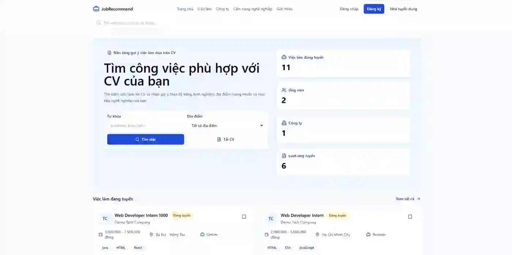
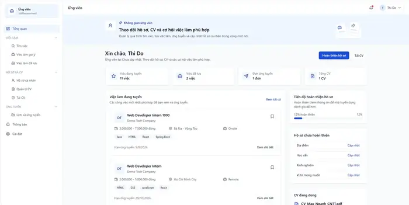
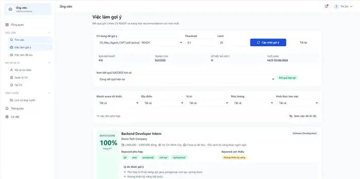
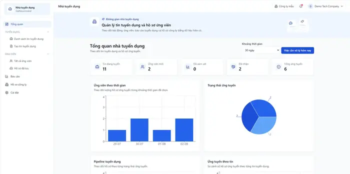
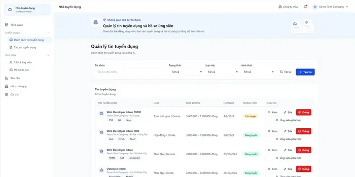
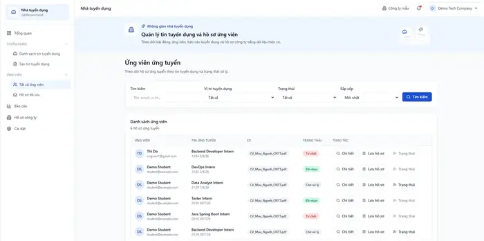
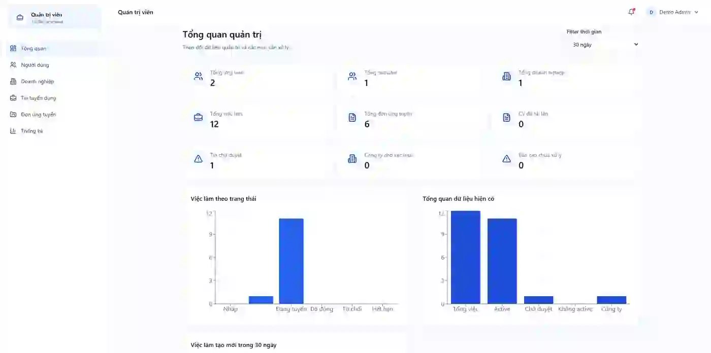

<div align="center">

# 🎓 Student Job Recommendation System

### Nền tảng tuyển dụng Full-stack hỗ trợ phân tích CV Việt/Anh, gợi ý việc làm cho sinh viên và xếp hạng ứng viên theo từng tin tuyển dụng, kèm điểm số và lý do phù hợp rõ ràng.

**React + TypeScript · Spring Boot · FastAPI · PostgreSQL · TF-IDF · Cosine Similarity · Canonical Skills**

[](https://github.com/binkadev/student-job-recommendation-system/actions/workflows/backend-ci.yml)
[](https://github.com/binkadev/student-job-recommendation-system/actions/workflows/ai-ci.yml)
[](https://github.com/binkadev/student-job-recommendation-system/actions/workflows/frontend-ci.yml)
[](https://github.com/binkadev/student-job-recommendation-system/actions/workflows/core-smoke-ci.yml)


**Tác giả:** [Bindev](https://github.com/binkadev) · Thi

<br />

<a href="#tong-quan">Tổng quan</a> ·
<a href="#diem-noi-bat">Điểm nổi bật</a> ·
<a href="#giao-dien">Giao diện</a> ·
<a href="#kien-truc">Kiến trúc</a> ·
<a href="#recommendation-ranking">Recommendation & Ranking</a> ·
<a href="#kiem-thu">Kiểm thử</a> ·
<a href="#khoi-chay">Khởi chạy</a>

<br />



</div>

---

<a id="tong-quan"></a>

## 🎯 Tổng quan

**Student Job Recommendation System** là hệ thống tuyển dụng dành cho sinh viên CNTT, doanh nghiệp và quản trị viên. Hệ thống tiếp nhận CV PDF/DOCX, phân tích nội dung tiếng Việt hoặc tiếng Anh, chuẩn hóa kỹ năng, gợi ý công việc phù hợp cho sinh viên và hỗ trợ doanh nghiệp xếp hạng các ứng viên đã ứng tuyển vào từng Job cụ thể.

Điểm thiết kế quan trọng là **Spring Boot Backend giữ quyền quyết định nghiệp vụ và dữ liệu chính**. Frontend chỉ gọi Backend; Backend chịu trách nhiệm authentication, authorization, ownership/eligibility, validation, sorting, rank và persistence. **FastAPI AI Service hoạt động stateless**, tập trung vào document parsing, NLP và tính các thành phần điểm; AI không truy cập PostgreSQL, không nhận JWT người dùng và không tự quyết định thứ hạng chính thức.

> Hệ thống hỗ trợ sàng lọc và ra quyết định tuyển dụng; kết quả không tự động thay thế đánh giá của con người.

<a id="diem-noi-bat"></a>

## ✨ Điểm nổi bật

| Năng lực | Giá trị kỹ thuật |
|---|---|
| **CV Parsing song ngữ** | Đọc PDF/DOCX, phát hiện ngôn ngữ, tiền xử lý Việt/Anh và lưu snapshot phân tích |
| **Canonical Skills** | Chuẩn hóa tên kỹ năng theo catalog/alias để giảm khác biệt cách viết giữa CV và Job |
| **Student-to-Job Recommendation** | Tạo danh sách Job phù hợp từ CV được chọn, có score breakdown, matched skills, missing skills và run history |
| **Recruiter Candidate Ranking** | Xếp hạng đúng corpus Application của một Job, dùng CV đã nộp cùng Application thay vì tìm kiếm ứng viên toàn hệ thống |
| **Backend-owned Ranking** | Backend xác định eligibility, validate AI response, sort deterministic, gán `rankPosition`/`tierRankPosition` và lưu lịch sử |
| **Explainable Results** | Hiển thị `textScore`, `skillScore`, strategy, kỹ năng khớp/thiếu và lý do phù hợp thay vì chỉ trả một điểm tổng |
| **Engineering Evidence** | Docker Compose, CI, automated tests, Core Smoke và Real API/stack E2E runners |

---

<a id="giao-dien"></a>

## 🖼️ Giao diện hệ thống

### Public

<p align="center">
  
  <br />
  <strong>Trang chủ công khai và khám phá cơ hội việc làm</strong>
</p>

### Student

<p align="center">
  
  <br />
  <strong>Dashboard sinh viên và trạng thái hồ sơ</strong>
</p>

<table>
<tr>
<td width="50%" valign="top">
  
  <p align="center"><strong>Quản lý CV và trạng thái phân tích</strong></p>
</td>
<td width="50%" valign="top">
  
  <p align="center"><strong>Gợi ý việc làm từ CV được chọn</strong></p>
</td>
</tr>
</table>

### Company

<p align="center">
  
  <br />
  <strong>Dashboard tuyển dụng và thống kê doanh nghiệp</strong>
</p>

<table>
<tr>
<td width="50%" valign="top">
  
  <p align="center"><strong>Quản lý tin tuyển dụng thuộc sở hữu</strong></p>
</td>
<td width="50%" valign="top">
  
  <p align="center"><strong>Quản lý ứng viên và CV đã ứng tuyển</strong></p>
</td>
</tr>
</table>

### Admin

<p align="center">
  
  <br />
  <strong>Tổng quan vận hành toàn hệ thống</strong>
</p>

<p align="center">
  
  <br />
  <strong>Quản lý người dùng và trạng thái tài khoản</strong>
</p>

---

<a id="kien-truc"></a>

## 🏗️ Kiến trúc

```text
React + TypeScript Frontend
            |
            | REST API + Bearer JWT
            v
     Spring Boot Backend
        |            |
        |            | Internal API key
        v            v
   PostgreSQL   FastAPI AI Service
```

**Frontend** chỉ giao tiếp với Backend. **Backend là system of record** và sở hữu authentication, authorization, business rules, corpus filtering, validation, official sorting/ranking và persistence. **AI Service** xử lý PDF/DOCX, tiền xử lý tiếng Việt/Anh, canonical skills, TF-IDF, Cosine Similarity và component scoring.

AI Service không truy cập database và không nhận user JWT. Với Candidate Ranking, AI trả các thành phần điểm; Backend mới là thành phần quyết định corpus hợp lệ và thứ hạng chính thức.

---

## ⚙️ Phạm vi theo vai trò

| Vai trò | Chức năng chính đã có |
|---|---|
| **Khách** | Xem Job/công ty công khai, đăng ký và đăng nhập |
| **Sinh viên** | Quản lý hồ sơ/kỹ năng; upload và phân tích CV; tạo recommendation từ CV; lưu/tìm Job; ứng tuyển và theo dõi lịch sử Application |
| **Doanh nghiệp** | Quản lý hồ sơ công ty và Job thuộc sở hữu; xem Application; cập nhật trạng thái; chạy Candidate Ranking và xem lịch sử run |
| **Quản trị viên** | Quản lý người dùng, doanh nghiệp, Job, Application, danh mục/kỹ năng và thống kê hệ thống qua các API quản trị hiện có |

---

<a id="recommendation-ranking"></a>

## 🧠 Recommendation & Candidate Ranking

### Student-to-Job Recommendation

Luồng tổng thể từ CV đến kết quả:

```text
CV PDF/DOCX
→ Parsing
→ Language detection
→ Preprocessing
→ Canonical skill extraction
→ TF-IDF/Cosine hoặc skill matching
→ Backend validation
→ rankPosition / tierRankPosition
→ Persistence
```

Khi tạo recommendation, sinh viên chọn một CV đã có snapshot phân tích hợp lệ. Hệ thống lưu lịch sử từng run và trả score breakdown cùng matched/missing skills để người dùng hiểu vì sao một Job được đề xuất.

### Recruiter Candidate Ranking

Đây là một trong những phần kỹ thuật trọng tâm của dự án:

- Xếp hạng **các ứng viên đã ứng tuyển vào một Job cụ thể**, không phải tìm ứng viên toàn cục.
- Backend tự xác định eligible Applications và dùng đúng CV đã submit cùng Application.
- Toàn bộ corpus hợp lệ được gửi trong **một bulk AI request**.
- AI trả component scores và strategy; **không trả official rank**.
- Backend validate response, áp dụng threshold/limit, sort deterministic và gán `rankPosition`.
- V3 hỗ trợ PRIMARY/FALLBACK tier, `tierRankPosition`, matched skills, missing skills và run history.

### Cách tính điểm

Với CV và Job đủ điều kiện so sánh văn bản cùng ngôn ngữ:

```text
score = 0.65 × textScore + 0.35 × skillScore
```

Với trường hợp cross-language:

```text
score = skillScore
textScore = null
```

`skillScore` biểu diễn mức độ phủ các canonical skills của Job bởi kỹ năng được trích xuất/chuẩn hóa từ CV. Vì PRIMARY và FALLBACK có semantics khác nhau, điểm của hai tier không nên được hiểu như cùng một thang “độ phù hợp tổng thể”.

---

## 🧩 Công nghệ

| Lớp | Công nghệ |
|---|---|
| **Frontend** | React 18.3.1, TypeScript 5.6, Vite 6, React Router, Axios, React Hook Form, Zod, Tailwind CSS, Vitest |
| **Backend** | Java 21, Spring Boot 3.5.16, Spring Security/JWT, Spring Data JPA, Hibernate, Flyway, Springdoc OpenAPI, Testcontainers |
| **AI/NLP** | Python 3.11, FastAPI 0.139.2, Pydantic, scikit-learn 1.9, underthesea, pdfplumber, python-docx, pytest |
| **Database & Infra** | PostgreSQL 17, Docker Compose, GitHub Actions |

---

<a id="kiem-thu"></a>

## ✅ Kiểm thử & E2E

Repository có CI riêng cho Backend, AI Service, Frontend và Core Smoke. Ngoài automated tests, dự án có runner Real API/stack E2E cho recommendation và Candidate Ranking.

**Baseline full-suite được ghi chính thức trong `docs/final-verification.md` ngày 03/08/2026 tại commit `56a21db4e99815dbcfd25d4da6ca9f7bd404cd69`:**

| Hạng mục | Evidence đã ghi nhận |
|---|---|
| Backend | **388 tests PASS**, 0 failure/error/skip |
| AI Service | **646 tests PASS**, 1 warning không chặn |
| Frontend | **51 tests PASS**, lint PASS, build PASS |
| Docker Compose | Normal Compose và E2E Compose validation PASS |
| Candidate Ranking Real E2E | PASS trên PostgreSQL + AI Service + Backend cô lập; create/list/detail, bulk AI call, persistence và cleanup được xác minh |

Các con số trên là **evidence tại commit/ngày được ghi**, không được mô tả như kết quả vừa chạy lại trên `master` hiện tại. Source sau đó tiếp tục được cập nhật thêm V3 semantics và Frontend business-flow fixes.

Repository hiện có:

```text
scripts/run-recommendation-real-e2e.ps1
scripts/run-candidate-ranking-real-e2e.ps1
```

Đây là **Real API/stack E2E**, không phải tuyên bố rằng toàn bộ browser UI journey Student → Company → Admin đã được automated và PASS.

---

<a id="khoi-chay"></a>

## ⚡ Khởi chạy nhanh

### 1. Core stack

```powershell
git clone https://github.com/binkadev/student-job-recommendation-system.git
cd student-job-recommendation-system
Copy-Item .env.example .env
docker compose up --build -d
docker compose ps
```

Core Compose chạy **PostgreSQL + AI Service + Backend**. Backend chạy profile `dev`, vì vậy local stack có dữ liệu demo được seed tự động.

| Dịch vụ | URL mặc định |
|---|---|
| Backend API | `http://localhost:8080/api` |
| Swagger UI | `http://localhost:8080/swagger-ui.html` |
| AI health | `http://localhost:8000/health` |
| AI docs | `http://localhost:8000/docs` |

### 2. Frontend

```powershell
cd frontend
npm.cmd ci
Copy-Item .env.example .env.local
npm.cmd run dev
```

Frontend Vite mặc định chạy tại `http://localhost:5173` và gọi Backend thông qua `/api`.

### Tài khoản demo local

| Vai trò | Email | Password |
|---|---|---|
| Admin | `admin@example.com` | `123456` |
| Student | `student@example.com` | `123456` |
| Company | `company@example.com` | `123456` |

Các tài khoản trên chỉ phục vụ **profile `dev` / local demo**. Không sử dụng các giá trị demo hoặc secret trong `.env.example` cho môi trường chia sẻ hay production.

---

## 📁 Cấu trúc repository

```text
student-job-recommendation-system/
├── .github/workflows/       # Backend / AI / Frontend / Core Smoke CI
├── backend/                 # Spring Boot system of record
├── ai-service/              # FastAPI AI/NLP service stateless
│   └── evaluation/          # Tooling đánh giá offline
├── frontend/                # React + TypeScript application
├── docs/                    # Contracts, runbooks, evidence, defense docs
├── scripts/                 # Smoke và Real API/stack E2E runners
├── performance/             # Performance tooling/evidence
├── docker-compose.yml       # Core local stack
├── docker-compose.e2e.yml   # Isolated E2E override
└── .env.example             # Local configuration template
```

---

## 📌 Trạng thái hiện tại

Dự án đã có source code cho luồng Public, Student, Company và Admin; CV parsing song ngữ; Student Recommendation; Candidate Ranking; persistence, migration, CI và automated tests. Candidate Ranking V3 và Recommendation V3 dùng content-based matching với TF-IDF/Cosine Similarity và canonical skills — **không phải deep learning, embedding model hay LLM ranking**.

Các giới hạn chính được giữ ngắn gọn và minh bạch:

- Chưa dùng embeddings/vector database, deep learning hoặc learned-to-rank.
- CV scan/image-only chưa có OCR.
- Chưa có human-labeled relevance dataset đủ lớn để kết luận chất lượng tuyển dụng bằng Precision@K/NDCG thực tế.
- Recommendation/ranking hiện synchronous; chưa có distributed queue/worker.
- Repository chưa cung cấp đủ evidence để tuyên bố production-ready hoặc full browser E2E tự động cho mọi vai trò.

---

## 📚 Tài liệu liên quan

- [Recommendation & Ranking V3 Contract](docs/recommendation-ranking-v3-contract.md)
- [Final Verification Evidence](docs/final-verification.md)
- [Project Status](docs/project-status.md)
- [Demo Runbook](docs/demo-runbook.md)
- [Defense Guide](docs/defense-guide.md)
- [Known Limitations](docs/known-limitations.md)

---

## 👥 Tác giả

- **Bindev** — [github.com/binkadev](https://github.com/binkadev)
- **Thi**

<div align="center">

**Student Job Recommendation System** · Full-stack Recruitment · Bilingual CV/NLP · Explainable Recommendation & Ranking

</div>
